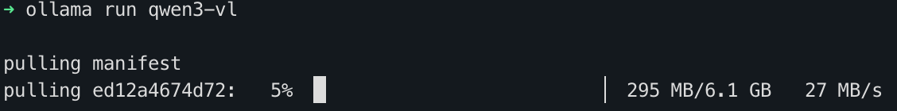

> 最近花了1万块购置了一台95新的 Macbook Pro M2 Max 32G/1TB (2023)，看中的是32G的统一内存和400GB/s的内存带宽。在当前AI引发存储全面涨价的今天，这样的配置无疑是性价比极高的。我终于有了搭建本地AI的条件。看到[The Ultimate Local AI Tier List For 2026](https://www.youtube.com/watch?v=pr9fsrK8nmQ) 中以RTX5090为例测试了本地AI有能力涵盖的日常任务，结合了我自身的需求，做了初步尝试。

## 本地AI适合做什么

1. 文本总结、整理。
	1. 阅读网页、PDF、截图
	2. 润色本地文档
2. 语音转文字。
	1. 视频总结（视频->音频->文字）
	2. 语音输入法，随时记录灵感或者懒得打字时用。但苹果系统自带了。
3. 文字转语音。
	1. 不方便看的时候，读出来。
	2. 生成PodCast，稍后听。
4. 图片生成。
5. 音效生成。

## 选择模型和工具

主力LLM
- qwen3-VL-8B (Q4_K_M量化，比FP8更省)。擅长图片/视频理解。

尝鲜LLM
- qwen3.6-35B-A3B (Q4_K_M量化)。MOE稀疏模型只激活3B，因此输出速度快。擅长推理。但注意虽然只激活3B，但整体模型都要加载进内存（占用约20GB）。
- gemma4 12B (Q8量化)。比qwen3.6-35B-A3B多了对音频的原生多模态支持。

语音转文字
- faster-whisper-large-v3-turbo。快。不过需要编写程序支持实时流式。
- Qwen3-ASR-1.7B。支持中文方言，精准时间戳，抗背景噪音。

语音生成（中文）
- 简单场景用 Open WebUI 内置的TTS。
- 长音频用 CosyVoice3，通过桌面客户端`3uyuan1ee/CosyVoice_app`使用。还能克隆音色。
- 如果只生成英文语音，Chatterbox TTS 是更强大的选择。

图片生成
- Flux.2-dev + ComfyUI

## 安装和使用

- 安装ollama
	- `brew install ollama`
	- 打开`sudo nano /opt/homebrew/opt/ollama/homebrew.mxcl.ollama.plist`，填充环境变量让kv-cache占用更少内存：
		
		```xml
		<key>EnvironmentVariables</key>
		<dict>
		    <key>OLLAMA_KV_CACHE_TYPE</key>
		    <string>q4_0</string>
		    <key>OLLAMA_FLASH_ATTENTION</key>
		    <string>1</string>
		    <key>OLLAMA_NUM_PARALLEL</key>
		    <string>1</string>
		    <key>OLLAMA_MAX_LOADED_MODELS</key>
		    <string>1</string>
		</dict>
		```

- 安装qwen3-VL (ollama)
	- `ollama run qwen3-vl` 
	- 上述命令会自动下载8B-instruct版并开启一个会话。
		
	- 在会话中拖入某张图片让其描述来验证。输入 `/bye` 退出5分钟后，内存会自动释放。

- 安装OpenWebUI (docker)
	- 用docker的原因是卸载干净。
	- 安装命令
		```bash
		docker run -d -p 3000:8080 \
		  --add-host=host.docker.internal:host-gateway \
		  -v open-webui:/app/backend/data \
		  -e OLLAMA_BASE_URL=http://host.docker.internal:11434 \
		  -e RAG_EMBEDDING_ENGINE=ollama \
		  -e RAG_OLLAMA_BASE_URL=http://host.docker.internal:11434 \
		  -e RAG_OLLAMA_MODEL=nomic-embed-text \
		  --name open-webui \
		  ghcr.io/open-webui/open-webui:main
		```
	- 上述命令只在第一次会安装open webui。完成后通过本机浏览器访问 http://localhost:3000 后续直接 `docker start open-webui` 即可。
	- 优化内存
		- 打开管理员面板，关掉不必要的功能。
		- docker分配的内存不要太高，只用来跑Open-WebUI的话，1～2G也够了。
		- 如果内存压力还是大就不使用docker（本身会占用几个G内存）转而使用pip；

### ollama日常维护
```bash
brew services restart ollama #重启服务

ollama pull [model] #下载模型
ollama run [model] #命令行方式运行模型
ollama list #已安装的模型
ollama show [model] #模型信息
ollama ps #当前加载的模型
ollama stop [model] #立即释放加载的模型
ollama remove [model] #删除模型
```

### OpenWebUI日常维护
```bash
docker start open-webui
docker stop open-webui
docker rm open-webui
docker pull ghcr.io/open-webui/open-webui:main
# Then run your long "docker run" command one more time
```

## 目前体验
- 通过 OpenWebUI (docker) 来使用大模型，延时太高。输入一张图片，回复延时可达1分钟。直接用ollama run来对话基本秒回。
- 即使有了 32G 通用内存，想要在不影响其他软件的使用下，使用本地大模型，8B模型+4bit量化已经是极限。并且会发热。
- qwen3-vl-8b 这样的多模态模型已经还不错，但阅读图片的效果并不如我的预期，给了一张有12副吉卜力海报的图片让其告诉我名称，模型在思考时不停的否定自己的判断从而一直循环。


## 如何估算模型占用内存
模型运行时的总内存开销主要由两部分组成：模型静态权重和动态上下文缓存（KV Cache）。
> 模型静态权重统一计算公式：
> $$\text{权重内存 (GB)} \approx \frac{\text{参数量 (Billion)} \times \text{量化位数 (Bit)}}{8} \times 1.2$$
> 1. **参数量 (B)**：比如 7B、14B、32B。
> 2. **量化位数 (Bit)**：FP16 是 16位，Q8 是 8位，Q4 是 4位。
> 3. **系数 1.2**：预留约 20% 的浮动空间（包含非矩阵参数、各种线性层对齐以及推理框架的额外开销）。
> 
> 动态上下文缓存计算比较复杂，统一计算公式（针对密集模型）：
> $$\text{KV Cache 内存 (GB)} \approx \frac{2 \times \text{层数} \times \text{注意力头数} \times \text{每个头的维度} \times \text{序列长度} \times \text{精度位数}}{8 \times 10^9}$$
> 别慌，社区有一个针对 **FP16 精度** 的行业通用**简化拍脑袋公式**：
> $$\text{每 10K 上下文 token} \approx \text{参数量 (B)} \times 0.2 \text{ GB}$$
>
> 如果你用 **Q4（4位量化）** 运行模型，KV Cache 的开销通常会降到原来的 **1/2 到 1/4**（取决于推理框架是否开启了 FlashAttention 和 KV Cache 量化）。