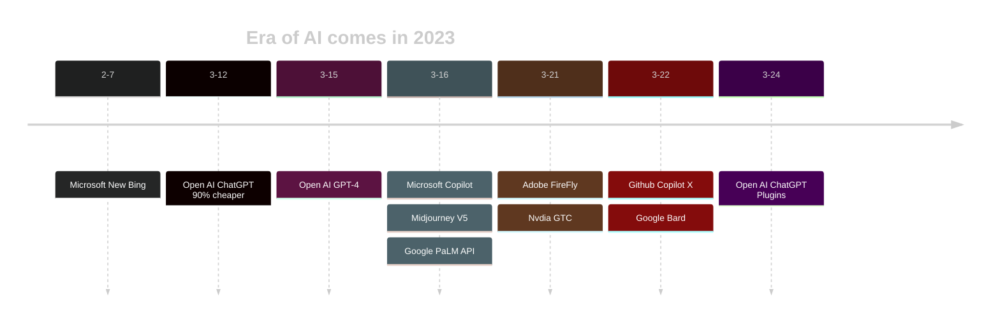

> "There are decades where nothing happens; and there are weeks where decades happen."
> ― Vladimir Lenin

基于大语言模型的AI在这个月带给人们的感受，用列宁的这句话概括再贴切不过了。作为普通人，去拥抱这些AI工具，就像会使用智能手机和搜索引擎；对人类来说，就像学会用电，学会用火。

------

> 更新：4月以来，AI应用的新概念、新架构、新产品如寒武纪大爆炸一般涌现（[AutoGPT](https://github.com/Significant-Gravitas/Auto-GPT) 首当其冲），非人力所能穷举。
> [这个网站](https://supertools.therundown.ai/)收录了大量AI工具，本文也会持续更新笔者常用、觉得好用的工具。

# For General Purpose

- Open AI's [ChatGPT](https://chat.openai.com/auth/login), and Plugins. GPT3.5 is free to use.
- Microsoft's [NewBing](https://www.bing.com/new). It's said to be powered by GPT4 (internal version).
- Google's [Bard](https://bard.google.com/).

Tips on chatting effectively:
- Use Englisih.
- Use precise verb.
- Only one topic at a time.
- No "thanks" and interrupt in time.
- Use role-play. `Act as a travel guide. ...`
- Chat to multiple GPT instances with slightly different views, as if they are expert team.

> After trying many LLM, ChatGPT is still the best one to be professional and smart. But I still prefer asking different models to get different points of view. Some common tips when asking:
> - Role play. `act as ...`. [Here](https://github.com/f/awesome-chatgpt-prompts#prompts) is a collection of role-related prompts.
> - Give template input-output.
> - Tell chatgpt to anwser `step by step`.

# For Doc
- Edge + NewBing. Explain any webpage (including PDF) side by side.
- [ChatDoc](https://chatdoc.com/)/[ChatPDF](https://www.chatpdf.com/), upload PDF and analyze.
- ⏳Microsoft's Copilot.

# For Software Development

- [phind](https://www.phind.com/), the AI search engine for developers.
- [Cursor](https://www.cursor.so/) editor, or vscode plugin `CodeCursor`, read/write current document/code, FREE to try.
- Old [Github Copilot](https://github.com/features/copilot) (based on OpenAI's `CODEX`), costs $10/mo after 60d trial.
- ⏳[Github Copilot X](https://github.com/features/preview/copilot-x)
- ⏳[Copilot for Docs](https://githubnext.com/projects/copilot-for-docs), used to learn a SDK/framework/API, can based on private content.

> The gist to generate code is, to describe a single-responsibility function to let AI generate, rather than a function with long description of chained operations.

# For 3D/2D Art
- [Stable-Diffusion (SD) web-ui](https://github.com/AUTOMATIC1111/stable-diffusion-webui), totally free and opensource, run model locally on PC.
  - Download/Share models on [civitai](https://civitai.com/content/guides/what-is-civitai)/[Hugging face](https://huggingface.co/)
  - Use [ControlNet](https://stablediffusionweb.com/ControlNet) ([Github](https://github.com/lllyasviel/ControlNet) )to add more controll on specific SD model.
  - Use [LoRA (Low-rank adaption)](https://huggingface.co/docs/diffusers/training/lora) to train faster with less memory.
  - Use [Text Inversion](https://huggingface.co/docs/diffusers/training/text_inversion) to train with amazingly small output.
  - Use [DreamBooth] to train if you need to be really expressive.

- [Midjourney](https://www.midjourney.com/home/),  famous for its artistic style, ~~25 times FREE try~~.
    - Built on Discord Bot, thus you can use [Official API](https://discord.com/developers/docs/resources/channel#create-message) or [thirdparty lib](https://deno.land/x/midjourney_discord_api@1.0.5) to automate the flow.
- Adobe's [Firefly](https://firefly.adobe.com/)
- Open AI's [DALL-E-2](https://labs.openai.com/), generates image with natural language and long prompts, but limited-access and less control.
- Bing's [Image Creator](https://www.bing.com/images/create), generate image with natural language, and free to try.
- [Only preview] [styledrop](https://styledrop.github.io/)
- [Only preview] [muse](https://muse-model.github.io/)

# For Music
- [Mubert](https://mubert.com/)
- [Soundraw.io](https://soundraw.io/create_music)

------
# Want more power?

If you want to:
- train your own AI based on these models
- know the strength and weakness of current AI models
- know why & how Generative AI works, mathematically

Here are my personal ideas:
- For text, play with [LLaMA](https://github.com/facebookresearch/llama)/[llama.cpp]((https://github.com/ggerganov/llama.cpp) ), or its fined tuned version [Alpaca](https://github.com/tatsu-lab/stanford_alpaca)/[Alpaca-LoRA](https://github.com/tloen/alpaca-lora). 
- For image, play with [Stable-Diffusion](https://github.com/Stability-AI/stablediffusion) and its plugins. They can run on PC/Mac.
- Weakness of current LLM models: math; chain of decision. But they are improving.
- ["Dive into Deep Learning"](https://d2l.ai/) by 李沐。中文版《[动手学深度学习](http://zh-v2.d2l.ai/index.html)》
- Hardware considerations
    - Training on cloud is cheaper and least effort to start. (Google's [Colab](https://colab.research.google.com/) is even FREE) 
    - Training on local hardware, if use multiple GPUs (with NVLink), traffic bandwidth between GPUs is the botthleneck. (DGX A100 specs: 8xA100 GPUs, total 640GB VRAM, 600GB/s GPU-to-GPU bandwidth.)