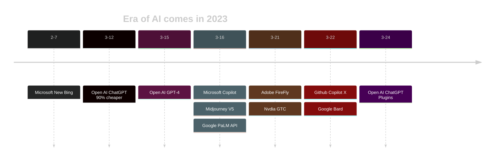

> "There are decades where nothing happens; and there are weeks where decades happen."
> ― Vladimir Lenin

用列宁的这句话形容AI在这个月带给人们的感受，是再贴切不过了。拥抱这些AI工具，就像会使用智能手机和搜索引擎；对人类来说，就像学会用电，学会用火。

------

# For General Purpose

- Open AI's [ChatGPT](https://chat.openai.com/auth/login)
- New Bing (Powered by GPT4)
- Open AI's ChatGPT Plugins
- [Hugging face](https://huggingface.co/)'s models/dataset/research

# For Document
- Microsoft's Copilot
- Notion AI
- [ChatDoc](https://chatdoc.com/)/[ChatPDF](https://www.chatpdf.com/), upload PDF and analyze.

# For Code

- Github's [Copilot X](https://github.com/features/preview/copilot-x), exsiting Copilot costs $10/mo after 60d trial.
  - Using [Copilot for Docs](https://githubnext.com/projects/copilot-for-docs) to learn a SDK/framework/API.
- [Cursor](https://www.cursor.so/), or CodeCursor(vscode plugin), analyze opened document/code, currently FREE.
- Open AI's CodeX

# For 3D/2D Art
- [Stable-Diffusion](https://stablediffusionweb.com/#demo)([Github](https://github.com/Stability-AI/stablediffusion)), an open-sourced model can run on PC.
  - Using [ControlNet](https://stablediffusionweb.com/ControlNet) ([Github](https://github.com/lllyasviel/ControlNet) )to add more control to this model.
  - Find/Share self-tuned models on [civitai](https://civitai.com/content/guides/what-is-civitai)
- [Midjourney](https://www.midjourney.com/home/),  tuned from stable diffusion, famous for its artistic style, 25 times FREE try.
- Open AI's [DALL-E-2](https://labs.openai.com/)
- Adobe's [Firefly](https://firefly.adobe.com/)
- Bing's [Image Creator](https://www.bing.com/images/create)

# For Music
- [Mubert](https://mubert.com/)
- [Soundraw.io](https://soundraw.io/create_music)