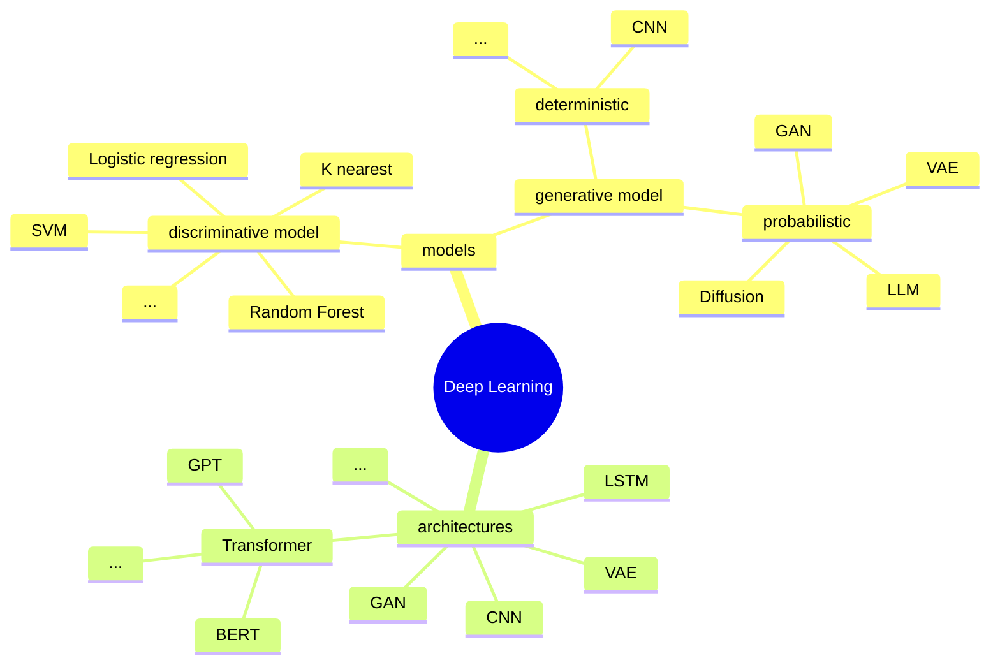

按照目前AI在学术界、工业界推陈出新的速度，感兴趣的同学们纷纷表示：真的学不动啦！不要慌，AI老师来了~ 在本系列中，我不会提前学习预备知识，以门外汉的视角去追问AI并了解一些基本概念。既可以锻炼提问技巧，还可以在听完高屋建瓴的讲解后有针对性的去学习感兴趣的部分，效率倍增！

---
系列文章
1. [用AI学AI.1]()
2. [用AI学AI.2]()
3. [用AI学AI.3]()
4. [用AI学AI.4]()

---

# 笔记

模型与架构
- We train a `model` by choosing an `architecture`.
- Some models are named after the architecture they use, e.g., `GAN, VAE`.

微调
- We `fine-tune` existing model as a foundation to generate a new model, with less training effort.

两类生成式模型
- `LLM` and `Diffusion` are both generative, probabilistic models.
- `ChatGPT` is a product powered by `GPT` model (belongs to `LLM` family).
- `Stable Diffusion` is a `Diffusion` model, it learns pattern in a hidden box called `latent space`.

Transformer架构
- Above models all use `Transformers` as the architecture.
- `Transformers` are a type of attention-based neural network.

# 问答

## Generative Models, Transformers, Large Language Models (LLM) ?

Me:
> **explain** generative models and list some types of it. And explain the **relationship** and differences with LLM.

ChatGPT: 
> Generative models are a type of machine learning model that learns to generate new data that is similar to the training data it was trained on. **Unlike discriminative models**, which learn to classify input data into specific categories, **generative models focus on learning the underlying patterns and structure of the input data**, allowing them to generate new data that is similar to the input data.
> 
> There are several types of generative models, including:
> 1. Variational Autoencoders (VAEs)
> 2. Generative Adversarial Networks (GANs)
> 3. Autoregressive models, such as PixelCNN and PixelRNN
> 4. Boltzmann Machines
> 5. Restricted Boltzmann Machines (RBMs)
> 6. Deep Belief Networks (DBNs)
> 
> **Language Models (LMs) are a type of generative model that specifically focuses on generating natural language**. Like other generative models, LMs are trained on a large corpus of text data and learn to generate new text that is similar to the input data. However, LMs differ from other types of generative models in that they specifically focus on generating text and incorporate language-specific features, such as grammar, syntax, and vocabulary.
> 
> One key difference between LMs and other types of generative models is that **LMs are typically based on probabilistic models**, such as n-gram models or neural network models, whereas other types of generative models, such as GANs and VAEs, are typically based on deep learning architectures. Additionally, **LMs may incorporate language-specific constraints**, such as word order and grammar, that are not present in other types of generative models.

Me:
> Do you mean generative models are unsupervised learning, while discriminative models are supervised learning?

ChatGPT: 
> **Generative models can be trained using both supervised and unsupervised learning approaches**, depending on the specific task and the type of data being used. In unsupervised learning, the model is trained on a dataset without explicit labels, and the goal is to learn the underlying structure and patterns in the data. In supervised learning, the model is trained using labeled data, and the goal is to learn to predict the label of new, unseen data.

> However, it is true that **discriminative models are typically used for supervised learning tasks**, such as classification, regression, and sequence labeling. These models learn to map input data to specific output labels or categories. In contrast, generative models are more commonly used for unsupervised learning tasks, such as density estimation, data synthesis, and anomaly detection. These models learn to generate new data that is similar to the training data, without necessarily mapping input data to specific output labels or categories.

Me:
> Got it. Now explain what transformers is about in deep learning, and the relationship between generative models and the transformers.

ChatGPT: 
> **Transformers are a type of deep learning model that has become increasingly popular in natural language processing (NLP) tasks**, such as language modeling, machine translation, and sentiment analysis. The Transformer architecture was introduced in a 2017 paper titled "[Attention Is All You Need](https://arxiv.org/abs/1706.03762)" by Vaswani et al., and it has since become the foundation for many state-of-the-art NLP models.
> 
> The key innovation of the Transformer architecture is the use of self-attention mechanisms to replace traditional recurrent or convolutional neural networks. **Self-attention** allows the model to weigh the importance of different parts of the input sequence when generating each output token. This enables the model to capture long-range dependencies and context more effectively, resulting in better performance on many NLP tasks.
> 
> Generative models, such as language models, can be built using the Transformer architecture. In fact, **many of the most successful language models, such as OpenAI's GPT series and Google's BERT, are based on the Transformer architecture**. These models are trained on large amounts of text data using unsupervised learning techniques, such as autoregressive language modeling or masked language modeling. Once trained, the models can be used to generate new text that is similar to the training data, or to perform downstream NLP tasks, such as sentiment analysis or machine translation.
> 
> In summary, the Transformer architecture is a powerful tool for building deep learning models for NLP tasks, including generative models such as language models. By leveraging self-attention mechanisms, Transformers are able to capture long-range dependencies and context more effectively, resulting in better performance on many NLP tasks.

## Models, Architectures?

Me:
> **Do you mean** one model can be implemented in different architectures, and transformers are just one of the architectures to build models? If this is true, **list some** other architectures popular.

ChatGPT: 
> Yes, that's correct. **A single machine learning or deep learning model can be implemented using different architectures**, depending on the specific task and the type of data being used. The choice of architecture can have a significant impact on the performance and efficiency of the model.
> 
> In addition to the Transformer architecture, there are several other popular deep learning architectures for building models in various domains. Here are a few examples: 
> 1. Convolutional Neural Networks (CNNs): These are commonly used in computer vision tasks, such as image classification, object detection, and segmentation. 
> 2. Recurrent Neural Networks (RNNs): These are often used for sequence modeling tasks, such as natural language processing, speech recognition, and time-series prediction. 
> 3. Long Short-Term Memory Networks (LSTMs): These are a type of RNN that are designed to handle long-term dependencies in sequences. 
> 4. Autoencoders: These are used for unsupervised learning tasks, such as feature extraction, data compression, and anomaly detection. 
> 5. Generative Adversarial Networks (GANs): These are used for generative modeling tasks, such as **image synthesis**, data augmentation, and **video prediction**. 
> 6. Variational Autoencoders (VAEs): These are also used for generative modeling tasks, such as **image synthesis** and data generation, but they incorporate **probabilistic** models and encode **latent** variables.
> 
> These are just a few examples of the many deep learning architectures that are available for building models. **The choice of architecture will depend on the specific task and the characteristics of the data being used**.

## Diffusion, Stable Diffusion, latent space?

Me:
> **Explain** stable diffusion to me. Is it a model, architecture, or others?

ChatGPT: 
> Stable Diffusion is a probabilistic model for generative modeling and data synthesis, and it is related to the concept of Generative Diffusion Models (GDMs).
> 
> At a high level, the Stable Diffusion model uses an iterative diffusion process to model the distribution of the data. **The diffusion process** involves iteratively adding noise to the input data and then progressively filtering out the noise using a series of conditional distributions. This process results in a sequence of probability distributions, each of which approximates the true data distribution more closely than the previous one.
>
> Unlike **traditional diffusion models, which can suffer from instability** due to the accumulation of noise over time, the Stable Diffusion model incorporates a stability regularization term to prevent this from happening. This regularization term encourages the diffusion process to converge to a stable distribution, resulting in more accurate and reliable generative models.
>
> The Stable Diffusion model is closely related to Generative Diffusion Models (GDMs), which also use a diffusion process to model the data distribution. However, GDMs suffer from instability due to the accumulation of noise over time, and they require careful tuning of the learning rate to avoid this. ~~The Stable Diffusion model addresses this issue by incorporating a stability regularization term, which improves the stability and reliability of the model~~.
>
> In summary, Stable Diffusion is a probabilistic model for generative modeling and data synthesis that uses an iterative diffusion process and a stability regularization term to improve the stability and reliability of the model. It is closely related to Generative Diffusion Models (GDMs) but incorporates additional features to address the instability issues that can arise in traditional diffusion models.

Me:
> Do you know stable diffusion 2? It's said to be a **latent** diffusion model, what does it mean?

ChatGPT: 
> Yes, Stable Diffusion 2 is a follow-up work to the original Stable Diffusion model and is a latent diffusion model.
>
> A latent diffusion model is a type of generative model that **learns a low-dimensional representation (or latent space)** of the data that captures the underlying structure of the data. In other words, **instead of modeling the data directly, the model learns to generate the data by sampling from a distribution in the latent space and then mapping the samples back to the data space**.
>
> Stable Diffusion 2 extends the original Stable Diffusion model by introducing a latent diffusion process. The model learns a diffusion process in the latent space, which allows it to generate data that has a **more complex and structured** distribution than the original model. The latent diffusion process involves iteratively adding noise to the latent space and then filtering out the noise using a series of conditional distributions. This process results in a sequence of probability distributions in the latent space, each of which **approximates the true data distribution** more closely than the previous one.
>
> Once the model has learned the diffusion process in the latent space, it can generate new data by sampling from the final distribution in the latent space and then mapping the samples back to the data space. ~~By using a latent diffusion process, Stable Diffusion 2 is able to generate data that has a more complex and structured distribution than the original model, making it suitable for more challenging generative modeling tasks.~~
>
> In summary, Stable Diffusion 2 is a latent diffusion model that learns a diffusion process in the latent space to generate complex and structured data distributions. It is a more advanced version of the original Stable Diffusion model and is suitable for more challenging generative modeling tasks.

Me:
> explain latent space **like I'm 5**

ChatGPT:  👍
> Imagine you have a big box full of toys. Each toy has different colors, shapes, and sizes. Now, imagine you have a **secret map** that tells you how to mix and match the toys to create new toys that no one has ever seen before. This secret map is like a code, and **it's hidden inside the box**.
> 
> The box of toys is like the data, and the secret map is like the latent space. The latent space is a hidden space that tells you how to mix and match the different parts of the data to create something new. It's like a secret code that only the computer knows.
>
> When you train a model to learn the latent space, it's like **teaching the computer to find the secret map inside the box of toys**. Once the computer knows the secret map, it can create new toys that no one has ever seen before by mixing and matching the parts of the toys in new and interesting ways.

## Summarize the talk

Me:
> **Summarize our conversation above** to give a thorough and concise relationship among all the models, architectures, and other important concepts we talked about.

ChatGPT: 
> In summary, we discussed several important concepts in deep learning, including generative models, discriminative models, language models, and architectures such as Transformers and Generative Adversarial Networks (GANs).
>
> Generative models are used for unsupervised learning and aim to model the data distribution to generate new data. Discriminative models, on the other hand, are used for supervised learning and aim to learn the decision boundary between different classes.
> 
> Language models are a type of generative model that learns to predict the probability of a sequence of words, given some context. Transformers are a popular architecture used for language modeling, which use a self-attention mechanism to capture long-range dependencies in the input.
> 
> Generative Adversarial Networks (GANs) are a type of generative model that uses two neural networks, a generator and a discriminator, to generate new data that is similar to the training data. The generator tries to create new data that can fool the discriminator, while the discriminator tries to distinguish between the generated data and the real data.
> 
> Finally, we discussed Stable Diffusion and Stable Diffusion 2, which are probabilistic generative models that use a diffusion process to model the data distribution. Stable Diffusion 2 is a latent diffusion model that learns a diffusion process in the latent space to generate complex and structured data distributions. The latent space is a hidden space that tells the model how to mix and match the different parts of the data to create something new.

