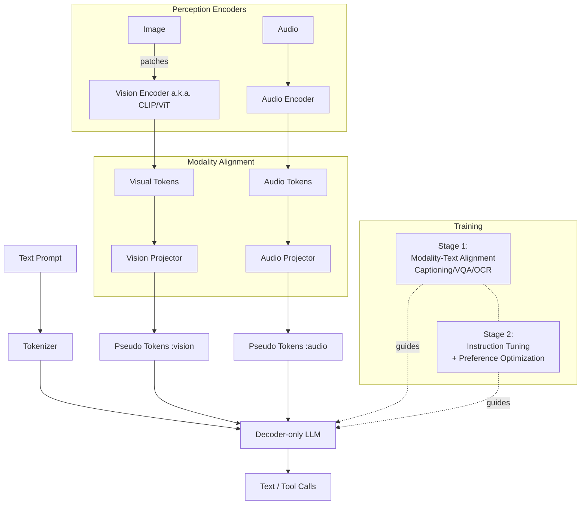

[上一篇]()发布已过去一年半，这段时间生成式AI进化肉眼可见：
- 上下文长度从万级到百万级；
- 多模态模型（文本、图像、音频、视频）；
- 数学与编程能力大幅提升；
- 联网搜索与检索增强（RAG）；
- 深度思考和推理；
- 指令遵循能力大幅提升；
- Agent与MCP；
- 除语言模型外，图像、视频、3D模型、动画等生成全面应用；
- 世界模型可生成数分钟的可交互视频；

国内大模型方面，24年底横空出世的DeepSeek V3/R1用极低的训练成本跻身最强模型之列，并通过开源在极短时间内集成进各类App。8月20日V3.1发布，更是拉开了国产GPU芯片替代Nvdia GPU训练的大幕。

本篇重点了解“多模态模型(Multimodal Large Models）”。它们不仅能理解语言文字，更能“看懂”图像、“听懂”声音，将人类丰富的感知世界以更全面的方式在数字世界中进行映射和创造。

本篇由AI起稿，人工精修。

---
系列文章
1. [用AI学AI.1]()
2. [用AI学AI.2]()
3. [用AI学AI.3]()
4. [用AI学AI.4]()

---

## 多模态

多模态大模型（Multimodal LLM, MLLM）将非文本信号（图像、音频、视频、表格、图表等）与文本统一到同一“语言空间”中建模。核心做法通常是：
- 使用**专用编码器**将各模态转成向量序列（视觉常用 ViT/CLIP，音频常用 Conformer）；
    > ViT借鉴了处理文本的Transformer架构，将图像分割成一个个小“补丁”（Patches），类似于将一句话拆分成单词。然后，ViT分析这些补丁及其相互之间的空间关系，最终生成一个能够代表整张图像内容和布局的向量序列。
- 通过**对齐模块**（线性投影、MLP、Q-Former/Adapter）把各种模态向量映射到“伪词元”；
    > 实现融合的主要技术是跨模态注意力机制。想象你在阅读一篇图文并茂的文章。当读到“埃菲尔铁塔”这个词时，你的目光会自然地移动到旁边的铁塔图片上，将文字概念与视觉形象对应起来。跨模态注意力机制就扮演了你“目光”的角色。在这个机制中，一种模态的向量（比如文本中的“埃菲尔铁塔”）会扮演查询（Query）的角色，去“质询”另一种模态的向量（图片的所有补丁）。图片中与“埃菲尔铁塔”这个概念最相关的补丁向量会作为键（Key）和值（Value）被激活，并给予更高的“注意力权重”。通过这种方式，模型就能精确地将文本描述与图像的具体区域建立起像素级的关联。
- 将这些“伪词元”与文本词元拼接，输入到解码式 LLM 统一进行自回归建模；
- 训练分两阶段：先做对齐预训练（图文对齐/描述/VQA），再做指令微调（SFT）及偏好对齐（RLHF/DPO），必要时加入工具调用与RAG。

最核心的架构差异在于，多模态模型在纯文本LLM的基础上，增加了前端的模态编码器和中端的模态融合模块。这些新增的组件是其能够感知和理解非文本世界的关键。

由此带来的优势：
- 看图读表更准确：截图、手写、图表都能“读懂”；
- 一条龙完成任务：看、想、做连成一气，少来回；
- 解释更清楚：能给出理由、圈出图中位置，过程更透明；
- 适应更快：见过类似场景就能举一反三；
- 集成更省心：一个接口支持多种输入，系统更简单、成本更低；
- 更会用工具：需要时会搜索资料、算表格、跑代码，结果更可靠。

## 市面上的多模态模型

- GPT-4o 家族（端到端文本-语音-视觉）
- Google Gemini 1.5（长上下文、全模态）
- Claude 3.5 系列（具备 Vision 能力）
- LLaVA、BLIP-2、Kosmos-2（学术与开源代表）
- Qwen-VL / Qwen2-VL（阿里）
- DeepSeek-VL（深度求索）
- InternVL / InternLM-XComposer、MiniCPM-V（开源多模态）

下面以“LLaVA 风格”的典型架构为例，说明多模态 LLM 的拼接与训练路径。

要点：
- 感知层各司其职，保持最优表征；对齐层把不同模态“翻译”为 LLM 可消费的词元；
- 统一的解码式 LLM 负责跨模态推理与响应生成；
- 通过 VQA/描述/OCR 等任务完成对齐，再用指令数据把能力打磨成“助手式”交互；
- 生产环境常结合检索（RAG）、工具（代码执行、搜索、表格计算）与多轮记忆。

## 小结

多模态让模型真正“看得见、听得到、读得懂、能动手”。在产品上，它把“感知—推理—行动”打穿；在工程上，它将多数据源统一到一个上下文接口。下一步的关键，将是更强的过程监督、更长上下文的稳定性，以及与现实世界工具和数据的更深融合。

