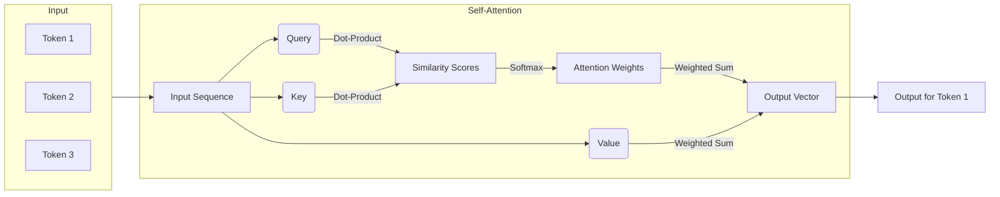

[上一篇]()我们了解了多模态模型，它们能够处理文本、图像、音频等多种信息。但无论是处理单一模态还是多模态，现代AI模型的核心驱动力之一，就是“注意力机制”（Attention Mechanism）。本篇我们就来深入探讨这个让模型“抓住重点”的关键技术。

本篇由AI起稿，人工精修。

---
系列文章
1. [用AI学AI.1]()
2. [用AI学AI.2]()
3. [用AI学AI.3]()
4. [用AI学AI.4]()

---

## 什么是注意力机制

想象一下你在阅读一段文字：“在巴黎的那个雨天，我把那把红色的雨伞落在了卢浮宫的入口处。” 当被问到“丢失了什么颜色的东西？”时，你的大脑会瞬间聚焦到“红色”和“雨伞”这两个词上，而暂时忽略“巴黎”、“雨天”等其他信息。

这种根据当前任务（问题）动态地为输入信息分配不同权重、聚焦于关键部分的能力，就是**注意力机制**的朴素思想。在深度学习中，它模仿了人类的认知注意力，让模型能够在处理一个序列（如句子）的某个部分时，“看到”并重点关注序列中的其他相关部分。这彻底改变了以往RNN/LSTM模型那种信息按顺序依次传递、容易遗忘早期信息的模式。

## 注意力机制的原理与结构

注意力机制的核心可以用三个角色来概括：查询（Query）、键（Key）和值（Value）。这三个概念源于信息检索领域，我们可以用一个图书馆查书的例子来理解：

- **查询 (Query, Q)**: 你脑中想问的问题，比如“关于人工智能历史的书”。
- **键 (Key, K)**: 书架上每本书的标签或标题，比如“《人工智能简史》”、“《深度学习革命》”。
- **值 (Value, V)**: 书本本身的内容。

查书的过程就是：
1. 用你的**查询(Q)**去和所有书的**键(K)**进行匹配，计算相似度。与“人工智能历史”最相关的书，其相似度得分就最高。
2. 将所有书的得分进行归一化（比如用Softmax），得到一个权重分布。得分最高的书权重最大。
3. 将这些权重分别乘以它们对应的**值(V)**（书本内容），然后加权求和。

最终，你就得到了一个与你的问题最相关的信息集合——也就是模型在当前步骤应该重点关注的内容。

在Transformer模型中，这种机制被称为**自注意力**（Self-Attention），因为Q、K、V都来源于同一个输入序列。也就是说，模型在处理序列中的一个词时，会计算这个词与序列中**所有其他词**的关联程度。

但只从一个角度看问题是不够的。比如，“bank”这个词，你可能需要关注它“银行”的含义，也可能需要关注“河岸”的含义。为了让模型能从不同角度理解信息，**多头注意力**（Multi-Head Attention）应运而生。

**它相当于把原始的Q、K、V通过不同的线性变换投影到多个独立的“子空间”中，在每个子空间里都独立进行一次自注意力计算。最后，将所有“头”得到的结拼接起来，再通过一次线性变换进行融合，得到最终的输出**。这使得模型可以同时关注来自不同表示子空间的信息，极大地增强了模型的表达能力。

## 注意力机制的限制

尽管强大，但标准的自注意力机制有一个显著的缺点：**计算复杂性**。

对于一个长度为N的序列，模型需要计算其中每个词与所有其他词的注意力得分，这就产生了一个N x N的注意力矩阵。因此，计算量和内存消耗都与序列长度的平方（O(N²)）成正比。当上下文窗口从几千扩展到几十万甚至上百万时，这种平方级的增长会带来巨大的计算和存储压力，成为长序列处理的主要瓶颈。

## 什么因素会影响注意力

这是作为使用者非常关心的问题。注意力能否“精准定位”，直接影响了模型的输出质量。

### 模型参数量？

**会。** 更大的模型通常意味着更强的注意力。
模型参数量（通常指模型的深度和宽度）决定了其学习和表示复杂关系的能力。一个拥有更多参数的模型，其多头注意力机制中的每个“头”就有可能学习到更细微、更独特的特征表示。这使得模型在计算注意力权重时，能够更精确地捕捉上下文中的微妙联系，从而表现出更强的“注意力”。当然，这并非无限增长，当模型规模远超数据复杂性时，收益会递减。

### 上下文窗口长度？

**会，这是一把双刃剑。**
对于同一个模型，更长的上下文窗口意味着模型在做决策时能“看到”更多的信息，理论上这有助于理解更复杂的长距离依赖关系。但实践中，效果可能不升反降。

主要原因在于**注意力稀释**或**大海捞针**问题。当上下文中充满了大量与当前任务无关的信息时，模型可能难以将有限的“注意力资源”集中在最关键的几段信息上，导致重点丢失。许多研究也表明，**模型对上下文开头和结尾的信息关注度最高，而中间部分的信息容易被忽略**（"Lost in the Middle"现象）。

### 还有哪些因素？

1.  **训练数据的质量**：模型是在海量数据中学习如何“分配注意力”的。如果训练数据质量高、逻辑清晰、信噪比高，模型就能学会更有效的注意力模式。
2.  **位置编码（Positional Encoding）**：标准的注意力机制本身不包含位置信息。它需要额外的位置编码来告诉模型每个词在序列中的顺序。位置编码的设计会影响模型对距离和顺序的敏感度。
3.  **模型架构**：稀疏注意力（Sparse Attention）、线性注意力（Linear Attention）等变体为了解决O(N²)的复杂性问题，牺牲了一部分全局注意力能力，这自然会改变注意力的效果。
4.  **微调任务的特性**：在特定任务上微调后，模型的注意力会向该任务的特定模式上“特化”，变得更擅长关注该任务中的关键信息。

## 引导LLM保持注意力

从使用者的角度，我们可以通过优化输入（Prompt Engineering）来帮助LLM更好地“抓住重点”。

1.  **明确指示，前置重点**：将最重要信息、约束或问题放在提示的开头或结尾。例如，明确说“**最重要的要求是...**”或“**请严格遵守以下约束：...**”。
2.  **结构化输入**：使用Markdown标题、列表、分隔符（如`---`）等方式将上下文结构化，帮助模型区分不同部分的主题和重要性。
3.  **上下文管理与总结**：在多轮对话中，如果担心模型忘记了前面的关键信息，可以在新的问题中主动**重申或总结**。例如：“根据我们之前讨论的[关键点A]，现在请分析[问题B]。”
4.  **角色扮演与指令**：通过设定角色（System Prompt）来预设模型的行为模式。例如，“你是一名资深代码审查员，请重点关注代码中的逻辑错误和安全漏洞。”
5.  **分步思考（Chain of Thought）**：要求模型“一步一步地思考”（Let's think step by step）。这会引导模型有序地处理信息，将注意力集中在当前的逻辑链条上，而不是在整个上下文中随机跳跃。
6.  **利用RAG（检索增强生成）**：对于需要专业知识或大量背景信息的任务，不要将所有信息都塞进上下文。使用RAG技术，只在需要时将最相关的知识片段检索出来并注入到提示中，可以极大地减少注意力的负担。

## 小结

注意力机制是现代LLM能够理解复杂上下文、进行深度推理的基石。它通过Q/K/V的交互动态分配权重，并通过多头机制从不同角度捕捉信息。尽管存在计算复杂性的限制，但通过理解影响其效果的因素（模型规模、上下文长度、数据质量等），并结合巧妙的提示工程技巧，我们作为使用者可以有效地引导模型，让它的“注意力”为我所用，从而获得更精准、更可靠的输出。
