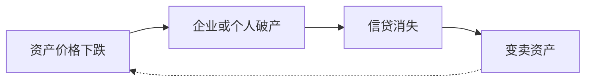

> 本文总结自`Ray Dalio: How the Economic Machine Works`，[原视频地址](https://www.youtube.com/watch?v=rFV7wdEX-Mo)

# 核心概念简述

## 什么是交易

- 买方使用`货币、信用（也叫信贷）`向卖方交换`商品、服务、金融资产`。
- 交易首先是由人的天性驱动的。
- 买方的支出总额（而不是其他）是`经济的驱动力`，所有的经济周期和动力都是交易造成的。
- 交易的主体通常有：个人、企业、银行、政府。

### 政府如何参与交易
- 政府其实同时是最大的买方和卖方。
- 政府主要由两部分：中央政府，负责收税；中央银行，负责花钱。
- 中央银行通过`利率`和`印钱`控制经济中的货币和信用（信贷数量）。

## 什么是信贷

- 信贷也是一种交易。比如你找银行借钱，你是借款人，银行是贷款人。你是交易的卖方，`银行是买方`。
- 这种交易的特殊之处在于：`交易是延迟完成的`，即借款人保证将来偿还`贷款和利息`，直到那个时候，交易才算完成。
- 交易未完成前的状态，即债务。`债务是贷款人的资产`，借款人的负债。
- 只有交易完成时，这些资产和负债才会消失。

## 什么是价格

$$
价格 = \frac{买方支出总额}{产销总量} =\frac{(货币 + 信贷)} {产销总量}
$$

## 什么是市场

一种市场，包含同一种商品的所有买方和所有卖方。有千千万万种商品或服务对应千千万万种市场。

## 什么是经济

全部市场的全部交易统称为经济。

### 经济形势变化的三条脉络

这三个相对独立的因素叠加起来，构成经济形势的变化：
- 生产率的提高（近似线性）
- 债务小周期（5~8年）
- 债务大周期（75~100年）

# 深入经济周期（债务周期）

## 信贷对经济为什么如此重要

简而言之，因为借款人通过信贷可以增加自己的支出，而支出是经济的驱动力。在没有信贷的社会中，增加支出的唯一方式是增加生产。由于信贷可以凭空产生，支出可以超越当前生产，所以能让经济注入更多活力。

更具体的说，交易双方中，A的支出是B的收入，A支出增加等于B收入增加，B偿还能力提升，信贷能力也会提升，B的支出可以进一步增加，在另一场交易中，B的支出增加等于C的收入增加……产生循环。不过要注意，借钱实质是向未来某一时刻的自己借钱，即未来那个时刻自己的收入减掉消费必须足够还钱才能保证交易最终的有效性。

`经济上下起伏不取决于人们多么善于创新或勤奋工作，而看信贷的总量。而人的天性和借贷机制决定了信贷总量一定是波动的`。

## 短期信贷周期为什么出现

考虑单一商品的情况。如果支出（消费）或者收入（消费是另一个人的收入）的增长速度超过所出售商品的生产速度，商品价格就会上涨。央行为了防止通货膨胀，会提高利率。`利率直接影响人们贷款和借款意愿`——这也是限制支出的唯一因素。还贷增加造成可支配的支出减少，商品价格下跌。

当信贷易于获得则经济扩张，信贷不易获得则经济收缩，`这个周期由央行主导`，一般5~8年。

## 长期信贷周期为什么出现

经历一个短期周期后，经济增长和债务规模都会超过前一个周期。债务规模的扩大其实正是人的天性：更喜欢消费而不是还钱。因此经历若干短周期后，债务增加的速度其实会超过收入（虽然收入也在增加）。到那时，`社会总债务会变得过重而导致支出、收入、信用的全面下降，这个过程叫去杠杆化`。

> 社会总债务：政府债务、居民债务、非金融企业债务。社会总债务过重一般是指超过GDP的好几倍。

去杠杆化过程开始后，会出现资产价格下跌、企业破产、信贷消失、无法正常还贷，只能变卖资产，进一步造成资产价格下跌，形成`恶性循环`，且无法通过降低利率摆脱（降到0以后就到底了）。例如欧美1929年、2008年，日本1989年。

根据具体情况的不同，该周期可能持续75~100年。

## 有哪些方式解决债务过重问题

衡量债务负担是否过重：

$$
债务负担 = \frac{债务}{收入}
$$

解决债务过重的四种主要手段：

- 所有交易主体`削减支出`；
  - 因为A的支出是B的收入，B收入也下降了，那么B的债务负担更重，所有人更痛苦。会演变成`通货紧缩`。
  - 例如企业为了削减成本造成大量人口失业。

- 通过判定违约和重组`减少债务`；
  - 大量借款人无法偿还即债务违约后，贷款人会向银行索要存款，造成挤兑，银行自身也会违约。这就叫`经济萧条`，即所有人都感觉自己的资产蒸发了。
  - 比债务违约稍好一点的方式是债务重组，即还款减少或延期或利率降低。
  - 不论哪种方式，由于A的债务是B的资产，债务消失或减少，意味着B的资产减少。依旧会演变成`通货紧缩`。

- 政府`财富再分配`；
  - 在去杠杆化的过程中，伴随着失业人口上升，因此政府支出变多甚至`财政赤字`，必须收更多的税或发行债券。
  - 向谁融资或征税呢？通常是富人。但容易引发`社会动荡`。如果是国与国之间，会引发`战争`。

- 央行`增发货币`；
  - 前文提到央行的两个手段：利率和印钞。利率降低到0之后，只能印钞。
  - `印出的钞票只能用来买入金融资产和政府债券`。前者可以保住金融资产（例如股市）的价格，因此提高了持有人的信用（但仅仅对持有金融资产的人有用），后者其实是把印出的钱借给政府，由政府通过救济金和刺激计划增加人们收入，`实质上是将经济系统分散的总债务，集中到政府的头上`。
  - 增发的货币刚好抵消贷款的降幅，就不会引发通货膨胀（参考前文说过的价格公式）。温和的通货膨胀本身对经济并不有害。但`增发太猛会导致恶性通货膨胀`，例如1920年的德国。

结合具体情势，通过巧妙地组合使用上述四种手段，才可以做到和谐的去杠杆。也不要太悲观，因为和谐的去杠杆化过程比信用扩张时期更好，因为此时经济是在自然缓慢增长的，夯实根基。

# 反思

- 上述模型大致可以判断当前我们处于哪个阶段，预测未来大趋势如何。
- 上述模型解释了经济周期的必然性：现代社会的经济发展依赖信贷，信贷依赖机制和人性，机制有一定的调整空间（但交易延迟完成和要连本带利是刚性的）、人性则不可避免的包含贪婪、恐惧、喜欢消费而不是还钱、从众……
- 上述模型对于个人的启发意义：
  - 不要让债务的增长速度超过收入，因为最终会让债务把你压垮；
  - 不要让收入的增长速度超过生产率，因为最终这会让你失去竞争力；
  - 尽一切努力提高生产率，因为它在长期起最关键的作用。