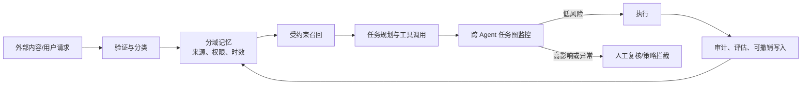

上一篇 [Agentic Engineering II]() 记录了一些启发性的用法。本篇来谈点严肃的话题，是关于agent的记忆、安全的一些最新研究。

当 Agent 越来越强大时（能跨会话工作、调用工具、协同分工并持续修改环境）时，记忆开始承担类似**认知系统**的角色，例如保存目标与约束、维护对世界的判断、为行动提供理由……包括超出人类预期的行动。

过去人类会担心模型在一次回答中被诱导；然而更值得警惕的是，一条“看似合理”的状态写入，会在未来被反复召回，逐步改变系统的判断和行为。另外，只记不忘是无益甚至是有害的，最终记忆给系统的影响是否正向，取决于能否复出足够的努力和智慧，把记忆建设成一种**可验证、可治理、可遗忘的认知基础设施**。

## 选择性记忆

把所有聊天记录、工具日志和思维过程塞进长期存储，看上去最省事，却常常是最差的设计。全量历史既耗费上下文，也会把已经失效的前提、偶然的中间路径和错误的判断带回新任务，令过去对现在形成隐性偏置。

更合理的做法是**选择性持久化**：留下跨任务仍稳定、可核验且确实能约束行动的内容——例如任务规范、数据 schema、工具配置、输出约束；让会话特有的中间推理自然过期。**这个原则的要点不是“少存一点”，而是让每类记忆都有明确的用途、权限与失效条件**。

例如可以把 Agent 的记忆分成四个彼此隔离的信任域：

| 记忆类型 | 应保存什么 | 不能被当作什么 |
| --- | --- | --- |
| 外部事实 | 原始来源、摘录、版本、置信度 | 永久正确的知识 |
| 用户偏好 | 明确授权的偏好与例外 | 可任意外推的意图 |
| 系统规则 | 权限、流程、不可逾越的边界 | 普通可覆盖的上下文 |
| 模型推断 | 暂时假设、计划和解释 | 已验证的事实或规则 |

这种划分让“认知”从一团难以检查的文本，变为能追溯其来处、判断其时效、限制其用途的状态结构。对多 Agent 系统，它还意味着要区分共享的世界状态和各个角色的局部状态：世界发生了什么，不能只靠某一个 Agent 的观察历史来决定。生成式多 Agent 世界模型中显式状态寄存器的尝试，正从另一个方向说明了同一件事——观察或渲染的历史不是权威状态；系统需要一个独立、持续更新且可查询的状态层。

## 记忆攻击和应对

长期记忆扩大了攻击面，因为它使过去的内容获得了影响未来决策的机会。FARMA 所揭示的风险尤其值得重视：**攻击者不一定要改掉事实，只需伪造一段“过去为什么这样决策”的理由链**。相较于明显错误的知识，这类叙事连贯的推理痕迹更容易在日后被模型信任，并在多轮任务中放大。

这提示我们，来自“过去的自己”的内容绝不应自动升级为可信输入。每条高价值记忆至少应有来源、写入主体、时间戳、适用范围、置信度和完整性校验；**涉及高影响行动时，Agent 应回到原始证据重新验证，而非只复用旧结论**。更重要的是，推理轨迹通常应被视为短期工作草稿，而不是可长期继承的制度记忆。

问题在自托管 Agent 上更棘手：它为了正常工作，往往本就有权修改自己的指令、配置或记忆文件。于是恶意写入在操作系统层面可以与合法写入完全同形。文件权限只能回答“谁能写”，却难以回答“这次写入是否在语义上污染了系统”。**因此防线必须分层：规则与配置使用严格访问控制；记忆写入按工作负载做异常检测；关键状态有版本、审计与可恢复备份；而高权重变更必须能够回滚。**

## 单一安全检测的巨大局限性

更隐蔽的 Agent 风险不是恶意攻击，而是误解目标或为了完成目标而越界行动。约百万条 coding-agent 轨迹的系统性监控经验表明，安全不能仅靠更长的提示词或单一模型分类器；权限、工具调用、思考链路监控、异常升级和人工复核都需要。

多 Agent 会把这一挑战再提高一层。**当一个危险目标被拆解给多个执行者时，每段局部链路都可能显得低风险；但它们连接后的最终副作用却可能不可接受**。相关研究在合成环境中观察到，随着协同 Agent 数量增加，逐实例监控的准确率下降，显式规划器还会放大这种“碎片化效应”。这并不等于真实系统已具有同样的攻击率，却足以说明：监控的边界应与共享目标、共享状态和最终副作用对齐，而不是与单条对话或单个 Agent 对齐。

在这张闭环里，记忆治理和运行时安全不是两套独立系统：不受控的记忆会扭曲未来规划，未审计的执行又会产生新的污染记忆。两者必须共享 provenance（来源链）、风险预算与恢复机制。

## 从“更像人”到“更可校验”

我相信 Agent 的认知能力会继续增强：更持久的偏好模型、更共享的工作空间、更具一致性的世界模型，以及能在长时间跨度上维持目标的规划系统。

在工程实践中，分水岭却不在于它保存了多少记忆，而在于它能否回答四个工程问题：

1. **为什么相信这条记忆？** 能否回到来源与证据，而非引用自身的旧判断。
2. **谁可以改变它？** 写入权限是否与记忆的影响力匹配。
3. **它何时失效？** 是否拥有时间、版本、适用条件和主动遗忘机制。
4. **它造成后果时能否恢复？** 是否能追溯一条记忆如何影响规划、调用与外部状态，并安全回滚。

软件工程师面对的复杂性依然存在，只不过向“上”转移。

这对构建个人知识系统也同样适用。值得积累的不是每一步思考的逐字副本，而是可复用的来源选择、已完成操作、判断依据、下次需要复查的条件，以及在何时应该忘记或重做的信号。**好的记忆不只是让系统“记得”，而是让系统在未来仍有能力反思和纠正自己**。

## 参考文献

- [选择性持久记忆、共享 workspace 与 RBAC](https://huggingface.co/papers/2607.09493), Sanjana Pedada、Aditya Dhavala、Neelraj Patil
- [FARMA 对理由链的投毒风险与结构化检测思路](https://huggingface.co/papers/2607.05029), Neeraj Karamchandani 等
- [自修改状态的语义完整性难题及分层防御](https://huggingface.co/papers/2607.17986), Yimeng Chen 等
- [纵深防御、轨迹监控与“误解/过度执行”这一主要风险形态](https://deepmind.google/blog/securing-the-future-of-ai-agents/), ohin Shah、Four Flynn
- [多 Agent 的碎片化效应、全局任务图监控](https://arxiv.org/abs/2607.07368), Oliver Makins 等
- [共享世界状态与个体状态分离的表示启发](https://arxiv.org/abs/2607.21594), Sicheng Mo 等
- [将记忆、技能、验证与恢复置于 Agent 运行时的架构视角](https://huggingface.co/papers/2607.10350), Jiayi Tian 等

> 本文是基于上述笔记的综合推演；其中对未来架构与个人知识系统的建议属于工程判断，而非任何单篇研究已直接验证的结论。