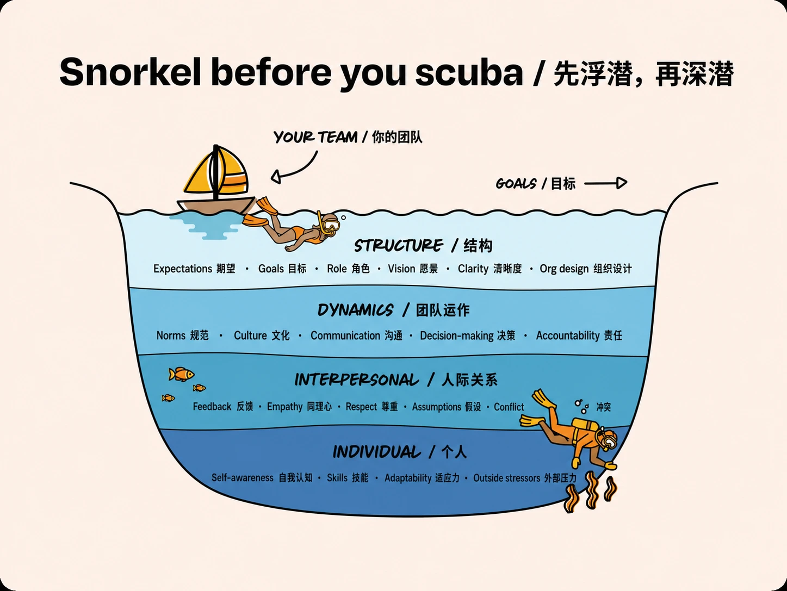

> 当一个团队出现问题，人的本能反应是认为某些人表现不好。推荐阅读 [How to debug a team that isn’t working](https://www.lennysnewsletter.com/p/how-to-debug-a-team-that-isnt-working)，里面提出的 Waterline Model 是一个很好的思考框架：**先检查塑造所有人行为的系统，再判断某个人是否真的失败了**。记录下来，常看常新。

如果把团队想象成一艘驶向目标的船。船走得慢、方向混乱，甚至原地打转时，船上的水手最显眼：谁没有划桨，谁的动作不协调，谁似乎能力不足。但真正制造阻力的东西，可能藏在水面之下。

Waterline Model 把问题分成四层：

1. **结构（Structure）**：目标、角色、期望、愿景和组织设计是否清楚。
2. **团队运作（Dynamics）**：日常如何沟通、决策、处理分歧和承担责任。
3. **人际关系（Interpersonal）**：两个人之间是否缺乏信任，是否存在没有解决的冲突。
4. **个人（Individual）**：能力、适应力、自我认知、压力与价值观是否匹配当前角色。

关键不只是这四层，而是检查的顺序：**从离个人最远、影响范围最大的地方开始，逐层向下。** 原文把它概括成一句很形象的话：*Snorkel before you scuba*——先浮潜，再深潜。

## 第一层：结构

很多所谓的执行问题，其实是**定义问题**。

可以分别问团队成员几个简单的问题：团队究竟要达成什么目标？你负责什么？哪个指标由你推动？什么样才算成功？如果答案彼此矛盾，就还没有条件评价个人表现。大家可能都很努力，只是在朝不同方向划船。

结构层常见的问题包括：

- 团队目标含糊，或者同时存在互相冲突的优先级；
- **角色边界不清，重要工作无人负责，或者多人重复负责**；
- 管理者心中的成功标准，从未变成团队可以执行和验证的标准；
- 组织设计与实际工作流不匹配，**协作成本高**，以及成本被错误地归到个人头上。

这时应该先澄清团队使命、目标、角色与成功标准。

## 第二层：团队运作

有时实际运行却是另一套规则。

例如，某些管理者**口头上授权团队快速决策，却经常插手相对微观的决策，或者时常推翻团队的决定**。团队很快就会学会自保：增加汇报、把本可自行决定的事情层层上交。外面看起来像执行缓慢，里面却是一群人在对不稳定的决策环境作出理性反应。

真正的团队规则，在于什么行为会被奖励、惩罚、容忍或忽略。

- 决定由谁做出，做出后是否稳定；
- 冲突能否被公开讨论并得到结论；
- 坏消息是否能够顺畅地向上传递；
- 失败之后，团队是在学习，还是在寻找责任人；
- 管理者的实际行为，是否和宣称的原则一致。

流程可以辅助改变，但无法代替领导者改变自己发出的信号。

## 第三层：人际关系

排除了结构和团队运作问题，才应该直接处理关系本身：明确说出紧张关系，描述它如何影响工作，并约定双方必须改变的行为。对关键合作关系而言，建立可工作的信任，本来就可以是角色职责和绩效标准的一部分。

有些关系可以修复，有些不能。重要的是不要用含糊的“磨合”无限拖延，也不要在系统问题尚未解决时匆忙换人。

## 第四层：个人

如果目标清楚、角色合理、团队运作正常、关键关系也得到处理，而一个人仍然无法达到要求，这时才更可能是个人层面的问题。

接下来要回答的不是“这个人好不好”，而是更长远的问题：**他将来能否胜任**？差距能否在业务可以承受的时间内通过辅导补上？如果可以，就明确投入和改善标准；如果不可以，就调整角色或作出干净的人员决定。

## 不是永远不谈个人

最后，Waterline Model 并不是说所有问题都是系统问题，也不是要管理者回避困难的人员决定。它强调的是：**个人应该是诊断的最后一层，而不是情绪上的第一反应。**

一个实用的排查顺序是：

1. 团队所有人是否对目标、角色和成功标准有共同理解？
2. 实际的决策、沟通与问责方式，是否支持这些目标？
3. 是否存在必须直接修复的人际冲突？
4. 在前三层都合理之后，个人与角色是否仍然不匹配？

所以，当下次脑中冒出“就是某个人不行”时，最好先停一下，再想一想。也许有更重要的系统问题要先解决。
