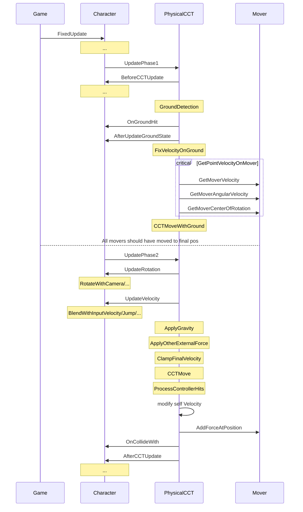

> 本文也是[PhysX物理引擎系列]()的番外篇。介绍了笔者基于CharacterController(CCT)设计的一个新的角色控制器，在修补Unity/PhysX的CCT的缺陷外，还增添了若干和物理交互相关的有趣特性。代码已经过实际项目验证，这里仅保留和具体业务无关的部分。

# 背景和需求
[前文]()结尾处提到一些PhysX自带的CCT（Unity也是基于此二次封装出`CharacterController`组件）在实际游戏开发中的缺点，这里再次总结：
- **CCT不参与碰撞系统的检测**。仅当CCT自身移动时会判断是否被其他刚体或CCT阻挡。这就造成一个BUG：CCT自身静止时，其他运动物体会穿过CCT且没有事件触发。[官方论坛上有苦主](https://discussions.unity.com/t/proper-collision-detection-with-charactercontroller/564371)持续8年向Unity反馈这个问题但无法解决，目前已知的唯一绕过方式是每帧给CCT附加一个微小的位移（下文中的`SlightMove`）。
- **Unity提供的接口`CharacterController.isGrounded`效果很不稳定**。其内部只是判断CCT上次运动后底部是否触碰物体。即`collisionFlags & eCOLLISION_DOWN::eCOLLISION_DOWN`。但在上下坡或崎岖地形时，很容易出现侧面触碰或短暂浮空。如果用该接口驱动动画表现甚至跑跳逻辑，效果很差。需要自行基于SceneQuery封装出更加稳定的判定着地的函数。
- **Unity没有暴露`CCT.upVector`，角色总是竖直向上的**。要实现反重力鞋在任意斜面上行走或像`马里奥银河`那样在曲面上跑跳穿梭，只能放弃使用CCT但也放弃了其在操作手感上的改善。其实拿到Unity的源码后，只用了十分钟将底层字段暴露到C#层就解决了该问题。

新的角色控制器需要增加的物理交互特性有：
- 受力。
    - 既可以像传统CCT一样精准操控运动，也可以像刚体一样对其施力。
    - 其他刚体可以对其产生推挤、撞飞效果。
    - 自身重力可在陡坡上产生滑行效果。
- 施力。运动时具有推力，自身重力可以对外做功。
- 重力方向。大小和方向动态可变，方向变化时可自动旋转CCT以调整姿态。
- 移动平台。CCT可附着在所有移动对象上跟随运动，不借助父子结构。

另外CCT还支持了两种网络同步方式：服务端跟随客户端（通过校验维持服务端权威性）、客户端跟随服务端（通过外插减小延迟），并且可以动态切换。考虑到篇幅，**本篇对同步算法不展开介绍**。

# 技术路线
角色要实现丰富的物理交互，大体有三种思路：
1. 基于CCT，添加动力学模拟（施力、受力）。运动受控度最高，但算法复杂。
2. 基于Kinematic刚体，添加CCT特性（`Collide-and-Slide`） 、添加动力学模拟（受力运动）。运动受控度高，但算法复杂。
3. 基于Dynamic刚体，添加部分CCT特性。例如`Active Ragdoll`技术。运动受控度低，但逻辑简洁，且特别适合糖豆人这类休闲蠢萌角色。

结合玩法类型和项目实际情况，为了最大化复用原有角色功能，最终选择了第一种思路。

# 框架设计
要模拟各类物理交互，有三个重要设计。
1. **所有交互最终都转化为速度这个物理量**。每帧通过融合后的总速度产生一次cctmove。具体交互包括摇杆输入、API输入、重力、摩擦、碰撞时的冲量...
2. **交互对象不限于刚体，而是所有实现了`IPhysicalMover`接口的对象**。这样就将不参与刚体仿真的对象也统一起来（比如cct和被强制移动的static collider）。
3. **将交互效果的计算，分为内核与接口**。内核部分`PhysicalCCT`实现了物理交互的核心计算和流程，不同业务的角色类只需实现`IPhysicalCharacter`接口部分就能受内核驱动，并定制玩法相关的效果。

下面是两个接口的定义：
```cs
/// <summary>
/// a actor who has mass, velocity, and can add force to. (e.g. moving platform)
/// </summary>
public interface IPhysicalMover
{
    float GetMoverMass();
    Vector3 GetMoverCenterOfRotation();
    Vector3 GetMoverVelocity(); //m/s
    Vector3 GetMoverAngularVelocity(); //degree/s
    void AddForceAtPosition(Vector3 force, ForceMode mode, Vector3 hitPoint);
}

public interface IPhysicalCharacter
{
    void BeforeCCTUpdate();
    void AfterCCTUpdate();

    /// <summary>
    /// Can be used to do Landing/Take off game logic based on CurrentGroundState and LastGroundState
    /// </summary>
    void AfterUpdateGroundState();

    /// <summary>
    /// Update CCT rotation according to input and game logic (e.g., change Forward to moving dir, or rotate Up to align with gravity). 
    /// BaseRotation means auto-generated rotation if walking on the surface of a rotating platform.
    /// Return modified Rotation.
    /// </summary>
    Quaternion UpdateRotation(Quaternion BaseRotation, float gameTime, float deltaTime);

    /// <summary>
    /// Update CCT velocity according to input (walk, run, jump...should have different speed) and game logic (e.g., if Dead, set velocity to zero).
    /// Do not add gravity inside.
    /// Return modified Velocity.
    /// </summary>
    Vector3 UpdateVelocity(Vector3 BaseVelocity, float gameTime, float deltaTime);

    void OnGroundHit(Collider hitCollider, Vector3 hitNormal, Vector3 hitPoint); // during GroundDetection
    void OnCollideWith(Collider hitCollider);
}
```

下面是框架调用流程。


框架代码示意：
```cs
public void UpdatePhase1(float gameTime, float deltaTime)
{
    m_Character.BeforeCCTUpdate();
    ResetEveryFrame(deltaTime);
    GroundDetection(); // may modify PositionNew if force unground
    m_Character.AfterUpdateGroundState();
    FixVelocityOnGround(deltaTime); // modify VelocityNew
    CCTMoveWithGround(deltaTime) // modify VelocityNew, RotationNew, PositionNew
}

public void UpdatePhase2(float gameTime, float deltaTime)
{
    RotationNew = m_Character.UpdateRotation(RotationNew, gameTime, deltaTime);
    VelocityNew = m_Character.UpdateVelocity(VelocityNew, gameTime, deltaTime);

    // apply gravity
    if (UseGravity && !IsGrounded)
    {
        VelocityNew += GravityDirection * GravityScale * deltaTime;
    }
    // apply other external force
    if (AdditionalForceToApply.sqrMagnitude > 0)
    {
        VelocityNew += AdditionalForceToApply;
        AdditionalForceToApply = Vector3.zero;
    }
    VelocityNew = ClampVelocity(VelocityNew);
    CurrentCollisionFlags = DoCCTMove(ref PositionNew, VelocityNew, deltaTime, true); // true means snap to ground
    ProcessControllerHits(); // may modify VelocityNew
    //...
    Velocity = VelocityNew; // for outside logic
    m_Character.AfterCCTUpdate();

#if UNITY_EDITOR
    RecordPreviousPositions(PositionNew); // for debug gizmos
#endif
}

```


# 具体功能实现
下面列举几个关键功能的实现方式。

## 着地状态检测`GroundDetection`
首先，PhysicalCCT中记录的关于着地状态的字段有：

```cs
public class PhysicalCCT : MonoBehaviour
{
    //...

    [Serializable]
    public struct GroundingState
    {
        public bool IsGrounded; // todo: we can decide if on a stable ground, or on an edge.
        public Vector3 GroundNormal;
        public Vector3 SnapToGroundDisplacement;// assigned when IsGrounded is true, and apply once in current frame's cctmove

        public IPhysicalMover Mover; // can be null
        public Vector3 MoverVelocityAtPosition;
        public Vector3 MoverAngularVelocityAtPosition;
    }
    public GroundingState CurrentGroundState;
    public GroundingState LastGroundState;

    public const float GroundDetectionBackDistance = 0.002f; // avoid raycast exactly from ground. must smaller than MinGroundDetectionDistance
    public float GroundDetectionDistance {
        get {
            var distance = 0.1f + GroundDetectionBackDistance + (LastGroundState.IsGrounded ? StepOffset : 0f);
            return distance;
        }
    }

    private RaycastHit[] m_GroundDetectionBuffer = new RaycastHit[8];
    private bool m_ForceUnground = false;
    private int m_ForceUngroundReMainFrameCount = 0;

    public bool IsLanding
    {
        get
        {
            return !LastGroundState.IsGrounded && CurrentGroundState.IsGrounded;
        }
    }
    public bool IsSliding
    {
        get
        {
            return IsGroundTooSteep(CurrentGroundState);
        }
    }
    public bool IsGrounded
    {
        get
        {
            return CurrentGroundState.IsGrounded;
        }
    }

    private bool IsGroundTooSteep(GroundingState state)
    {
        if (state.IsGrounded)
        {
            float slopeAngle = Vector3.Angle(CharacterUp, state.GroundNormal);
            if (slopeAngle > 90)
            {
                return false;// meaningless
            }
            return slopeAngle > SlopeLimit;
        }
        return false;
    }
}


```

流程图中`GroundDetection`内部逻辑如下：

```cs
private void GroundDetection()
{
    LastGroundState = CurrentGroundState;

    var newState = new GroundingState();
    newState.IsGrounded = false;

    if (IsForcingUnGround) // e.g. request jump
    {
        m_ForceUngroundReMainFrameCount--;
        if (m_ForceUngroundReMainFrameCount <= 0)
        {
            m_ForceUnground = false;
            PositionNew += CharacterUp * GroundDetectionBackDistance; // ensure next frame
        }
    }
    else
    {
        var groundLayerMask = PhysicsUtil.GetLayerMask(...); // use your own layer mask
        RaycastHit closestSweepHit;
        var startPos = PositionNew + CharacterUp * GroundDetectionBackDistance; //add a little offset to avoid raycast exactly from ground

        var DetectionDirection = -CharacterUp; // not GravityDirection, because "OnGround" means stand on feet

        var isHit = CCTSweep(startPos, DetectionDirection, GroundDetectionDistance, groundLayerMask, out closestSweepHit);

        if (isHit && closestSweepHit.collider != null && !closestSweepHit.collider.isTrigger) // do not include trigger
        {
            newState.IsGrounded = true;
            newState.SnapToGroundDisplacement = (closestSweepHit.distance - GroundDetectionBackDistance) * DetectionDirection;

            Vector3 hitPos;
            RaycastHit closestRaycastHit;
            var extraDistance = Mathf.Max(Radius, StepOffset);
            if (CCTRaycast(startPos, DetectionDirection, GroundDetectionDistance + extraDistance, groundLayerMask, out closestRaycastHit)) // more precise
            {
                newState.GroundNormal = closestRaycastHit.normal;
                newState.Mover = closestSweepHit.collider.gameObject.GetComponentInParent<IPhysicalMover>();
                hitPos = closestRaycastHit.point;
            }
            else // fallback
            {
                newState.GroundNormal = closestSweepHit.normal;
                newState.Mover = closestSweepHit.collider.gameObject.GetComponentInParent<IPhysicalMover>();
                hitPos = PositionNew;
            }

            if (newState.Mover != null)
            {
                var pressure = GravityDirection * GravityScale * Mass;
                newState.Mover.AddForceAtPosition(pressure, ForceMode.Force, hitPos);
            }
        }
    }

    CurrentGroundState = newState;
}

Vector3 m_sweep_point1 = Vector3.zero;
Vector3 m_sweep_point2 = Vector3.zero;
Vector3 m_sweep_direction = Vector3.zero;
float m_sweep_distance = 0;
float m_sweep_radius = 0;

private bool CCTSweep(Vector3 position, Vector3 direction, float distance, int layermask, out RaycastHit closestHit)
{
    closestHit = new RaycastHit();

    if (distance <= 0)
    {
        return false;
    }

    distance += SkinWidth; // must add skinwidth, since capsulecast m_sweep_point1 is hemi-sphere center, not capsule foot position

    var bias = Height * 0.5f - Radius;
    m_sweep_point1 = position + CharacterUp * (CenterOffset.y - bias); // foot hemi-sphere center
    m_sweep_point2 = position + CharacterUp * (CenterOffset.y + bias); // head hemi-sphere center

    m_sweep_distance = distance;
    m_sweep_radius = Radius;
    m_sweep_direction = direction.normalized;

    if (m_sweep_direction.sqrMagnitude <= 0)
    {
        Debugger.Log("Invalid sweep direction:" + direction.ToString("G3"));
        return false;
    }

    int numberOfHits = Physics.CapsuleCastNonAlloc(m_sweep_point1, m_sweep_point2, m_sweep_radius, m_sweep_direction, m_GroundDetectionBuffer, m_sweep_distance, layermask);
    //find closest hit
    bool foundValidHit = false;
    float closestHitDistance = float.MaxValue;
    for (int i = 0; i < numberOfHits; i++)
    {
        var hit = m_GroundDetectionBuffer[i];
        if (hit.distance > 0 && hit.distance < closestHitDistance)
        {
            closestHitDistance = hit.distance;
            closestHit = hit;
            foundValidHit = true;
        }
    }

    return foundValidHit;
}

private bool CCTRaycast(Vector3 position, Vector3 direction, float distance, int layermask, out RaycastHit closestHit)
{
    closestHit = new RaycastHit();

    int numberOfHits = Physics.RaycastNonAlloc(position, direction, m_GroundDetectionBuffer, distance, layermask);
    //find closest hit
    bool foundValidHit = false;
    float closestHitDistance = float.MaxValue;
    for (int i = 0; i < numberOfHits; i++)
    {
        var hit = m_GroundDetectionBuffer[i];
        if (hit.distance > 0 && hit.distance < closestHitDistance)
        {
            closestHitDistance = hit.distance;
            closestHit = hit;
            foundValidHit = true;
        }
    }

    return foundValidHit;
}
```

## 落地速度修正`FixVelocityOnGround`
这一步的目的是防止落地后弹跳等不自然表现，以及向上冲陡坡时的限制。
```cs
private void FixVelocityOnGround(float deltaTime)
{
    if (!IsGrounded)
    {
        return;
    }

    Vector3 tempVelocity = VelocityNew;

    if (IsLanding)
    {
        tempVelocity = ProjectVectorToPlane(tempVelocity, CharacterUp); // no jump up
        Vector3 vRight = Vector3.Cross(tempVelocity, CharacterUp);
        Vector3 tangentDir = Vector3.Cross(CurrentGroundState.GroundNormal, vRight).normalized;
        tempVelocity = tangentDir * tempVelocity.magnitude; // reorient velocity along ground tangent
    }

    if (IsSliding)
    {
        Vector3 slidingAcceleration = ProjectVectorToPlane(GravityDirection * GravityScale, CurrentGroundState.GroundNormal);
        tempVelocity = ProjectVectorToPlane(tempVelocity, CurrentGroundState.GroundNormal);

        if (ForbidUphillMovementWhenSliding)
        {
            var slidingProjection = Vector3.Dot(tempVelocity, slidingAcceleration.normalized);
            if (slidingProjection < 0) // has uphill velocity
            {
                // discard uphill velocity
                tempVelocity -= slidingProjection * slidingAcceleration.normalized;
            }
        }

        tempVelocity +=  slidingAcceleration * deltaTime;
    }

    VelocityNew = tempVelocity;
}

/// <summary>
/// Discard velocity that is perpendicular to the hit normal from v
/// </summary>
private Vector3 ProjectVectorToPlane(Vector3 v, Vector3 planeNormal)
{
    return v - Vector3.Dot(v, planeNormal) * planeNormal;
}
```

## 移动平台跟随`CCTMoveWithGround`
此时已经获得了着地状态，如果脚下是移动平台，需要处理跟随运动、以及跳进跳出时的惯性。
```cs
{
    Vector3 MoverVelocity = Vector3.zero;
    Vector3 MoverAngularVelocity = Vector3.zero;
    GetPointVelocityFromPhysicalMover(CurrentGroundState.Mover, PositionNew, deltaTime, out MoverVelocity, out MoverAngularVelocity);
    CurrentGroundState.MoverVelocityAtPosition = MoverVelocity;
    CurrentGroundState.MoverAngularVelocityAtPosition = MoverAngularVelocity;

    // jump between different moving grounds
    if (LastGroundState.Mover != null && CurrentGroundState.Mover != LastGroundState.Mover)
    {
        VelocityNew += LastGroundState.MoverVelocityAtPosition;
        VelocityNew -= CurrentGroundState.MoverVelocityAtPosition;
    }

    // do not bump when landing
    if (LastGroundState.Mover == null && CurrentGroundState.Mover != null)
    {
        VelocityNew -= ProjectVectorToPlane(CurrentGroundState.MoverVelocityAtPosition, CharacterUp);
    }

    // rotate with mover
    if (CurrentGroundState.MoverAngularVelocityAtPosition.sqrMagnitude > 0)
    {
        Vector3 newForward = Quaternion.Euler(CurrentGroundState.MoverAngularVelocityAtPosition * deltaTime) * CharacterForward;
        newForward = ProjectVectorToPlane(newForward, CharacterUp).normalized;
        RotationNew = Quaternion.LookRotation(newForward, CharacterUp);
    }

    // translate with mover
    if (CurrentGroundState.MoverVelocityAtPosition.sqrMagnitude > 0)
    {
        DoCCTMove(ref PositionNew, CurrentGroundState.MoverVelocityAtPosition, deltaTime, false);
    }
}

// Turn on SlightMove when user is not moving, this is to detect collision
private CollisionFlags DoCCTMove(ref Vector3 position, Vector3 velocity, float deltaTime, bool extraSnapToGround)
{
    float noiseMovemet = 0.001f * deltaTime;
    Vector3 movement = SlightMove ? noiseMovemet * CharacterForward : Vector3.zero;

    if (velocity.sqrMagnitude > 0)
    {
        movement = velocity * deltaTime;
    }

    // Snap to ground: add displacement to keep character attached when going downhill
    if (extraSnapToGround && CurrentGroundState.IsGrounded && CurrentGroundState.SnapToGroundDisplacement.sqrMagnitude > 0)
    {
        movement += CurrentGroundState.SnapToGroundDisplacement;
    }

    var flags = m_CCT.Move(movement);
    position = m_CCT.transform.position;
    return flags;
}
```

## 与输入速度混合`BlendWithInputVelocity`
这一步是在实现接口函数`UpdateVelocity`时，将传入的`BaseVelocity`和读取到的玩家输入进行混合，包括处理跳跃、空中移动等。

```cs
Vector3 IPhysicalCharacter.UpdateVelocity(Vector3 BaseVelocity, float gameTime, float deltaTime)
{
    Vector3 originalV = BaseVelocity;

    // handle jump separately
    if (RequestJump)
    {
        RequestJump = false;

        if (PhysicalCCT.JumpCount < PhysicalCCT.JumpMaxCount)
        {
            float jumpupSpeed = Mathf.Sqrt(PhysicalCCT.JumpHeight * 2 * PhysicalCCT.GravityScale);

            if (PhysicalCCT.CurrentGroundState.IsGrounded)
            {
                PhysicalCCT.JumpCount = 1;
                BaseVelocity += jumpupSpeed * PhysicalCCT.CharacterUp;
                PhysicalCCT.ForceUnground();
            }
            else
            {
                // when second jump, it reset BaseVelocity along CharacterUp direction, rather than add to BaseVelocity
                var cutVelocity = Vector3.Dot(BaseVelocity, PhysicalCCT.CharacterUp) * PhysicalCCT.CharacterUp;
                var restVelocity = BaseVelocity - cutVelocity;
                BaseVelocity = restVelocity + jumpupSpeed * PhysicalCCT.CharacterUp;
                PhysicalCCT.JumpCount++;
            }
        }
    }
    else
    {
        Vector3 InputVelocity = Vector3.zero;
        if (PhysicalCCT.CurrentGroundState.IsGrounded) // standing, walking, running
        {
            PhysicalCCT.JumpCount = 0; // reset jump count
            InputVelocity = MovingDirection * MoveSpeed;

            // rotate InputVelocity onto ground plane, only if IsSliding false
            Vector3 groundNormal = PhysicalCCT.CurrentGroundState.GroundNormal;
            if (InputVelocity.sqrMagnitude > 0 && groundNormal.sqrMagnitude > 0)
            {
                InputVelocity = PhysicalCCT.ReorientVelocityToPlane(InputVelocity, PhysicalCCT.CharacterUp, groundNormal);
            }

            // assign BaseVelocity with InputVelocity
            if (PhysicalCCT.IsSliding)
            {
                // usually we don't want to lose control immediately, but gradually
                BaseVelocity += Vector3.Lerp(InputVelocity, Vector3.zero, 1f - Mathf.Exp(-PhysicalCCT.LoseControlMoveSensibility * deltaTime));
            }
            else
            {
                // we want to move as desired velocity (InputVelocity) quickly, but not immediately
                BaseVelocity = Vector3.Lerp(BaseVelocity, InputVelocity, 1f - Mathf.Exp(-PhysicalCCT.ControlMoveSensibility * deltaTime));
            }
        }
        else // falling
        {
            if (PhysicalCCT.CanMoveInAir)
            {
                // when dashing, moving dir is 0,0,0
                var dir = MovingDirection;
                dir.y = 0;
                var horizontalBaseVelocity = dir.normalized * MoveSpeed;

                // when in air, don't change horizontal velocity if no input
                if (horizontalBaseVelocity.sqrMagnitude > 0)
                {
                    BaseVelocity.x = horizontalBaseVelocity.x;
                    BaseVelocity.z = horizontalBaseVelocity.z;
                }
            }
        }
    }
    return BaseVelocity;
}

```

## 受力运动`ApplyOtherEnternalForce`
Addforce支持多种施力模式，和刚体类似。转化为速度后，最后在`ApplyOtherEnternalForce`中直接叠加到`VelocityNew`。

```cs
public void AddExternalForce(Vector3 force, ForceMode mode = ForceMode.Force)
{
    switch (mode)
    {
        case ForceMode.Force:
            AdditionalForceToApply += force * DeltaTime / Mass;
            break;
        case ForceMode.Acceleration:
            AdditionalForceToApply += force * DeltaTime;
            break;
        case ForceMode.Impulse:
            AdditionalForceToApply += force / Mass;
            break;
        case ForceMode.VelocityChange:
            AdditionalForceToApply += force;
            break;
        default:
            break;
    }
}
```

## 处理物理碰撞效果`ProcessControllerHits`
被推挤还是被撞飞有一个判定阈值。`SolveCCTCollideWithMovableObject`内部，会根据二者相碰时碰撞方向上的速度差，以及二者的质量差，决定是弹性或是非弹性碰撞。

```cs

/// <summary>
/// This is called just after CCTMove
/// </summary>
private void OnControllerColliderHit(ControllerColliderHit hit)
{
    var mover = hit.gameObject.GetComponentInParent<IPhysicalMover>();
    if (mover != null)
    {
        ControllerHitInfo projectionHit = new ControllerHitInfo();
        projectionHit.HitNormal = hit.normal;
        projectionHit.HitPoint = hit.point;
        projectionHit.Mover = mover;
        projectionHit.CCTHitVelocity = Velocity;

        m_ControllerHits.Add(projectionHit);
    }
}

private void ProcessControllerHits()
{
    for (int i = 0; i < m_ControllerHits.Count; i++)
    {
        var hitInfo = m_ControllerHits[i];
        if(!hitInfo.IsValid() || m_HittedMovers.Contains(hitInfo.Mover))
        {
            continue;
        }
        m_HittedMovers.Add(hitInfo.Mover);

        // todo: what if Mover is other CCT/PhysicalMover

        float moverMass = hitInfo.Mover.GetMoverMass();
        float cctMass = this.Mass;

        Vector3 cctVelocityDeltaAfterCollision, moverVelocityDeltaAfterCollision;
        bool isBounce = PhysicalContactSolver.SolveCCTCollideWithMovableObject(this,
            hitInfo.HitNormal, hitInfo.CCTHitVelocity, hitInfo.MoverHitVelocity, cctMass, moverMass, 
            out cctVelocityDeltaAfterCollision, out moverVelocityDeltaAfterCollision);

        if (!isBounce && UseCustomPushForce)
        {
            hitInfo.Mover.AddForceAtPosition(hitInfo.HitNormal * (-CustomPushForce), ForceMode.Force, hitInfo.HitPoint);
        }
        else
        {
            VelocityNew += cctVelocityDeltaAfterCollision;

            hitInfo.Mover.AddForceAtPosition(moverVelocityDeltaAfterCollision, ForceMode.VelocityChange, hitInfo.HitPoint);
        }
    }
}
```