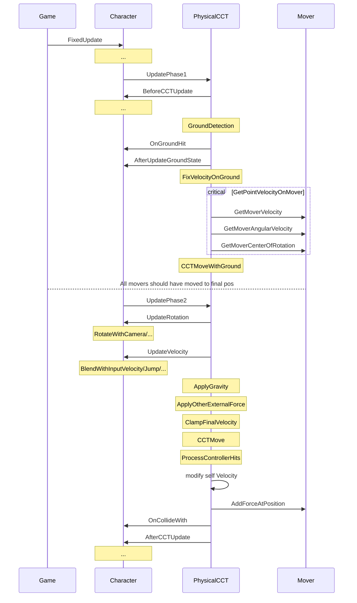

> 本文也是[PhysX物理引擎系列]()的番外篇。介绍了笔者基于CharacterController(CCT)设计的一个新的角色控制器，在修补Unity/PhysX的CCT的缺陷外，还增添了若干和物理交互相关的有趣特性。代码已经过实际项目验证，这里仅保留和具体业务无关的部分。

# 背景和需求
[前文]()结尾处提到一些PhysX自带的CCT（Unity也是基于此二次封装出`CharacterController`组件）在实际游戏开发中的缺点，这里再次总结：
- **CCT不参与碰撞系统的检测**。仅当CCT自身移动时会判断是否被其他刚体或CCT阻挡。这就造成一个BUG：CCT自身静止时，其他运动物体会穿过CCT且没有事件触发。[官方论坛上有苦主](https://discussions.unity.com/t/proper-collision-detection-with-charactercontroller/564371)持续8年向Unity反馈这个问题但无法解决，目前已知的唯一绕过方式是每帧给CCT附加一个微小的位移。
- **Unity提供的接口`CharacterController.isGrounded`效果很不稳定**。其内部只是判断CCT上次运动后底部是否触碰物体。即`collisionFlags & eCOLLISION_DOWN::eCOLLISION_DOWN`。但在上下坡或崎岖地形时，很容易出现侧面触碰或短暂浮空。如果用该接口驱动动画表现甚至跑跳逻辑，效果很差。需要自行基于SceneQuery封装出更加稳定的判定着地的函数。
- **Unity没有暴露`CCT.upVector`，角色总是竖直向上的**。要实现反重力鞋在任意斜面上行走或像`马里奥银河`那样在曲面上跑跳穿梭，只能放弃使用CCT但也放弃了其在操作手感上的改善。其实拿到Unity的源码后，只用了十分钟将底层字段暴露到C#层就解决了该问题。

新的角色控制器需要增加的物理交互特性有：
- 受力。
    - 既可以像传统CCT一样精准操控运动，也可以像刚体一样对其施力。
    - 其他刚体可以对其产生推挤、撞飞效果。
    - 自身重力可在陡坡上产生滑行效果。
- 施力。运动时具有推力，自身重力可以对外做功。
- 重力方向。大小和方向动态可变，方向变化时可自动旋转CCT以调整姿态。
- 移动平台。CCT可附着在所有移动对象上跟随运动，不借助父子结构。

另外CCT还支持了两种网络同步方式：服务端跟随客户端（通过校验维持服务端权威性）、客户端跟随服务端（通过外插减小延迟），并且可以动态切换。考虑到篇幅，**本篇对同步算法不展开介绍**。

# 技术路线
角色要实现丰富的物理交互，大体有三种思路：
1. 基于CCT，添加动力学模拟（施力、受力）。运动受控度最高，但算法复杂。
2. 基于Kinematic刚体，添加CCT特性（`Collide-and-Slide`） 、添加动力学模拟（受力运动）。运动受控度高，但算法复杂。
3. 基于Dynamic刚体，添加部分CCT特性。例如`Active Ragdoll`技术。运动受控度低，但逻辑简洁，且特别适合糖豆人这类休闲蠢萌角色。

结合玩法类型和项目实际情况，为了最大化复用原有角色功能，最终选择了第一种思路。

# 框架设计
要模拟各类物理交互，有三个重要设计。
1. **所有交互最终都转化为速度这个物理量**。每帧通过融合后的总速度产生一次cctmove。具体交互包括摇杆输入、API输入、重力、摩擦、碰撞时的冲量...
2. **交互对象不限于刚体，而是所有实现了`IPhysicalMover`接口的对象**。这样就将不参与刚体仿真的对象也统一起来（比如cct和被强制移动的static collider）。
3. **将交互效果的计算，分为内核与接口**。内核部分`PhysicalCCT`实现了物理交互的核心计算和流程，不同业务的角色类只需实现`IPhysicalCharacter`接口部分就能受内核驱动，并定制玩法相关的效果。

下面是两个接口的定义：
```cs
/// <summary>
/// a actor who has mass, velocity, and can add force to. (e.g. moving platform)
/// </summary>
public interface IPhysicalMover
{
    float GetMoverMass();
    Vector3 GetMoverCenterOfRotation();
    Vector3 GetMoverVelocity(); //m/s
    Vector3 GetMoverAngularVelocity(); //degree/s
    void AddForceAtPosition(Vector3 force, ForceMode mode, Vector3 hitPoint);
}

public interface IPhysicalCharacter
{
    void BeforeCCTUpdate();
    void AfterCCTUpdate();

    /// <summary>
    /// Can be used to do Landing/Take off game logic based on CurrentGroundState and LastGroundState
    /// </summary>
    void AfterUpdateGroundState();

    /// <summary>
    /// Update CCT rotation according to input and game logic (e.g., change Forward to moving dir, or rotate Up to align with gravity). 
    /// BaseRotation means auto-generated rotation if walking on the surface of a rotating platform.
    /// Return modified Rotation.
    /// </summary>
    Quaternion UpdateRotation(Quaternion BaseRotation, float gameTime, float deltaTime);

    /// <summary>
    /// Update CCT velocity according to input (walk, run, jump...should have different speed) and game logic (e.g., if Dead, set velocity to zero).
    /// Do not add gravity inside.
    /// Return modified Velocity.
    /// </summary>
    Vector3 UpdateVelocity(Vector3 BaseVelocity, float gameTime, float deltaTime);

    void OnGroundHit(Collider hitCollider, Vector3 hitNormal, Vector3 hitPoint); // during GroundDetection
    void OnCollideWith(Collider hitCollider);
}
```

下面是框架调用流程。



# 具体功能实现
下面列举几个关键功能的实现方式。

## 着地状态检测`GroundDetection`

## 落地速度修正`FixVelocityOnGround`

## 移动平台跟随`CCTMoveWithGround`

## 与输入速度混合`BlendWithInputVelocity`
假如脚下的地面是运动的，那么`UpdateVelocity`传入的`BaseVelocity`就是非零值。

## 施力运动`ApplyOtherEnternalForce`
Addforce支持多种施力模式，和刚体类似。

## 处理物理碰撞效果`ProcessControllerHits`
被推挤还是被撞飞。

## 重力方向改变
