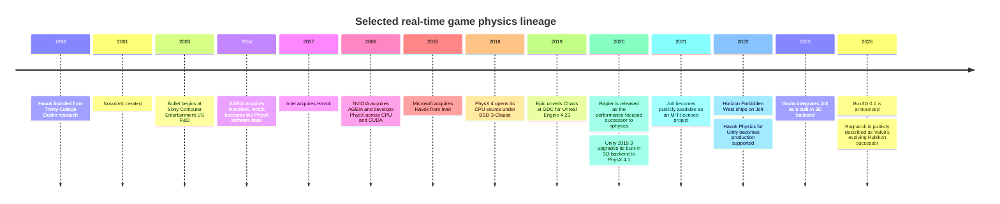
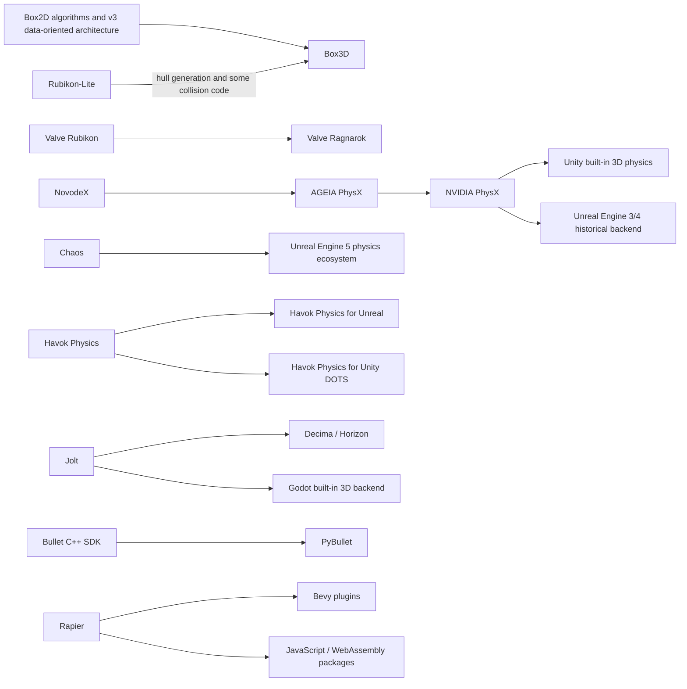
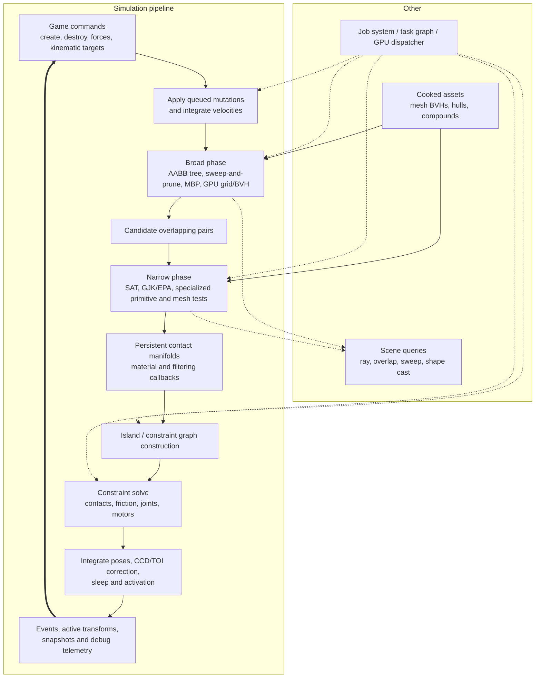
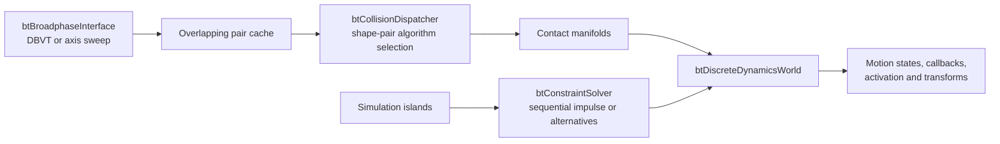
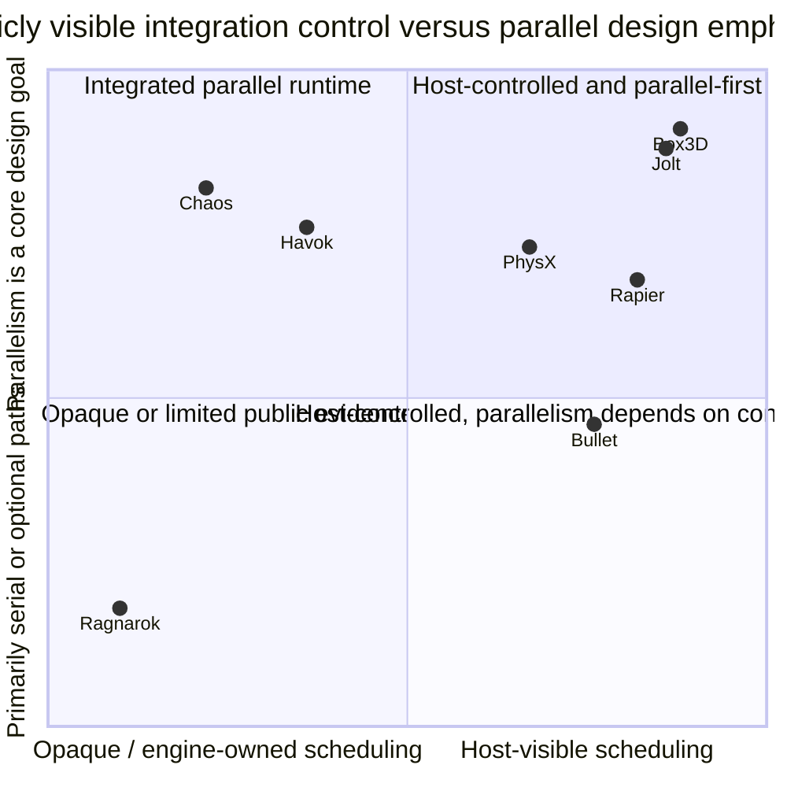
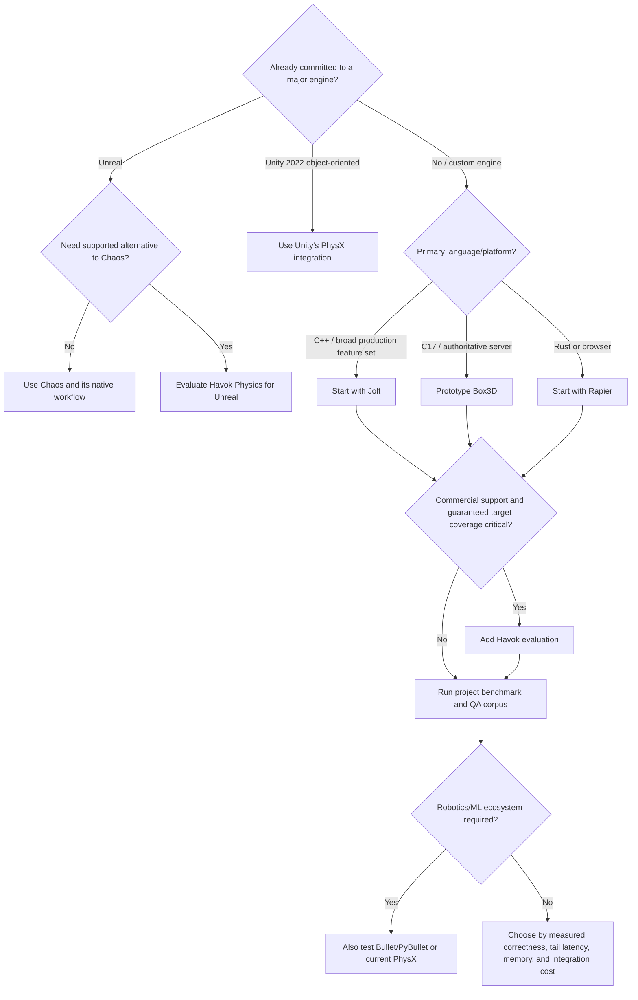

> This tech note is for game engine programmers and technical directors evaluating real-time/networked game physics.
> I use GPT-5.6 sol-xhigh to assist in the writing of this note.

To be specific, this note compares eight 3D-capable physics systems:

1. Jolt Physics
2. Box3D
3. NVIDIA PhysX 4.1
4. Havok Physics
5. Chaos Physics in Unreal Engine
6. Bullet 3 / the Bullet Physics SDK
7. Valve’s Ragnarok / Rubikon lineage
8. Rapier as the additional modern comparison

The focus is real-time game development: rigid-body dynamics, collision queries, characters, vehicles, ragdolls, destruction/deformables, large worlds, networking, authoring/debugging, deployment, and predictable frame cost. Robotics-only accuracy, differentiability, offline finite-element analysis, and film-only solvers are outside scope except where an engine deliberately spans those uses.

“Deterministic” is split into three levels:

- **Repeatable on one executable/machine:** identical inputs give the same output when order and floating-point state are controlled.
- **Cross-build or cross-platform deterministic:** different compilers, operating systems, or CPU architectures give bit-identical or contractually identical results under documented constraints.
- **Network-ready:** the full application also has deterministic input ordering, allocation/ID behavior, callbacks, gameplay math, serialization, time stepping, and rollback/state history. A deterministic physics library alone does not guarantee this.

## Executive summary

There is no universal “fastest physics engine.” The practical winner depends on the scene topology, solver quality target, CCD policy, number and size of simulation islands, query load, streaming pattern, thread budget, target hardware, and how much editor/network/tooling work the game engine already supplies. A benchmark that equalizes only body count is usually misleading.

The strongest short conclusions are:

- **Jolt Physics** is the best default candidate here for a new, source-available, CPU-driven 3D game engine that values multicore scaling, concurrent world access, large worlds, deterministic replay, and a broad production-oriented feature set. It has strong production evidence through *Horizon Forbidden West* and *Death Stranding 2*, and it is now the default 3D backend for new projects in Godot 4.6. Its main cost is that a custom engine still has to build the authoring, profiling, asset-cooking, and engine-facing abstraction around it.
- **Box3D** is unusually interesting for a C-first, data-oriented engine, authoritative server simulation, voxel/streamed worlds, and teams that like Box2D’s API and solver philosophy. It offers cross-platform determinism, recording/replay, graph-colored wide-SIMD solving, CCD, double-precision positions, and baked compound collision. It is also only version 0.1 and its own manual says it is still maturing, so adoption in a shipping project should be gated by a project-specific soak test.
- **PhysX 4.1** remains the relevant implementation reference for Unity 2022 LTS built-in 3D physics. It is mature, feature-rich, permissively licensed on public platforms, and has both CPU and optional CUDA rigid-body paths. It is now a legacy branch; new standalone projects should evaluate PhysX 5 rather than start from 4.1 unless compatibility with Unity-era behavior or an existing 4.x integration is the requirement.
- **Havok Physics** is the commercial, supported, high-maturity option. Its differentiators are production support, broad platform coverage, robust edge-case behavior, cross-platform determinism, mature debugging, and maintained Unreal integration. Public architectural detail and reproducible benchmarks are limited compared with open-source engines, and licensing/evaluation is a material procurement decision.
- **Chaos Physics** is best understood as Unreal Engine’s physics ecosystem, not merely a drop-in rigid-body library. Its advantage is deep integration with Geometry Collections, destruction authoring, Dataflow, Niagara, networking/resimulation, cloth, flesh, hair, vehicles, and Unreal’s editor. Outside Unreal, it is not a sensible standalone middleware choice.
- **Bullet 3** remains a flexible, permissively licensed, portable toolbox spanning games, VFX, robotics, and machine learning. Its modular collision/dynamics design and PyBullet ecosystem are major strengths. The production C++ path is still largely the Bullet 2-style CPU stack; the repository’s OpenCL “Bullet 3” path is explicitly experimental. For a new high-object-count game runtime, benchmark it carefully against Jolt, Box3D, and Rapier rather than assuming its historical ubiquity implies the best current CPU scaling.
- **Ragnarok** is a Valve-internal successor/evolution of Rubikon disclosed publicly by Erin Catto in June 2026. It is relevant to physics-engine history and future Valve technology, but there is no public SDK, source, platform matrix, feature specification, or benchmark. It is not an external adoption candidate.
- **Rapier** is the most relevant additional comparison: a modern Rust-native 2D/3D engine with official Rust and WebAssembly/JavaScript paths, Bevy integration, optional SIMD/parallelism, `f32`/`f64` variants, and optional bit-level cross-platform determinism. It is attractive for Rust and web stacks; its determinism mode currently trades away SIMD and parallelism, and its GPU solver is still a future direction rather than a shipping core feature.

**Recommended first shortlist by project type:**

| Project need | First candidate | Also evaluate | Why |
|---|---|---|---|
| New custom C++ game engine | Jolt | PhysX 5, Havok | Best balance of open source, production evidence, features, concurrent access, and multicore design |
| C ABI, compact source, server-authoritative world | Box3D | Jolt through a C wrapper, Rapier C/FFI | Box3D is C17, handle-based, deterministic, replayable, and built around data-oriented parallel solving |
| Existing Unity 2022 LTS game | Unity’s built-in PhysX integration | Havok Physics for Unity for DOTS workloads | Unity already supplies the component/editor/serialization layer; replacing the backend is a different project from using the public PhysX SDK |
| Unreal Engine game with destruction-heavy authoring | Chaos | Havok Physics for Unreal | Chaos owns the native workflow; Havok offers a supported replacement at Unreal’s physics API level |
| Deterministic lockstep across heterogeneous machines | Havok or Jolt deterministic build | Box3D, Rapier deterministic build | Validate the entire game stack; physics determinism alone is insufficient |
| Rust or browser/WebAssembly game | Rapier | Jolt.js, Box3D/Emscripten | Rapier has first-party Rust and JavaScript/Wasm distribution and a natural Rust API |
| Robotics / reinforcement learning plus game-like simulation | Bullet/PyBullet or Rapier | PhysX 5 | PyBullet’s ecosystem is unusually broad; Rapier supplies Rust, multibodies, URDF/MJCF work, and deterministic options |

## History and family tree

### Timeline

The key ownership and origin sources are NVIDIA’s account of [NovodeX beginning in 2001 and becoming PhysX after two acquisitions](https://developer.nvidia.com/blog/open-source-simulation-expands-with-nvidia-physx-5-release/), Intel’s [2007 Havok acquisition announcement](https://www.intel.com/pressroom/archive/releases/2007/20070914corp.htm), Microsoft’s [2015 Havok acquisition announcement](https://blogs.microsoft.com/blog/2015/10/02/havok-to-join-microsoft/), Epic/Intel’s [GDC 2019 Chaos account](https://www.intel.com/content/dam/develop/external/us/en/documents/unreal-engines-new-chaos-physics-system-screams-with-in-depth-intel-cpu-optimizations.pdf), Dimforge’s [2020 Rapier announcement](https://dimforge.com/blog/2020/08/25/announcing-the-rapier-physics-engine/), Guerrilla’s [Jolt production talk](https://www.guerrilla-games.com/read/architecting-jolt-physics-for-horizon-forbidden-west), and Erin Catto’s [2026 Box3D/Rubikon/Ragnarok history](https://box2d.org/posts/2026/06/announcing-box3d/).

### Family tree

## Common architecture model

Most real-time rigid-body engines implement variations of the same pipeline. Their real differences lie in data ownership, concurrency, algorithms, solver policy, cache design, and how tightly the pipeline is coupled to a game engine.

Important evaluation implications:

- A broad phase can dominate a streaming/open-world game even when few bodies are actually colliding.
- Narrow-phase choice matters when the content contains complex convex hulls, triangle meshes, height fields, or high-speed thin features.
- Solver iteration counts are not interchangeable between engines. “Four iterations” can represent different work and different quality.
- Parallel performance depends on available independent work. Thousands of isolated bodies and many small islands parallelize differently from one giant ragdoll/constraint island.
- CCD is not one feature switch: speculative contacts, sphere-swept approximations, full-shape linear casts, and multi-pass time-of-impact solvers have different cost and failure modes.
- Scene queries often serve gameplay, AI, cameras, audio, and navigation; their cost and concurrency model can matter more than rigid-body solve time.
- Integration cost is architectural. A fast SDK can still lose if every frame copies bodies through an abstraction, serializes callbacks on the main thread, or rebuilds cooked data unnecessarily.

## At-a-glance comparison

| Engine | Availability / license | Primary design center | Core runtime style | Parallel / acceleration strategy | Determinism contract | Current adoption posture |
|---|---|---|---|---|---|---|
| Jolt 5.6.x source snapshot | MIT, open source | CPU multicore games and VR; concurrent engine access | C++17 retained world, handles/IDs, explicit job and temp allocators | Lock-conscious/lock-free structures, jobs, SIMD; CPU rigid bodies; separate GPU hair feature | Same-run deterministic by design; optional cross-platform build with documented caveats and ~8% cited cost | Strong default for custom engines; production proven |
| Box3D 0.1 | MIT, open source | C-first 3D sibling of Box2D; large piles, server worlds, replay | Portable C17, opaque generational IDs, data-oriented arrays | Graph coloring, wide-SIMD contact blocks, multithreading hooks or internal scheduler; SSE2/NEON/Wasm SIMD | Cross-platform deterministic; FMA contraction disabled; recording/replay | Technically promising, but early and still maturing |
| PhysX 4.1.2 | BSD-3-Clause public source; console code under separate terms/NDA | Scalable middleware from mobile CPU to multicore CPU/CUDA GPU | C++ scene/actor/shape retained API, cooking, extensions | Task dispatcher, SIMD, ABP/SAP/MBP/GPU broad phase, optional CUDA rigid pipeline | Enhanced local determinism mode; no general cross-platform bitwise guarantee | Mature legacy; relevant to Unity 2022 and existing 4.x integrations |
| Havok Physics 2025.x | Commercial proprietary SDK | Supported, robust, cross-platform AAA middleware | C++ SDK plus tools and engine integrations | Proprietary multicore optimizations; detailed internals/benchmarks mostly customer-only | Vendor-guaranteed cross-platform deterministic SDK, conditional on deterministic integration | Best when support, platform certification, and robustness justify cost |
| Chaos in UE 5.x | Unreal Engine source under Unreal license | Deep Unreal-native simulation and content workflow | UE modules, game/physics thread proxies, Task Graph, editor assets | Task Graph, async/dedicated physics thread, ISPC/SIMD CPU kernels; feature-specific GPU paths | Networking uses replication, prediction, and resimulation; do not assume cross-platform lockstep | Natural choice inside Unreal, especially destruction and authoring |
| Bullet 3.27 source snapshot | zlib, open source | Broad reusable collision/multiphysics toolbox | Modular C++ collision world and dynamics world; optional components | CPU SIMD and optional multithreaded dispatch/solvers; experimental OpenCL pipeline | Generally repeatable only under controlled configuration; no broad cross-platform guarantee | Mature and flexible; strongest ecosystem outside pure game runtime |
| Ragnarok | Closed, Valve-internal | Future Valve/Source physics, evolving Rubikon | Undisclosed | Publicly described only as having optimizations similar to Box3D | Undisclosed | Watch item, not adoptable middleware |
| Rapier 0.34 source snapshot | Apache-2.0, open source | Rust-native 2D/3D games, animation, robotics, web | Rust sets/handles and explicit pipeline components | Optional Rayon parallelism and explicit SIMD; cross-platform GPU work is research/future work | Local deterministic by default; enhanced cross-platform mode disables parallel/SIMD | Strong for Rust, Bevy, web, and mixed game/robotics workloads |

## 1. Jolt Physics

### Origin and philosophy

Jolt began as Jorrit Rouwé’s personal learning project and was shaped by production problems at Guerrilla. The key concern was not merely making `PhysicsSystem::Update` fast; it was allowing a multithreaded game engine to query, stream, add, and remove physics data without turning the physics world into a global synchronization bottleneck.

Guerrilla reports that switching from a commercial engine to Jolt for *Horizon Forbidden West* reduced memory and executable size and allowed the simulation frequency to double while using less CPU time. The associated architecture work emphasizes a lock-free broad phase and lock-free simulation-island building. See [Guerrilla’s GDC 2022 summary](https://www.guerrilla-games.com/read/architecting-jolt-physics-for-horizon-forbidden-west) and the [slides with speaker notes](https://jrouwe.nl/architectingjolt/ArchitectingJoltPhysics_Rouwe_Jorrit_Notes.pdf).

The upstream [README](https://github.com/jrouwe/JoltPhysics) states four design priorities particularly relevant to games:

- Concurrent collision queries and world mutation with defined before/after visibility.
- Background batch construction and low-impact insertion for streaming.
- Explicit activation behavior so content changes do not accidentally wake large neighborhoods.
- Deterministic simulation, including an optional cross-platform deterministic build.

### Architecture

Jolt uses a conventional `world/body/shape/constraint` model but makes ownership and concurrency explicit:

- `PhysicsSystem` owns bodies, constraints, broad phase, contact management, islands, and the step pipeline.
- Bodies are accessed through `BodyInterface`; IDs separate public lifetime references from internal storage and locking.
- Shapes are immutable and reference counted, encouraging sharing and safe concurrent use. Static, compound, mesh, and height-field shapes can be cooked before insertion.
- Object layers and broad-phase layers let the integration encode coarse collision policy before narrow-phase work.
- The application supplies a `JobSystem` and temporary allocator to `PhysicsSystem::Update`, allowing physics tasks to participate in the engine’s scheduler instead of owning an opaque thread pool.
- The broad phase supports concurrent queries and updates. Narrow-phase collectors make allocation and early-out policy explicit.
- Active bodies form simulation islands. Large islands can be split into parallel batches; contact caching avoids repeating narrow-phase work when relative transforms have not materially changed.
- The default solver is an iterative impulse/constraint solver with separate velocity and position iteration controls. Constraint priority can bias influential constraints such as joints nearer a ragdoll root.

The complete upstream reference is [Architecture of Jolt Physics](https://jrouwe.github.io/JoltPhysics/).

### Game-facing features

Current source includes:

- Rigid bodies with sphere, box, capsule, tapered capsule/cylinder, cylinder, convex hull, plane, compound, triangle mesh, and height field shapes.
- Discrete and continuous motion quality, ray casts, overlap tests, broad-phase tests, and shape casts.
- Fixed, point, distance/spring, hinge, slider, cone, rack-and-pinion, gear, pulley, path, swing-twist, and 6-DOF constraints plus motors.
- Sensors, contact/activation listeners, animated ragdolls, and state save/restore.
- Rigid and “virtual” character controllers with different interaction/control tradeoffs.
- Wheeled, tracked, and motorcycle vehicle support.
- Soft bodies with edge, bend, rod, volume, tether, skinning-range, pressure, and rigid-body collision constraints.
- Buoyancy, optional double-precision world positions, serialization/recording, JoltViewer, samples, unit tests, and performance tests.
- A newer strand-based GPU hair system; this should not be confused with GPU acceleration of the core rigid-body pipeline.

### Performance evidence

The official [Jolt multicore study](https://jrouwe.nl/jolt/JoltPhysicsMulticoreScaling.pdf) is unusually useful because its ported convex-vs-mesh scene includes Jolt 1.1, PhysX 4.1, and Bullet 3.21 with disclosed solver and CCD settings.

- In its 3,680-body ragdoll scene, Jolt reached **4.9×** the one-thread rate at 8 threads and **5.7×** at 16 threads on the cited Intel EC2 machine.
- Scaling flattened after roughly 16 cores as memory bandwidth and contact-cache atomics became limiting.
- On the ported convex-vs-mesh scene, PhysX had better single-thread performance on the tested laptop, while Jolt scaled better; the paper’s conclusion is that Jolt achieved similar overall performance for that simple scene.
- The author explicitly warns that PhysX uses scene-size-dependent thread limits and that every engine must be profiled on the target scene.

This study is evidence for architectural scaling, not a timeless league table: the versions are old, the workload is synthetic, and current Jolt has evolved substantially.

### Determinism, platforms, and integrations

The optional `CROSS_PLATFORM_DETERMINISTIC` build is documented as about **8% slower** and tested across MSVC/Clang/GCC/Emscripten, Windows/macOS/Linux, 32/64-bit, x86, ARM, RISC-V, PowerPC, LoongArch, and Wasm. **The guarantee has boundaries**: broad-phase query ordering, listener callback ordering, and active-body ordering can vary under multithreading and must be sorted or filtered by the application. The definitive caveats are in [Jolt’s deterministic simulation documentation](https://jrouwe.github.io/JoltPhysics/#deterministic-simulation).

Officially listed targets include Windows x86/x64/ARM64; Linux across x86, ARM, RISC-V, LoongArch, and PowerPC; FreeBSD; Android; macOS; iOS; MinGW; WebAssembly through JoltPhysics.js; and an NDA-covered console target. Minimum x86 is SSE2, with optional SSE4/AVX/AVX2/AVX-512; ARM64 uses NEON. See the [upstream platform matrix](https://github.com/jrouwe/JoltPhysics#supported-platforms).

Notable integrations are Decima/Guerrilla, Godot, community Source-engine replacement work, and Unreal plugins. Godot added Jolt as an alternative built-in backend in 4.4; by the [Godot 4.6 documentation](https://docs.godotengine.org/en/4.6/tutorials/physics/using_jolt_physics.html), new projects use it by default.

### Best fit and cautions

Best fit: a custom CPU-oriented 3D engine with meaningful streaming, query concurrency, large-world, high-body-count, or deterministic replay requirements.

Cautions: production integration still needs asset cooking/versioning, editor representation, profiling UI, gameplay-safe event ordering, rollback policy, and platform certification. Jolt’s broad feature list does not automatically reproduce the semantics of Unity, Unreal, or a legacy engine abstraction.

## 2. Box3D

### Origin and philosophy

Box3D was announced by Erin Catto on 2026-06-30 as a 3D physics engine for games. It grew from a practical game problem rather than an abstract port of Box2D:

1. Catto’s *The Legend of California* needed reliable fast-falling trees, server-side simulation, a broad phase for hundreds of thousands of entities, runtime voxel collision construction, and efficient streaming of strongholds containing tens of thousands of collision meshes.
2. Dirk Gregorius supplied “Rubikon-Lite,” a home version of Valve’s Rubikon engine. Catto integrated it into Unreal, then progressively replaced most APIs, data structures, and algorithms with Box2D v3-derived designs to keep his 2D and 3D work aligned.
3. Current Box3D retains some Rubikon-Lite convex-hull generation and collision code; the rest is Box2D-derived or new Box3D work.

This history and the first public Ragnarok description are in [Announcing Box3D](https://box2d.org/posts/2026/06/announcing-box3d/).

The philosophy is recognizably Box2D v3: portable C, opaque generational IDs rather than exposed pointers, compact data-oriented storage, a sub-stepped “Soft Step” solver, graph coloring, wide SIMD, explicit events, determinism, and a small embeddable core.

### Architecture

The [Box3D 0.1 manual](https://box2d.org/documentation3d/) describes a world of bodies, attached shapes, generated contacts, and user-created joints. Internally:

- Public C17 APIs return opaque IDs with generation checks. Definitions are copied into internal structures, which keeps the API stable and lets the engine organize storage independently.
- The broad phase uses dynamic bounding-volume trees. The public dynamic-tree API can also serve game-specific spatial indexing.
- Convex collision primarily uses the Separating Axis Test (SAT) rather than relying exclusively on GJK/EPA. Catto argues that SAT produces useful separating features without requiring a collision margin and recently added SIMD work for complex hull edge tests; see [SIMD for Collision](https://box2d.org/posts/2026/07/simd-for-collision/).
- Continuous collision combines speculative contacts with time-of-impact processing, covering fast translation and rotation.
- The Soft Step solver divides a game step into substeps. The manual recommends 60 Hz with four substeps as a starting point, giving constraints four opportunities per frame to react without necessarily executing an entire game loop at 240 Hz.
- A constraint graph is colored so non-conflicting contacts and joints can be processed in parallel. “Wide SIMD” solves multiple independent contact points together; worker scheduling can be supplied by the host or handled by an optional internal scheduler.
- Sleeping bodies are organized into solver sets/islands. Baked compounds collapse large static collections into a compact single shape, addressing streaming and per-object overhead.
- Positions can use double precision while much of the local math remains float-oriented. The current CMake option is `BOX3D_DOUBLE_PRECISION`.
- Recording, replay, world snapshots, event streams, and deterministic math are first-class rather than afterthoughts.

### Game-facing features

Current 0.1 source provides:

- Convex hull, capsule, sphere, triangle mesh, height-field, and compound collision.
- Continuous collision, filtering, sensors, contact events, ray casts, shape casts, overlap queries, and a character mover.
- Revolute, prismatic, distance, spherical, motor, weld, wheel, parallel, and filter joints in the current manual/source, with limits, motors, springs, friction, break thresholds, and force reporting.
- Island sleeping, body movement events, deterministic snapshots, replay, large-world position mode, and runtime mesh/hull construction.
- A dependency-light core: only the C runtime and `libm` on Unix.

It does **not** currently present the breadth of Jolt, Havok, PhysX, Chaos, or Bullet in soft bodies, cloth, fluids, mature vehicle frameworks, or decades of compatibility tooling. Destruction is an integration/content system to build around rigid bodies and cooked fragments, not a turnkey Box3D module.

### Performance evidence

Box3D includes benchmark source and CSV results and publishes a [Box3D benchmark dashboard](https://box2d.org/files/benchmarks_3d.html). The checked-in AMD Ryzen 9 7950X SSE2 results use one through eight threads on one CCD. For the heavily parallel workloads, current CSVs show:

| Bundled workload | 1-thread total | 8-thread total | Observed speedup |
|---|---:|---:|---:|
| Convex pile | 17,336.6 ms | 2,410.11 ms | 7.19× |
| Joint grid | 1,586.48 ms | 214.504 ms | 7.40× |
| Junkyard | 20,044.1 ms | 2,970.84 ms | 6.75× |
| Large pyramid | 2,071.23 ms | 333.042 ms | 6.22× |
| Many pyramids | 2,331.14 ms | 316.039 ms | 7.38× |
| Rain | 2,434.57 ms | 444.147 ms | 5.48× |

The `large_world` micro-workload becomes slower with more workers (10.938 ms at one thread versus 14.7126 ms at eight), a useful reminder that scheduling overhead beats parallelism when work is too small or poorly partitioned. These numbers show scaling inside Box3D; they do not compare simulation quality or speed against another engine.

### Determinism, platforms, and integrations

Box3D advertises cross-platform determinism and disables floating-point contraction/FMA in supported compiler paths so scalar/SIMD targets do not silently diverge. Recording and replay make determinism testable. The integration must still maintain stable command and event order.

The library and samples are documented on Windows, Linux, and macOS. The core builds through Emscripten for web. SIMD paths cover SSE2 and NEON, with Wasm SIMD mapping through Emscripten; SIMD can be disabled. A C17 compiler is required for the library and C++20 for samples. No GPU runtime is required or used by the core solver.

The announcement lists *The Legend of California*, Facepunch’s s&box, Esoterica, and Glenn Fiedler’s 1,000-player space-game project as early users. The first project integrates Box3D into Unreal through a custom ECS/scripting/animation stack, which is strong evidence that replacement is possible but also evidence that it is substantial engine work.

### Best fit and cautions

Best fit: teams comfortable owning physics integration, especially C/C++ engine teams building authoritative servers, voxel worlds, high-entity-count broad-phase systems, or projects that value deterministic replay and Box2D-like design.

Cautions: the [manual explicitly says](https://box2d.org/documentation3d/) its written portion is a work in progress, and the repository calls out v0.1 maturity. Require crash/NaN fuzzing, long-duration replay tests, representative character and vehicle tests, mesh/CCD torture scenes, serialization compatibility policy, and console/mobile validation before committing a production schedule.

## 3. NVIDIA PhysX 4.1

### Origin and philosophy

PhysX descends from Adam Moravanszky’s NovodeX engine, started in 2001, acquired by AGEIA, and then acquired with AGEIA by NVIDIA in 2008. It evolved from dedicated physics-hardware ambitions into a portable CPU SDK plus optional CUDA acceleration. NVIDIA made PhysX 4 CPU source available under BSD-3-Clause in 2018. See [NVIDIA’s lineage summary](https://developer.nvidia.com/blog/open-source-simulation-expands-with-nvidia-physx-5-release/) and [PhysX 4 open-source announcement](https://developer.nvidia.com/blog/announcing-physx-sdk-4-0-an-open-source-physics-engine/).

The design target is broad middleware scalability: the same high-level scene/actor/shape API can serve mobile CPUs, multicore desktop/console CPUs, and CUDA-capable GPUs, with specialized extensions for characters, vehicles, cooking, serialization, and visual debugging.

### Architecture

PhysX uses a retained-mode object hierarchy:

- `PxFoundation` owns allocation/error services; `PxPhysics` creates materials, shapes, actors, meshes, and scenes.
- A `PxScene` is an independent simulation world. Static and dynamic actors own or share `PxShape` objects; actors in different scenes do not interact.
- Cooking turns triangle meshes, convex meshes, and height fields into runtime formats. Keeping cooking explicit supports offline pipelines and platform-specific compatibility decisions.
- Broad-phase choices include sweep-and-prune (SAP), multi-box pruning (MBP), automatic box pruning (ABP, new/default in 4.x), and a GPU broad phase when CUDA dynamics is enabled.
- Narrow phase uses specialized primitive/convex/mesh algorithms and persistent contact manifolds. Filtering can reject pairs or request contacts, triggers, CCD, and callbacks.
- The scene constructs islands and partitions work through a CPU dispatcher/task graph. `simulate()` starts work and `fetchResults()` synchronizes and exposes the completed state. Applications can split collision and solve phases more explicitly with advanced APIs.
- The traditional projected Gauss-Seidel (PGS) solver remains available. PhysX 4 adds Temporal Gauss-Seidel (TGS), which recomputes constraints using updated relative motion during iterations and improves joint/articulation convergence.
- Reduced-coordinate articulations model link trees with low drift and realistic actuation/inverse dynamics, particularly useful for machinery and robotics.
- “Immediate mode” exposes lower-level contact/constraint building and solving for applications that need a different ownership model than `PxScene`.
- GPU rigid bodies can move broad phase, contact generation, shape/body management, and constraint solving to CUDA. Unsupported geometry/contact cases can fall back, but the GPU solver still processes response pairs and requires preallocated buffers.

The checked-out tree contains the complete [PhysX 4.1 simulation guide](https://github.com/NVIDIAGameWorks/PhysX/blob/4.1/physx/documentation/PhysXGuide/Manual/Simulation.html), [threading guide](https://github.com/NVIDIAGameWorks/PhysX/blob/4.1/physx/documentation/PhysXGuide/Manual/Threading.html), [GPU rigid-body guide](https://github.com/NVIDIAGameWorks/PhysX/blob/4.1/physx/documentation/PhysXGuide/Manual/GPURigidBodies.html), and [best-practices guide](https://github.com/NVIDIAGameWorks/PhysX/blob/4.1/physx/documentation/PhysXGuide/Manual/BestPractices.html).

### Significant 4.1 features

The [4.1 release notes](https://github.com/NVIDIAGameWorks/PhysX/blob/4.1/physx/release_notes.html) highlight:

- TGS solver and reduced-coordinate articulations.
- ABP broad phase and a BVH structure optimized for actors containing many shapes.
- CPU and GPU rigid bodies, GPU broad phase, GPU articulation acceleration, PCM contacts, CCD, scene queries, aggregates, joints, origin shifting, serialization, PVD, and profiling.
- Character-controller and vehicle SDK extensions.
- Optional torsional friction and improved actor-centric queries/cooking.

PhysX 4 removed the older core particle and cloth features. NVIDIA’s Blast, NvCloth/APEX-era systems, FleX, and later PhysX 5 deformable/particle features are separate products or generations; do not attribute the full PhysX 5 feature set to 4.1.

### Unity 2022 LTS relationship

Unity’s [2022.3 manual](https://docs.unity3d.com/cn/2022.3/Manual/PhysicsOverview.html) states that built-in 3D physics is an integration of NVIDIA PhysX. Unity upgraded that integration to PhysX 4.1 in 2019.3, exposing the fast midphase, automatic box pruning, TGS selection, and mesh baking; see the [Unity 2019.3 release notes](https://unity.com/releases/editor/whats-new/2019.3.0).

For Unity 2022 LTS, this means:

- `Rigidbody`, `Collider`, `Joint`, `ArticulationBody`, `PhysicsScene`, queries, and the Physics Profiler are Unity-facing wrappers and workflows around PhysX behavior.
- The public NVIDIA 4.1.2 tree is valuable for architecture study, bug investigation, and compatible native tooling, but it is not a drop-in replacement for Unity’s private integration layer or a guarantee of identical build flags/patches.
- Unity’s built-in PhysX path is distinct from Unity Physics and Havok Physics for Unity, which are DOTS/ECS packages.
- Replacing Unity’s backend with Jolt/Box3D/Bullet would require a native plugin plus transform synchronization, cooking/import, collision layers, callbacks, character/joint parity, serialization/editor tooling, platform binaries, and likely gameplay behavior retuning.

### Performance and hardware

PhysX is SIMD-accelerated and multithreaded on CPU. The Jolt comparison found stronger PhysX single-thread speed in its simple convex-vs-mesh test but weaker scaling for that test; it also notes PhysX schedules threads according to scene size, so a larger scene may scale beyond the shown result.

The 4.1 release notes list Windows, Linux, macOS, iOS, and Android public targets. Console code is omitted from GitHub and subject to platform NDA/terms. CUDA rigid bodies are supported on Windows and Linux with a compatible NVIDIA GPU/driver; the 4.1 matrix cites CUDA 10 and compute architecture 3.0-era requirements. CPU PhysX remains cross-vendor and is the normal portability baseline.

### Determinism, lifecycle, and best fit

`PxSceneFlag::eENABLE_ENHANCED_DETERMINISM` reduces changes caused by unrelated island insertion/removal, at a performance cost. This is not a broad promise of bitwise equivalence across OS, compiler, CPU, and GPU. GPU execution adds further ordering and hardware concerns. Network rollback should treat PhysX 4 state capture/resimulation as an application responsibility.

Best fit: maintenance and understanding of Unity 2022/older custom-engine integrations, mature C++ middleware needs that require 4.x compatibility, or CPU/CUDA simulations where the legacy branch’s capabilities and API are already embedded.

Caution: the repository README identifies 4.1 as legacy and directs new projects to PhysX 5. Starting a greenfield engine on 4.1 creates avoidable migration debt.

## 4. Havok Physics

### Origin and philosophy

Havok was founded in Dublin in 1998 from Trinity College computer-graphics research. Intel acquired it in 2007; Microsoft acquired it from Intel in 2015 and continues to license it broadly. Microsoft’s acquisition announcement already cited more than 600 games across partners including Activision, EA, Ubisoft, Nintendo, Sony, and Microsoft.

Havok’s core philosophy is production predictability: robust behavior across unusual content, stable frame costs, cross-platform deterministic output, deep platform optimization, mature visual debugging, and direct engineering support. It is a commercial SDK rather than a transparent research/code reference.

### Architecture and features

Public product material describes a C++ SDK built for proprietary engine integration, with:

- Dynamic rigid bodies, continuous collision, extensive shapes, constraints, ragdolls, character controllers, high-performance queries, large-world support, runtime shape changes, and geometry processing.
- A robust iterative constraint solver plus a direct solver for difficult joint systems.
- LOD collision shapes and tools intended to keep cost predictable across object and landscape scale.
- Physics Particles: lower-cost solid-object simulation for large effect populations, with controlled quality tradeoffs.
- Visual Debugger capture/viewers and heat maps for expensive objects.
- Modifiers and callbacks for custom contact behavior and recovery from invalid states.

Havok Cloth and Havok Navigation are separate products. The product boundary matters when comparing the broad “Havok suite” against a single open-source rigid-body library.

The best public summaries are the [Havok Physics product page](https://www.havok.com/havok-physics/), [2025 product sheet](https://www.havok.com/wp-content/uploads/2025/03/havokphysics-productsheet.pdf), and [2025.2 release highlights](https://www.havok.com/blog/havok-sdk-2025-2-release-highlights/). Detailed broad-phase, contact-generation, memory-layout, and solver implementation documentation is normally customer material; any architectural comparison beyond the public contract should be labeled inference.

### Performance and determinism

Havok markets itself as the fastest and most robust engine for games, but public vendor statements are not a reproducible cross-engine benchmark. Its more defensible differentiator is the combination of long production history, support, tools, and a contractual product focus on predictable performance.

Havok states that the SDK is cross-platform deterministic by default and guarantees identical output across supported targets, provided the surrounding engine integration is deterministic. This is the strongest public determinism claim in this group, but a proof-of-concept should still hash states across every compiler, platform, job configuration, and content-cooking path used by the project.

### Platforms and integrations

Havok describes support for all major game platforms and maintains teams in Europe, North America, and Japan. Exact console/platform/version matrices are part of the commercial relationship.

Current integration paths include:

- Proprietary/custom game engines through the C++ SDK.
- [Havok Physics for Unreal](https://www.havok.com/havok-physics/), a maintained replacement at Unreal’s physics API level with Blueprint, Niagara, Geometry Collection/destruction, field, and engine workflow integration.
- Havok Physics for Unity’s DOTS path, declared production-supported in [December 2022](https://unity.com/blog/engine-platform/havok-physics-now-supported-for-production). Unity has since announced that first-party entitlement/support changes at Unity 6.3 LTS; the Microsoft Havok team may continue it as a third-party extension. Older Unity 2022 LTS support follows its existing entitlement period; see [Unity’s pricing/product update](https://unity.com/products/pricing-updates).

### Best fit and cautions

Best fit: AAA/cross-platform teams for whom vendor support, certification, production edge cases, deterministic networking, and established content/debugging tools are worth more than zero license cost.

Cautions: evaluation requires commercial contact/NDA, procurement, platform scope, and a support/upgrade plan. Public evidence is insufficient for algorithm-level due diligence; benchmark the evaluation SDK in the real engine.

## 5. Chaos Physics in Unreal Engine

### Origin and philosophy

Epic unveiled Chaos at GDC 2019 as a “Hollywood quality” physics and destruction system planned for Unreal Engine 4.23. Intel engineers worked with Epic on low-level solvers, data structures, threading, and ISPC vectorization. Early UE4 documentation described it as Fortnite’s lightweight solver and the future PhysX replacement. In UE5, Chaos is the native physics family.

Its philosophy is vertically integrated simulation: the solver, editor, asset types, rendering/VFX hooks, animation, networking, caching, and authoring workflows should evolve together. This is a different product shape from Jolt or Box3D.

### Architecture

Public APIs and documentation show:

- A particle/body-oriented core and acceleration structures behind Unreal-facing body instances and components.
- Proxies and transient particle data that communicate state between the game thread and physics thread.
- Task Graph, single-thread, and dedicated/async-thread modes, with fixed or variable/capped stepping and buffering policies.
- Broad-phase acceleration, narrow-phase collision constraints, persistent manifolds, island/constraint solving, and asynchronous scene queries within Unreal’s runtime modules.
- ISPC kernels that express multiple collision/intersection operations as SIMD work and compile for SSE4/AVX/AVX2 targets, described in Intel’s [Chaos optimization paper](https://www.intel.com/content/dam/develop/external/us/en/documents/unreal-engines-new-chaos-physics-system-screams-with-in-depth-intel-cpu-optimizations.pdf).
- Geometry Collections with clustered fracture hierarchies, connection graphs, strain/damage evaluation, caches, and live/cached hybrid playback.
- Physics Fields that affect rigid bodies and destruction and can be sampled by Niagara/material systems.
- Dataflow as a procedural graph for authoring fracture, cloth, flesh, and related physics assets.

The low-level [Chaos API index](https://dev.epicgames.com/documentation/unreal-engine/API/Runtime/Chaos) is useful for source navigation, while [Physics in Unreal Engine](https://dev.epicgames.com/documentation/unreal-engine/physics-in-unreal-engine) describes the product-level feature family.

### Game-facing features

Chaos covers rigid bodies, constraints, ragdolls/physical animation, async physics, destruction, cloth and ML cloth, vehicles, fields, fluids, hair, flesh/soft tissues, visual debugging, and networked physics. Some of these are separate plugins/modules with different maturity and platform/performance profiles; “Chaos supports X” does not mean a single solver or execution path implements every feature.

Networking is a first-class UE workflow:

- Default legacy replication corrects client state toward the server.
- Predictive interpolation improves local interaction for server-authoritative actors.
- Resimulation keeps physics history, compares authoritative state at a matching physics frame, and re-simulates on divergence.

These systems mitigate nondeterminism over a network; they are not proof that Chaos produces bit-identical results on heterogeneous clients.

### Performance, platforms, and fit

Chaos’s strongest performance story is end-to-end: author high-density destruction, cache or reduce it, use clustering and sleeping/disable fields, vectorize collision work, and feed events directly into Niagara. The exact rigid-body performance relative to Jolt/Havok/PhysX remains scene- and UE-version-dependent. Erin Catto’s Box3D announcement records specific bad experiences with early Chaos tree/CCD behavior and missing gyroscopic torque, while also noting Epic added gyroscopic support in late 2024; that is a useful project history, not a general current benchmark.

Chaos deploys wherever the corresponding Unreal features are supported; desktop, mobile, and console details follow Unreal’s versioned platform matrix and individual module limitations. Core rigid-body work is CPU-oriented and multicore/SIMD optimized. Do not assume CUDA-style GPU rigid-body acceleration merely because some Chaos cloth, flesh, ML, or rendering-adjacent systems have GPU paths.

Best fit: Unreal projects, particularly those whose value comes from destruction, artist iteration, Niagara, animation, networked-physics workflows, and staying close to Epic’s supported path.

Caution: replacing Chaos can give a specialist runtime better behavior/performance, but the replacement must either emulate Unreal’s physics abstraction and tools or deliberately give up parts of the native ecosystem.

## 6. Bullet Physics SDK / Bullet 3

### Origin and philosophy

Erwin Coumans started Bullet while working at Sony Computer Entertainment US R&D. The project grew through contributions from game, VFX, and research engineers and deliberately exposed modular collision and dynamics components under the permissive zlib license. Its scope later expanded through PyBullet into robotics, reinforcement learning, and VR.

The name “Bullet 3” needs care:

- The mainstream C++ SDK still contains the mature Bullet 2-style CPU libraries (`LinearMath`, `BulletCollision`, `BulletDynamics`, `BulletSoftBody`, and related modules).
- The repository also contains Bullet 3 data-oriented/OpenCL work intended to execute broad phase, narrow phase, and rigid-body dynamics on a GPU.
- The upstream README calls OpenCL support experimental and warns about driver/kernel coverage. Do not assume all normal Bullet applications use the GPU pipeline.

The current repository `VERSION` file reports 3.27; the most recently highlighted GitHub release may lag that source snapshot. The [official repository README](https://github.com/bulletphysics/bullet3) is the authoritative scope/platform/license source.

### Architecture

A typical CPU Bullet world is deliberately assembled from replaceable components:

- `btCollisionWorld` supports collision detection and queries without dynamics.
- `btDiscreteDynamicsWorld` adds integration, island management, contact/joint solving, CCD, activation, and synchronization to motion states.
- Broad phases include dynamic AABB-tree and sweep-and-prune variants; the overlapping pair cache feeds the dispatcher.
- The dispatcher chooses specialized algorithms by shape pair. GJK, EPA, SAT/clipping, BVH mesh collision, GImpact, and compound algorithms appear across the modular narrow phase.
- Persistent manifolds retain a small set of contact points across frames.
- The default sequential impulse solver handles contacts, friction, and constraints. Alternate and multithreaded solver/dispatcher paths exist, but integration and result ordering require care.
- `btSoftRigidDynamicsWorld` adds soft bodies; `btMultiBodyDynamicsWorld` and Featherstone-based multibodies address articulated chains.

The older but still useful [Bullet 2.80 manual](https://www.cs.kent.edu/~ruttan/GameEngines/lectures/Bullet_User_Manual) explains component assembly and credits; current generated [API documentation](https://pybullet.org/Bullet/BulletFull/) should be used for exact classes.

### Features

Bullet includes rigid bodies, compound/convex/mesh shapes, CCD, ray/sweep/overlap queries, constraints, ragdolls, a kinematic character controller, raycast vehicles, soft bodies/cloth/rope, multibodies, serialization, debug drawing, and many import/demo utilities. PyBullet adds shared-memory/TCP/UDP client-server modes, Python bindings, URDF/SDF/MJCF import, inverse kinematics/dynamics, sensors, logging, and ML/robotics examples.

This breadth is a strength and an integration risk: game projects should decide which subset is production runtime, which is tooling, and which experimental paths are excluded.

### Performance, determinism, and platforms

Bullet’s default CPU design is mature and can be very effective for modest or specialized scenes. In Jolt’s old convex-vs-mesh test, Bullet 3.21 scaled less than Jolt and plateaued around six or seven cores for that scene; its CCD used a simplified sphere sweep in that comparison, so visual/robustness equivalence is not guaranteed. Treat the result as one workload, not a verdict.

Bullet does not make a broad current promise of bit-identical cross-platform lockstep. Stable insertion order, single-threaded execution where necessary, fixed step, identical compiler/FP behavior, disabled solver randomization, and sorted callback/query results are typical prerequisites. Rollback projects should validate hashes rather than rely on reputation.

The C++ library is tested on Windows, Linux, macOS, iOS, and Android and should port to platforms with a suitable C++ compiler. Optional demos add OpenGL requirements. Experimental OpenCL requires a capable GPU/driver and is not equivalent to generic CPU portability.

### Integrations and best fit

Bullet has appeared in Blender rigid-body workflows, Godot 3’s historical 3D backend, Panda3D and many custom engines/bindings; PyBullet is a major robotics/ML integration. The Godot team’s historical [Bullet 3 switch article](https://godotengine.org/article/godot-30-switches-bullet-3-physics/) is also a cautionary integration case: matching an engine’s area, kinematic-body, raycast, and gameplay semantics requires substantial adapter work, and Godot later returned to its in-house backend before adopting Jolt.

Best fit: teams needing permissive source, modular collision/dynamics, soft bodies or multibody/robotics crossover, PyBullet tooling, or compatibility with an existing Bullet integration.

Caution: choose and freeze a supported subset, validate current maintenance of the exact modules used, and do not conflate experimental OpenCL code with the production CPU runtime.

## 7. Valve Rubikon and Ragnarok

### What is publicly known

The only strong public technical source located is Erin Catto’s first-hand [Box3D announcement](https://box2d.org/posts/2026/06/announcing-box3d/):

- Dirk Gregorius shipped Valve’s custom Rubikon physics engine in *Half-Life: Alyx*.
- Gregorius maintained a hobby/home “Rubikon-Lite” version, which became Box3D’s initial base before most of it was replaced with Box2D-derived architecture.
- Valve-side Rubikon continued to evolve.
- Gregorius developed optimizations similar to Box3D in a new engine called **Ragnarok**, intended for future Valve games.

### What is not publicly known

No public SDK, repository, paper, API, license, solver description, benchmark, hardware requirement, supported-platform list, deterministic contract, or named shipped Ragnarok title was found as of the research date. Social-media and forum repetition traces back to Catto’s post and should not be treated as additional confirmation.

### Architectural inference, clearly labeled

It is reasonable to infer a focus on data-oriented CPU performance, large-world/gameplay interaction, and ideas related to the Box2D v3/Box3D optimization family because Catto explicitly says the optimizations are similar. It is **not** reasonable to infer that Ragnarok shares Box3D’s C API, Soft Step solver, exact graph coloring, determinism, or license.

### Evaluation posture

Ragnarok belongs in the history/competitive-watch section of a technology strategy, not an engine selection matrix. External teams cannot acquire, integrate, benchmark, or support it. Valve/Source projects should follow Valve’s own future tooling and documentation when it appears.

## 8. Rapier

### Origin and philosophy

Dimforge released Rapier in August 2020 after about five months of development as the performance-focused successor to the Rust `nphysics` engine. It deliberately provides separate 2D/3D and `f32`/`f64` crates while sharing implementation, and targets games, animation, and robotics. Performance, portability, Rust-native safety, WebAssembly, and optional determinism were goals from the beginning. See [the original announcement](https://dimforge.com/blog/2020/08/25/announcing-the-rapier-physics-engine/) and [current repository](https://github.com/dimforge/rapier).

Current `master` metadata reports version 0.34.0, Rust 1.86, edition 2024, and Apache-2.0 licensing.

### Architecture

Rapier exposes the pipeline as explicit Rust-owned sets and managers:

- `RigidBodySet` and `ColliderSet` store bodies/colliders behind generational handles.
- `IslandManager`, broad phase, `NarrowPhase`, impulse-joint and multibody-joint sets, and `CCDSolver` are visible pipeline components.
- `PhysicsPipeline::step` orchestrates integration, collision detection, island management, solving, CCD, hooks, and events.
- Parry provides geometric queries/collision detection. The newer dynamic BVH is used for broad phase and scene queries, with automatic rebalancing and SIMD traversal.
- Impulse joints serve general constrained bodies; reduced-coordinate multibody joints target articulated trees.
- Cargo features opt into Rayon parallelism, explicit SIMD, serialization, WebAssembly, and enhanced determinism.

The explicit [basic simulation example](https://rapier.rs/docs/user_guides/rust/getting_started/) makes ownership clear and can be easier to adapt to an ECS than a hidden singleton world.

### Features and ecosystem

Rapier offers rigid bodies, common primitives and triangle/height-field/compound geometry, collision groups/hooks/events, joints/motors/limits, CCD, ray/shape/point queries, character and vehicle controllers, multibodies, serialization, snapshots, debug rendering, 2D/3D and float/double variants, and newer sparse-voxel colliders. Dimforge’s [2025 review](https://dimforge.com/blog/2026/01/09/the-year-2025-in-dimforge/) describes the new BVH, explicit voxel support, math migration, and cross-platform GPU research.

Official JavaScript/TypeScript bindings distribute WebAssembly packages through NPM. Official Bevy plugins connect Rapier to a Rust ECS/game engine. Community integrations exist for Godot and other engines.

### Performance and determinism

The 2020 announcement benchmarked then-new Rapier against PhysX 4 PGS and Box2D on disclosed scenes and showed promising single-thread results. Those numbers are too old to rank current Rapier 0.34, current Jolt/Box3D, or current PhysX. Their enduring value is methodological: same scene initialization, fixed step, disclosed solver iteration counts, single-thread target, and separate CPU machines.

Rapier is locally deterministic by default under identical initial state, insertion order, library/compiler, and machine. The `enhanced-determinism` feature targets IEEE-754-compliant CPUs and Wasm across platforms. Current documentation states that enhanced determinism cannot be enabled with SIMD or parallel features. This is a direct throughput-versus-lockstep tradeoff that should be budgeted explicitly; see [Rapier determinism](https://rapier.rs/docs/user_guides/rust/determinism/).

### Hardware, fit, and cautions

Rapier’s Rust crates can target desktop/mobile platforms supported by the Rust toolchain and have a first-party WebAssembly route. SIMD and parallel features are optional. The 2026 GPU work is exploratory and future-facing; current engine selection should assume CPU execution.

Best fit: Rust/Bevy engines, browser games, applications sharing simulation with robotics tooling, teams that value memory safety and Cargo integration, and projects that can choose explicitly between parallel/SIMD throughput and enhanced cross-platform determinism.

Cautions: pre-1.0 releases may make breaking changes; assess character/vehicle/editor integration maturity relative to the project, and benchmark current crates rather than the 2020 announcement.

## Architecture comparison

### API and data ownership

| Engine | Public ownership model | Integration consequence |
|---|---|---|
| Jolt | C++ objects plus body IDs/interfaces; immutable shared shapes; host-supplied allocators/jobs | Good control over memory and scheduling; wrapper work for non-C++ languages |
| Box3D | Flat C17 API with opaque generational IDs and copied definitions | FFI-friendly, internal data can remain compact; early API may still evolve |
| PhysX 4.1 | C++ retained scene/actor/shape objects with reference counting and callbacks | Mature and expressive; integration must obey scene read/write and simulate/fetch phases |
| Havok | Proprietary C++ SDK and tools | Supported integration but public implementation detail is limited |
| Chaos | Unreal objects/components/proxies backed by UE runtime modules | Minimal impedance inside UE; extremely high coupling outside it |
| Bullet | Application assembles broad phase, dispatcher, solver, world, and optional systems | Highly replaceable/modular; more configuration surface and legacy API exposure |
| Ragnarok | Undisclosed | Not integrable |
| Rapier | Rust-owned sets/managers and handles, explicit pipeline step | Natural ECS/Rust composition; FFI layers need stable ABI ownership rules |

### Broad phase and world streaming

- **Jolt:** concurrency and streaming were first-order architecture drivers. It supports background body preparation, batch insertion, and queries concurrent with mutation/update. Best candidate to test when the game has many readers and streamed cells.
- **Box3D:** dynamic trees and baked compounds directly address large entity sets, voxel terrain, and loading tens of thousands of collision pieces as one optimized shape. Its broad-phase data structures are also public for game-specific queries.
- **PhysX 4.1:** ABP provides a strong default, SAP is useful for coherent worlds, MBP allows regions, GPU broad phase serves CUDA scenes, and actor-centric BVHs help actors with many shapes. Origin shifting is supplied for large worlds.
- **Havok:** advertises large-world support, LOD shapes, high-performance queries, and geometry processing; exact structures are commercial documentation.
- **Chaos:** aligns acceleration structures with UE world/asset representations and destruction clusters. Streaming cost is inseparable from Unreal component/proxy lifecycle.
- **Bullet:** DBVT is flexible for dynamic worlds and sweep-and-prune can be excellent with bounded coherent scenes. The integration chooses and tunes the broad phase.
- **Rapier:** a rebalancing dynamic BVH now serves both broad phase and scene queries, reducing duplicate acceleration structures. Sparse voxel collision is relevant to block worlds.

### Narrow phase, contact quality, and CCD

- **Box3D** most clearly commits to SAT for convex hulls and combines speculative contacts with time of impact. This avoids a required hull margin but puts more work into feature/edge testing for complex hulls.
- **Jolt** uses many specialized shape-pair algorithms, GJK-style convex queries where appropriate, persistent caches, active-edge/internal-edge mitigation, and full-shape linear-cast CCD.
- **PhysX** combines specialized contact generation, PCM, GJK/EPA/SAT-family algorithms, mesh midphases, and configurable multi-pass CCD/speculative CCD.
- **Havok** advertises CCD by default and a mature customizable collision pipeline; detailed algorithms are not public in current product material.
- **Chaos** has evolved substantially since its UE4 beta. Evaluate the exact UE branch with the project’s skeletal meshes, Geometry Collections, landscapes, and fast bodies.
- **Bullet** has a rich set of specialized and generic algorithms; its common CCD path and thresholds need shape-specific validation. The Jolt comparison’s sphere approximation is a quality/performance difference, not just an optimization detail.
- **Rapier** exposes CCD and Parry-based queries; validate complex-mesh edge behavior and character sweeps in current versions.

### Constraint solver philosophy

| Engine | Solver emphasis | Practical effect |
|---|---|---|
| Jolt | Iterative velocity/position solving, island parallelism, constraint priority | Good general game balance; tune position work carefully because its cost differs from velocity iterations |
| Box3D | Soft Step substepping with sequential constraints, graph coloring and wide SIMD | Robust stacks/joints at a fixed game tick; cost is controlled through substeps and parallel batches |
| PhysX 4.1 | PGS plus TGS; reduced-coordinate articulations | PGS for legacy/performance behavior, TGS for better joint/articulation convergence |
| Havok | Robust iterative solver plus direct solver | Direct solve is valuable for difficult chains/ragdolls but may cost more; exact policy is SDK-specific |
| Chaos | UE-evolving iterative/position-based solvers across rigid, cloth, flesh, and destruction systems | Deep feature integration; tuning/version behavior follows UE |
| Bullet | Sequential impulse default, alternate MLCP/multithread paths, Featherstone multibodies | Flexible and well understood; component choice changes performance and behavior |
| Rapier | Impulse constraints plus reduced-coordinate multibodies; current/future Soft-TGS work | General games plus articulated systems; robotics accuracy is an active development focus |

### Multithreading and SIMD

This diagram is a qualitative architecture map, not a benchmark. “Host-visible” means the application can see or supply pipeline components/jobs, not that integration is automatically easy.

### Determinism comparison

| Engine | Same-machine repeatability | Cross-platform claim | Key caveat |
|---|---|---|---|
| Jolt | Yes under stable command order | Optional documented build | Multithreaded query/callback/result order must be normalized; cited ~8% cost |
| Box3D | Yes, plus record/replay | Advertised by default | Application event/command order and compiler coverage still need validation |
| PhysX 4.1 | Enhanced mode improves locality/repeatability | No general guarantee | Compiler/CPU/GPU, insertion, and task ordering can diverge |
| Havok | Yes | Vendor-guaranteed SDK output | Surrounding engine must also be deterministic; verify purchased target matrix |
| Chaos | UE supplies state history/resimulation | No general lockstep promise | Networking correction/resimulation is not the same as bit-identical simulation |
| Bullet | Possible under strict configuration | No general guarantee | Solver/task order and floating-point environment require control |
| Ragnarok | Unknown | Unknown | No public information |
| Rapier | Local deterministic by default | Optional enhanced feature | Enhanced mode currently excludes SIMD and parallelism |

## Feature matrix

Legend: **Yes** = a documented current core or first-party feature; **Partial** = limited, separate module, community integration, or substantial custom work; **No** = not a stated feature; **Unknown** = not public.

| Feature | Jolt | Box3D | PhysX 4.1 | Havok | Chaos | Bullet | Ragnarok | Rapier |
|---|---|---|---|---|---|---|---|---|
| 3D rigid bodies | Yes | Yes | Yes | Yes | Yes | Yes | Unknown | Yes |
| 2D-native variant | Partial via DOF limits | No; use Box2D | No | No public 2D product | UE has separate 2D paths | Partial / 2D shapes | Unknown | Yes, first-party crate |
| Convex, compound, mesh, height field | Yes | Yes | Yes | Yes | Yes | Yes | Unknown | Yes |
| Continuous collision | Yes | Yes | Yes | Yes/default claim | Yes | Yes | Unknown | Yes |
| Scene queries | Yes | Yes | Yes | Yes | Yes | Yes | Unknown | Yes |
| Character controller | Rigid + virtual | Character mover | CCT extension | Yes | UE Character/physics workflows | Kinematic controller | Unknown | Kinematic controller |
| Vehicle framework | Wheeled/tracked/motorcycle | Wheel joints; no comparable full framework | Vehicle SDK | Product features/integration | Chaos Vehicles | Raycast vehicle | Unknown | Dynamic vehicle controller |
| Ragdoll/physical animation | Yes | Build from joints | Yes | Yes | Deep UE integration | Yes | Unknown | Build from joints/integration |
| Reduced-coordinate articulation/multibody | No equivalent full robotics API | No | Yes | Public feature set focuses game constraints | Feature-specific | Featherstone multibody | Unknown | Yes |
| Soft body / cloth | Yes | No | Removed from 4.x core; separate tech | Cloth is separate product | Yes, deep suite | Yes | Unknown | No mature core soft body |
| Destruction authoring/runtime | Custom integration | Custom integration | Blast/APEX separate | Unreal integration supports UE destruction workflows | Yes, Geometry Collections | Custom/demo tooling | Unknown | Custom integration |
| GPU rigid-body pipeline | No | No | Yes, CUDA | No public equivalent claim | Core rigid solver is CPU-oriented | Experimental OpenCL | Unknown | Research/future work |
| Large-world support | Double precision | Double positions + compounds | Origin shifting | Yes | UE Large World workflows | Double build / custom origin policy | Unknown | `f64` crates |
| Snapshot / replay | Yes | Yes, first-class recording | Serialization/PVD; gameplay rollback is custom | Visual debugging and deterministic replay workflows | Chaos Visual Debugger/caches/history | Serialization/logging | Unknown | Serialization/snapshots |
| Cross-platform deterministic option | Yes | Yes | No general guarantee | Yes, vendor claim | No general guarantee | No general guarantee | Unknown | Yes, without parallel/SIMD |
| First-party visual debugger | JoltViewer | Samples/replay tooling | PVD | Havok Visual Debugger | Chaos Visual Debugger | Debug draw/example browser | Unknown | Testbed/debug rendering |

## Performance discussion

### Evidence that can be used

1. **Jolt/PhysX/Bullet common scene:** The Jolt multicore paper ports one convex-vs-mesh scene and discloses versions, solver counts, CCD policy, compiler, machines, and thread counts. It supports the conclusion that Jolt 1.1 scaled better on that scene, PhysX 4.1 had better one-thread performance on the tested laptop, and all three require scenario-specific profiling.
2. **Box3D internal scaling:** The repository includes code and raw CSVs for AMD SSE2, AMD scalar, and Apple M2 NEON. It supports claims about Box3D’s internal worker scaling and SIMD experiments, not cross-engine superiority.
3. **Rapier 2020 launch benchmark:** It is transparent enough to understand, but too old to rank present engines. It establishes that Rapier was designed for performance and reached competitive early results.
4. **Production outcomes:** Guerrilla’s memory/CPU/frequency outcome for Jolt is valuable because it includes integration cost and real content. Havok’s hundreds of shipped titles establish maturity, not a numeric speed rank. Chaos’s shipped UE/Fortnite ecosystem establishes scalability/tool integration, not standalone solver superiority.

### Claims that should not be combined

- Vendor “fastest” claims measured on different scenes.
- Bodies per second when body shapes, sleep, contact counts, and solver quality differ.
- GPU and CPU results without transfer/synchronization cost.
- Fixed-step throughput when one engine uses full-shape CCD and another uses a sphere approximation.
- Solver iteration counts without measuring constraint error, penetration, energy drift, and joint separation.
- Editor FPS, runtime server step time, and offline simulation throughput.

### Recommended project benchmark suite

Build one adapter per engine behind the smallest common test API and preserve engine-native paths for advanced features. Record median, p95, p99, and maximum step time rather than only mean throughput.

| Test | Content | Measures |
|---|---|---|
| Static streamed world | Add/remove cells containing mesh/compound collision while queries run | Cooking, insertion spikes, broad-phase updates, lock contention, memory |
| Dynamic pile | 1k, 5k, 20k mixed convex bodies with sleep on/off | Broad/narrow phase, contact cache, solver, sleeping, worker scaling |
| One giant island | Joint grid or ragdoll pile | Graph/island construction and ability to parallelize dependent work |
| Many small islands | Independent mechanisms/ragdolls | Job overhead and island-level scaling |
| Fast trees/projectiles | Long capsules/hulls hitting smooth and faceted mesh | CCD correctness, tunneling, contact stability, peak cost |
| Character course | Stairs, slopes, moving platforms, seams, dynamic pushes | Gameplay quality, ghost edges, query volume, integration semantics |
| Vehicles | Multiple cars/tracks at target speed and tick rate | Suspension/contact model, determinism, solver stability |
| Query storm | Rays, sweeps, overlaps from AI/camera/audio/navigation jobs | Query throughput, concurrency, ordering, allocation behavior |
| Large coordinates | Origin shifts or double-precision positions across world bounds | Jitter, contacts, query error, serialization size |
| Rollback | Save N frames, restore, reapply inputs on every target | State size, restore time, hash equality, callback/event repeatability |
| Pathological content | Degenerate hulls, bad mesh winding, initial overlap, NaN injection | Validation, graceful recovery, debugging quality |

Controls for every test:

- Same fixed time step and catch-up policy.
- Matched materials, mass/inertia, sleep thresholds, collision filters, and initial transforms.
- Solver settings tuned to comparable error, not comparable integer counts.
- CCD modes documented per body/shape and correctness scored alongside time.
- Rendering disabled; asset cooking measured separately from steady-state runtime.
- Release/LTO/SIMD flags recorded; CPU frequency, core affinity, SMT, NUMA/CCX, and worker counts fixed.
- Warm-up and multiple randomized-but-replayable seeds.
- Memory high-water mark, allocations, active/contact counts, and debug checks recorded.
- Videos and state hashes stored so a faster but visibly wrong run cannot win.

## Platform, hardware, language, and integration

| Engine | Language/API | Publicly documented CPU/OS targets | GPU relationship | Notable engine integrations |
|---|---|---|---|---|
| Jolt | C++17; community C/C#/Rust/Java/JS/Python/Zig bindings | Windows, Linux, BSD, Android, macOS, iOS, MinGW, Wasm; x86/ARM plus several server architectures | Core rigid CPU; newer separate GPU hair | Decima, Godot, Source community replacement, Unreal plugins |
| Box3D | C17 core; C++20 samples | Windows, Linux, macOS, Emscripten web; SSE2/NEON/scalar | None required | Custom Unreal integration, s&box, Esoterica, early server projects |
| PhysX 4.1 | C++ API | Windows, Linux, macOS, iOS, Android; console code separately licensed/NDA | Optional CUDA rigid bodies and broad phase on Windows/Linux NVIDIA GPUs | Unity built-in 3D, historical UE3/UE4, many proprietary engines |
| Havok | Commercial C++ SDK | Vendor states all major game platforms; exact matrix by agreement | Public product focus is cross-platform CPU/game hardware | Proprietary engines, maintained Unreal plugin, Unity DOTS package history |
| Chaos | Unreal C++/Blueprint-facing modules | Follows Unreal version and feature platform support | CPU multicore/ISPC core; selected feature-specific GPU paths | Unreal Engine native |
| Bullet | C++ with C/Python and many community bindings | Windows, Linux, macOS, iOS, Android; generally portable C++ | Experimental OpenCL full pipeline; CPU is normal production path | PyBullet, Blender, historical Godot 3, Panda3D/custom engines |
| Ragnarok | Undisclosed | Undisclosed | Undisclosed | Valve/Source future games only |
| Rapier | Rust; first-party JS/Wasm; community FFI | Rust-supported native targets and Wasm; `f32`/`f64` | CPU today; cross-platform GPU work planned | Bevy, web/Three.js/Pixi/PlayCanvas examples, community Godot integrations |

## Which engine to choose?

### Greenfield custom engine

Start with **Jolt** as the control implementation. Add **Box3D** if C ABI, authoritative replay, voxel/compound streaming, or Box2D-style data orientation are strategic. Add **Havok** if the budget supports evaluation and console/vendor support is important. Evaluate current **PhysX 5**, not 4.1, unless legacy compatibility is the point.

### Unity 2022 LTS production

Stay with Unity’s PhysX integration unless there is a measured blocker. Use the checked-out PhysX 4.1.2 source to understand concepts and reproduce isolated issues, but diagnose through Unity’s Physics Profiler, project settings, collision matrix, cooking options, solver type, and fixed-step behavior first. For DOTS, compare Unity Physics with the entitled Havok package rather than assuming built-in `Rigidbody` behavior transfers directly.

### Unreal project

Use **Chaos** when native authoring, destruction, networked physics, animation, Niagara, and upgrade compatibility dominate. Evaluate **Havok Physics for Unreal** when a supported drop-in replacement promises better project-specific performance/stability. A Jolt or Box3D replacement is justified only when the project is already willing to own a custom physics abstraction and give up or rebuild native workflows.

### Deterministic multiplayer or rollback

Prototype **Havok**, **Jolt deterministic**, **Box3D**, and **Rapier enhanced-determinism** with the real target mix. Include state snapshot size/restore time and callback order. Rapier’s no-SIMD/no-parallel constraint may change the result. For Jolt, sort multithreaded callbacks/query hits as documented. For every engine, deterministic gameplay math and command ordering are part of the test.

### Large open or voxel world

Prioritize **Jolt** and **Box3D**. Test background cooking/insertion, concurrent scene queries, origin/double-precision policy, and static compound memory. Rapier’s sparse voxel collider is a relevant third candidate. PhysX origin shifting and broad-phase variants remain mature options for an existing integration.

### Browser and Rust

Prioritize **Rapier** because Rust, Wasm, JS/TS packages, and Bevy support are first party. Jolt.js and Box3D/Emscripten are credible alternatives when their solver/feature behavior is a better match. Measure Wasm SIMD, worker availability, snapshot transfer, and JavaScript boundary cost.

### Robotics/game crossover

Prioritize **Bullet/PyBullet** for ecosystem and **Rapier** for a Rust-native stack. Consider PhysX 5 for GPU-scale/Omniverse/USD workflows. Jolt and Box3D intentionally optimize game approximations rather than robotics fidelity.

### Selection flow

## Risks and final checklist

Before final selection, require answers to all of the following:

### Correctness and game feel

- Do characters cross mesh seams, stairs, slopes, moving platforms, and rotating frames without jitter or snagging?
- Do long thin fast bodies hit triangle terrain reliably at the project’s fixed tick?
- Are friction, restitution, mass ratios, gyroscopic torque, and sleeping behavior appropriate for the game rather than merely physically plausible?
- Can designers get stable ragdolls/vehicles with understandable parameters?

### Performance

- What are p95/p99/max step time on minimum-spec CPU, server CPU, and every console architecture?
- Does the engine scale inside one large island, only across islands, or mostly in collision stages?
- When does worker overhead make the single-thread path faster?
- Are scene queries safe and efficient from game jobs during simulation or streaming?
- What are cooking, insertion, destruction, and wake-up spikes—not just steady-state solve time?

### Memory and streaming

- Per-body, per-shape, per-contact, and per-joint memory?
- Can immutable/cooked shapes be shared and versioned?
- Can cells be built off-thread and inserted in batches?
- What invalidates broad-phase and contact caches?
- Can static kits become one compound without losing material/query metadata?

### Determinism and networking

- Exact guarantee: local, cross-build, cross-platform, or contractual?
- Are SIMD, FMA, multithreading, GPU, or fast-math compatible with it?
- Are query hits, activation events, and contact callbacks ordered?
- Is snapshot serialization stable, compact, and fast enough for rollback?
- Can authoritative correction reapply inputs without double-firing effects?

### Tooling and support

- Can a problematic frame be captured on device and replayed on a developer machine?
- Are contacts, broad-phase bounds, islands, sleeping, constraints, and timings visible?
- Is there an asset validator and deterministic cooking pipeline?
- What is the bug-fix, ABI, file-format, and long-term branch policy?
- Who owns console certification issues and urgent production fixes?

### Legal and lifecycle

- Are all target platforms covered by the license?
- Are GPU binaries/source and console source under different terms?
- Are notices, attribution, static/dynamic linking, and redistribution handled?
- Is the chosen version current, legacy, pre-1.0, or tied to an engine subscription?
- What is the migration path if maintainership or engine ownership changes?

## Bottom line

For a new general-purpose custom game engine, **Jolt is the most defensible starting point**. It combines production evidence, permissive source, broad features, modern multicore architecture, concurrent engine access, deterministic options, and strong platform reach.

**Box3D is the most strategically interesting newcomer**: its C17/data-oriented design, solver graph, replay, determinism, large-world position mode, compounds, and server/voxel origin make it worth an immediate prototype. Its v0.1 maturity prevents an unconditional production recommendation.

**PhysX 4.1 is the right historical and implementation reference for Unity 2022 LTS**, but it is a legacy baseline rather than the greenfield choice. **Havok** is the supported commercial benchmark to include when robustness and cross-platform guarantees have budget value. **Chaos** wins through Unreal integration rather than standalone portability. **Bullet** wins through openness, modularity, and robotics/VFX breadth, but needs a current game-specific performance evaluation. **Rapier** wins the Rust/web shortlist. **Ragnarok** is important future Valve technology but cannot yet be evaluated externally.

The final decision should be made by the project benchmark suite, not by feature count or a vendor’s average-throughput graph. Optimize for correct game behavior, p99 frame time, memory, authoring/debugging, network recovery, and the engineering cost of the whole integration.

## Primary sources and further technical reading

Jolt

- [Jolt Physics repository and README](https://github.com/jrouwe/JoltPhysics)
- [Architecture of Jolt Physics](https://jrouwe.github.io/JoltPhysics/)
- [Guerrilla: Architecting Jolt Physics for Horizon Forbidden West](https://www.guerrilla-games.com/read/architecting-jolt-physics-for-horizon-forbidden-west)
- [GDC 2022 slides with speaker notes](https://jrouwe.nl/architectingjolt/ArchitectingJoltPhysics_Rouwe_Jorrit_Notes.pdf)
- [Jolt Physics Multicore Scaling](https://jrouwe.nl/jolt/JoltPhysicsMulticoreScaling.pdf)
- [Jolt performance-test documentation](https://jrouwe.github.io/JoltPhysics/md__docs_2_performance_test.html)
- [Godot 4.6: Using Jolt Physics](https://docs.godotengine.org/en/4.6/tutorials/physics/using_jolt_physics.html)

Box3D, Rubikon, and Ragnarok

- [Erin Catto: Announcing Box3D](https://box2d.org/posts/2026/06/announcing-box3d/)
- [Box3D repository](https://github.com/erincatto/box3d)
- [Box3D 0.1 manual](https://box2d.org/documentation3d/)
- [Box3D benchmark dashboard](https://box2d.org/files/benchmarks_3d.html)
- [Erin Catto: SIMD for Collision](https://box2d.org/posts/2026/07/simd-for-collision/)
- [Erin Catto’s physics publications](https://box2d.org/publications/)

PhysX and Unity

- [NVIDIA GameWorks PhysX 4.1 repository](https://github.com/NVIDIAGameWorks/PhysX/tree/4.1)
- [PhysX 4.1 release notes](https://github.com/NVIDIAGameWorks/PhysX/blob/4.1/physx/release_notes.html)
- [NVIDIA: PhysX SDK 4.0 open-source announcement](https://developer.nvidia.com/blog/announcing-physx-sdk-4-0-an-open-source-physics-engine/)
- [NVIDIA: PhysX lineage and PhysX 5](https://developer.nvidia.com/blog/open-source-simulation-expands-with-nvidia-physx-5-release/)
- [PhysX 4.1 simulation guide](https://github.com/NVIDIAGameWorks/PhysX/blob/4.1/physx/documentation/PhysXGuide/Manual/Simulation.html)
- [PhysX 4.1 GPU rigid bodies](https://github.com/NVIDIAGameWorks/PhysX/blob/4.1/physx/documentation/PhysXGuide/Manual/GPURigidBodies.html)
- [Unity 2022.3 built-in 3D physics](https://docs.unity3d.com/cn/2022.3/Manual/PhysicsOverview.html)
- [Unity 2019.3 PhysX 4.1 upgrade notes](https://unity.com/releases/editor/whats-new/2019.3.0)

Havok

- [Havok Physics product page and FAQ](https://www.havok.com/havok-physics/)
- [Havok Physics product sheet](https://www.havok.com/wp-content/uploads/2025/03/havokphysics-productsheet.pdf)
- [Havok 2025.2 release highlights](https://www.havok.com/blog/havok-sdk-2025-2-release-highlights/)
- [Havok Physics Particles technical overview](https://www.havok.com/blog/havok-physics-particles-sdk/)
- [Havok Physics for Unity production support](https://unity.com/blog/engine-platform/havok-physics-now-supported-for-production)
- [Microsoft acquires Havok, 2015](https://blogs.microsoft.com/blog/2015/10/02/havok-to-join-microsoft/)
- [Intel announces Havok acquisition, 2007](https://www.intel.com/pressroom/archive/releases/2007/20070914corp.htm)

Chaos

- [Epic: Physics in Unreal Engine](https://dev.epicgames.com/documentation/unreal-engine/physics-in-unreal-engine)
- [Epic: Chaos runtime API index](https://dev.epicgames.com/documentation/unreal-engine/API/Runtime/Chaos)
- [Epic: Chaos Physics overview in UE 4.27](https://dev.epicgames.com/documentation/en-us/unreal-engine/chaos-physics-overview?application_version=4.27)
- [Intel: Unreal Engine’s New Chaos Physics System](https://www.intel.com/content/dam/develop/external/us/en/documents/unreal-engines-new-chaos-physics-system-screams-with-in-depth-intel-cpu-optimizations.pdf)
- [Epic: Chaos GDC 2019 demo](https://www.youtube.com/watch?v=fnuWG2I2QCY)

Bullet

- [Bullet Physics SDK repository](https://github.com/bulletphysics/bullet3)
- [Bullet generated API documentation](https://pybullet.org/Bullet/BulletFull/)
- [Bullet 2.80 Physics SDK manual](https://www.cs.kent.edu/~ruttan/GameEngines/lectures/Bullet_User_Manual)
- [Godot 3.0’s historical Bullet integration](https://godotengine.org/article/godot-30-switches-bullet-3-physics/)
- [GDC 2013: GPU Rigid Body Simulation / Bullet 3](https://storage.googleapis.com/google-code-archive-downloads/v2/code.google.com/bullet/GDC2013_ErwinCoumans_GPU_rigid_body_simulation.pdf)

Rapier

- [Rapier repository](https://github.com/dimforge/rapier)
- [Dimforge: Announcing Rapier](https://dimforge.com/blog/2020/08/25/announcing-the-rapier-physics-engine/)
- [Rapier getting started and pipeline components](https://rapier.rs/docs/user_guides/rust/getting_started/)
- [Rapier determinism](https://rapier.rs/docs/user_guides/rust/determinism/)
- [Dimforge 2025 review and 2026 goals](https://dimforge.com/blog/2026/01/09/the-year-2025-in-dimforge/)
