> 三月出差去了在旧金山一年一度的 GDC2026，感触很大。成千上万的来自全世界的游戏开发者聚集在这里，仿佛形成了一个巨大的游戏场，给每一个游戏开发者能量。另外旧金山也是一座美丽的城市，依山傍海。这里的人们大多友好而自信，希望以后还有机会去。
>
> 本文按时间整合自我在公众号发布的三篇现场记录：[AI Trends of Today and Opportunities Tomorrow](https://mp.weixin.qq.com/s/9LKO8OE1-p2UOmiGsBu4dw)（3月11日）、[任天堂和其他有趣见闻](https://mp.weixin.qq.com/s/EuKlaM8O6TeQhyCTnykY8g)（3月12日）、[AI Games以及看展见闻](https://mp.weixin.qq.com/s/ix5iNNLMxwbgFF3AavHuYw)（3月13日），补充了一些当时来不及展开的思考。

# 一场关于AI的圆桌

第一天的重头戏在YBCA（Yerba Buena Center for the Arts），主题是 *AI Trends of Today and Opportunities Tomorrow*。台上坐的是Google DeepMind、NVIDIA、Meta、暴雪的人，算是把"模型方"和"用模型方"凑齐了。

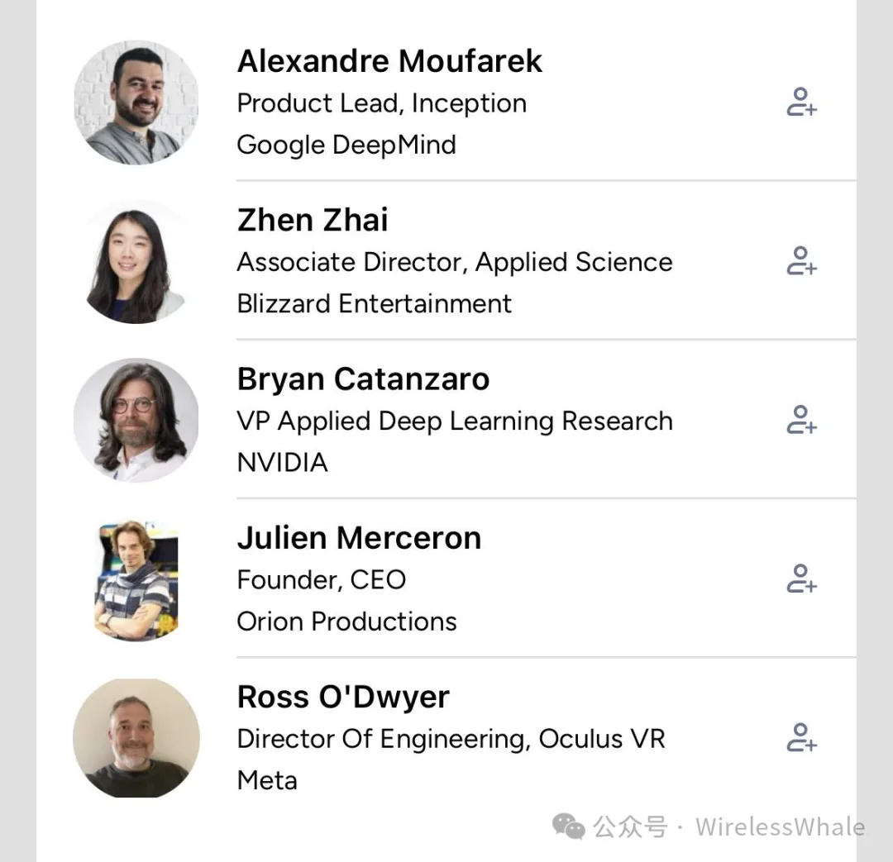

## 游戏内AI助手的尝试为什么失败了

这个话题是我没想到会被摆在台面上讲的——几家都试过把AI助手集成进游戏里，结果都不理想。台上给的复盘有：

1. **场景错位。** AI助手在生产力工具（比如手机助手）里表现出色，因为它解决的是明确的"任务型"问题：查询、提醒、控制设备。用户和AI是一对一的协作关系，目标清晰。但玩家在游戏里并没有一个需要AI来解决的"任务"，突然插进来一个AI，反而打断心流，成了干扰。

2. **体验不匹配。** 玩家追求的是乐趣、探索、挑战或叙事沉浸，而不是效率提升。AI助手在实验里变成了"局外人"，它的介入没有自然融入玩法。一句话：技术能做到，不等于体验应该这样做。

3. **只是还没找到正确的融合点。** 尽管这轮尝试失败了，但在为视障或低视力玩家设计AI游戏伴侣，由AI扮演"眼睛"和实时解说员等方向上可能还有潜力。这个设计符合"辅助"而非"闯入"的逻辑。

顺着往下想，AI在游戏中的价值大概率不在于做一个独立的语音助手，而在于个性化适配、动态辅助、无障碍体验这类和玩法深度耦合的场景。出发点必须是"玩家需要什么"，而不是"技术能做什么"。

## 一键生成游戏、世界模型、去引擎化

关于**一键生成游戏**，同样让我略感意外的是，DeepMind和NVIDIA的人都认为，即使技术上可行，这也不是理想方向。游戏创作的本质是人类的创意表达与协作过程，玩家与游戏的情感连接，有一部分正来自于"知道是人花了心血造出来的"——《空洞骑士：丝之歌》能被等那么多年，如果每周都有一个新的空洞骑士被生产出来，你还会这么期待吗？何况当前生态已经过剩，不缺数量，缺的是独特体验。

DeepMind的人用"做蛋糕"打比方：用户需要参与感，哪怕只是自己打个鸡蛋，AI应该辅助而不是全包。AI的定位是让小团队或个人更高效地实现创意，而不是取代创作本身。

关于**去引擎化（engineless）**，也就是完全用生成式AI/世界模型（如Google Genie）替代传统引擎实时生成游戏世界：世界模型已经能生成一致、可控的虚拟环境，时长从几秒发展到约一分钟，进步很快。一种可能的方案是"云脑+端渲染"——云端世界模型生成环境骨架，本地神经渲染（DLSS一类）填充细节。AI还能做实时个性化内容生成，比如动态调整教程、剧情分支，缓解"玩家无限自由度"和"内容制作成本"之间的矛盾。

主要挑战仍然是一致性、可控性和协作性。传统引擎提供的是成熟管线，对复杂项目而言仍是高效协作的基础。而且去引擎化不只是技术问题，还要商业模式和硬件（比如统一内存、客户端AI算力）一起变。

散场前NVIDIA的人"不经意"透露上个月他们实现了一项技术突破即将发布，和游戏有关。当时盲猜是"云端世界模型 + 端侧DLSS细化"这套架构的解决方案？

# 任天堂

第二天上午是一场重量级讲座：任天堂的《咚奇刚 蕉力全开》全场景物理破坏的设计与实现。西厅3004早早排起长队，讲座果然也没让人失望，全场掌声和笑声不断。制作人是元仓健太，也是《超级马力欧奥德赛》的Director，他和另一位程序负责人把思路徐徐展开，让我这样入行刚满10年的人也有一种如听仙乐耳暂明的轻快感。

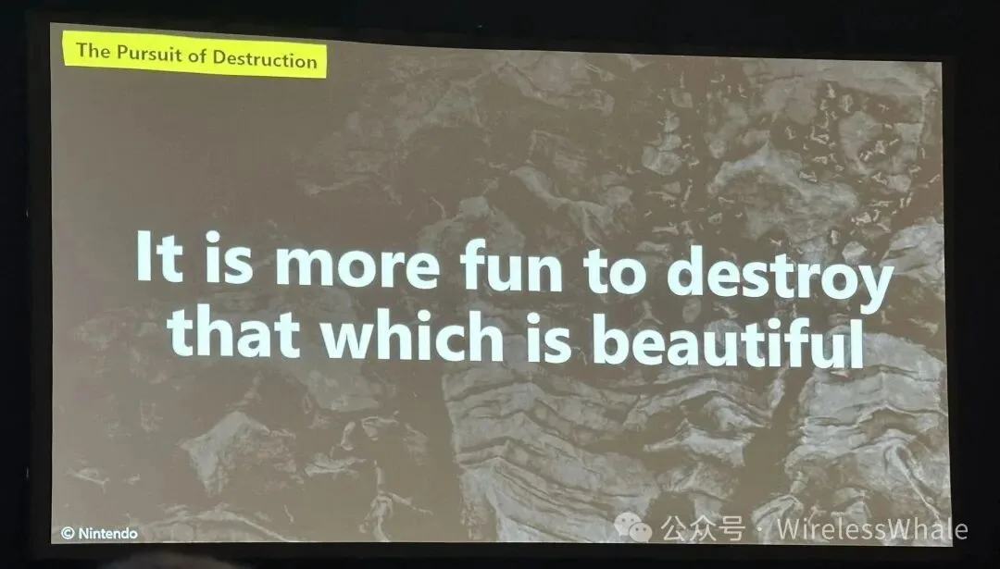

技术上的核心是体素。地形用密度场表示，破坏就是改密度：

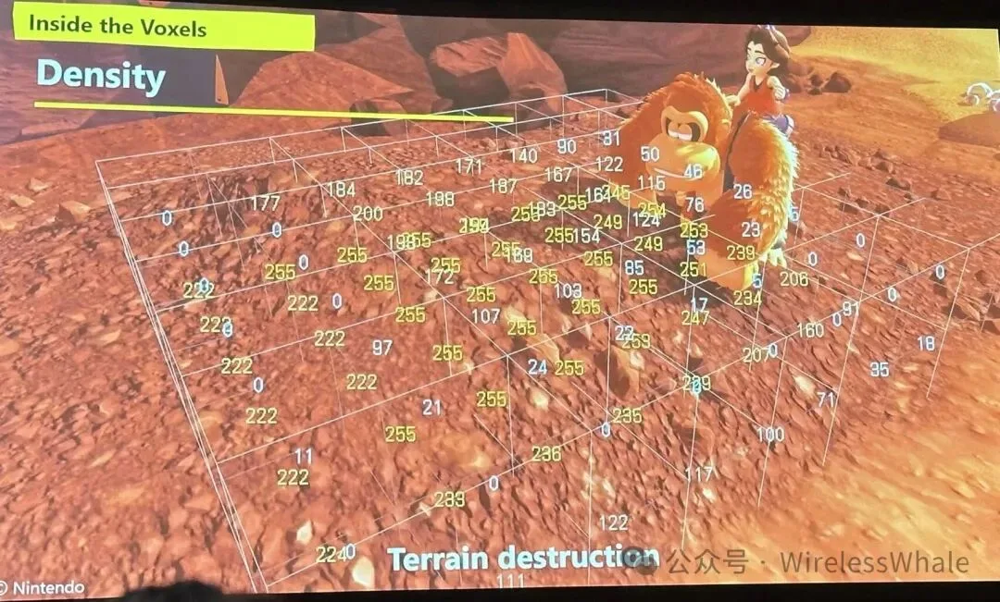

而在碰撞这一侧，他们做了一个我觉得很有决断力的选择——显示网格和碰撞网格几乎完全一致，碰撞网格只是稍粗一点：

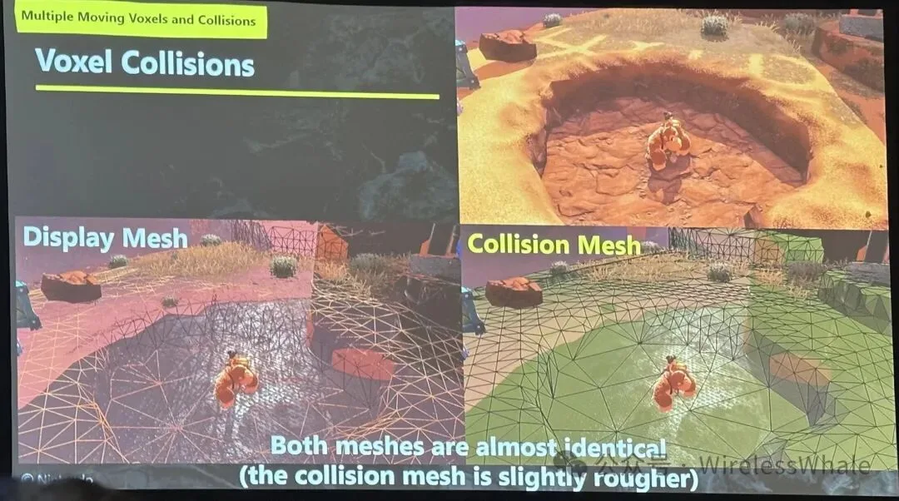

对于一个"所见即可破坏"的游戏，这几乎是唯一能保证手感真实的做法：玩家凿开的洞必须就是他能钻进去的洞。代价是碰撞体要跟着体素实时重建，这部分主办方只给了1小时，很多细节被略过了，留下的是设计脉络和技术思路，值得后面单独挖一挖（顺带一提，我后来整理的[游戏物理引擎比较]()里对破坏和形变的支持部分，多少也是被这场讲座勾起的兴趣；关于任天堂的做事方式，之前也写过[一篇读书笔记]()）。

后来也听了ARC Raiders这类热门游戏的硬核分享，同样有待后续整理。

## 活动区开放了

当天活动区开放，包括各厂商宣传展台、游戏路演区、文化讨论区，氛围热烈。

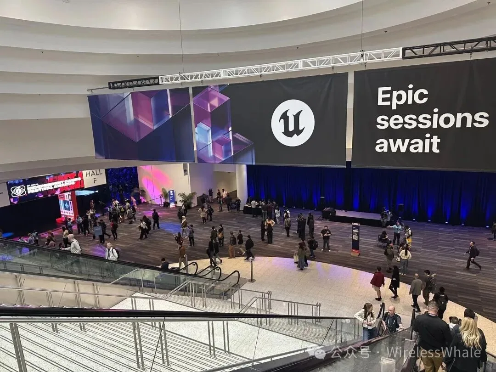

我重点看了Roblox、Meshy和Tripo的展台，以及一些做AI生成游戏的初创公司。

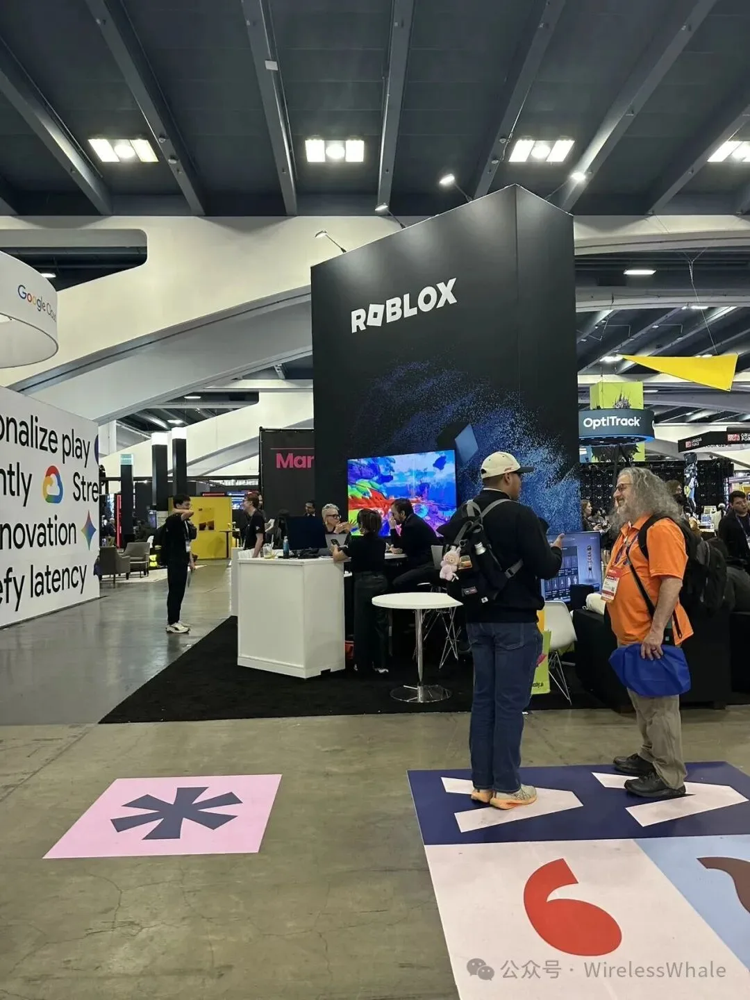

**Roblox** 的官方编辑器集成了AI助手（Agent和MCP），可以通过对话生成资产和逻辑。我试着一句话生成一个1v1近战游戏，结果非常粗糙且充满bug，但大体流程他们是跑通了的，主要问题是响应和吐字太慢。

**Meshy和Tripo** 这两家3D资产生成，我用自家游戏的主角kelly做了对比，从模型、贴图、动画三个方面看，Meshy表现不错。在Meshy展台还看到了胡渊明（Ethan），不过没好意思打招呼。

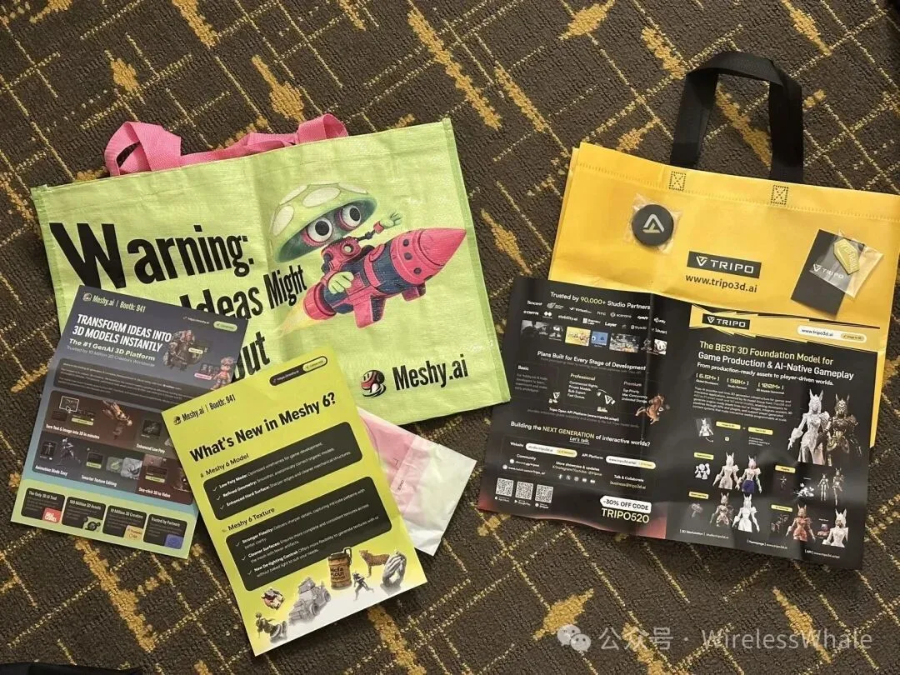

不远处是两家AI游戏初创公司。我被其中一家的迷彩帽吸引过去，他们是 tesana.ai，做的是一个基于Godot封装、通过AI chat生成游戏的工具加平台。和一个很能说的技术小哥聊了产品能力、底层能力供应商、封装和优化、资源结构等等，也没藏着掖着。团队创业才几个月，临走送了我们体验券，希望越来越好吧。

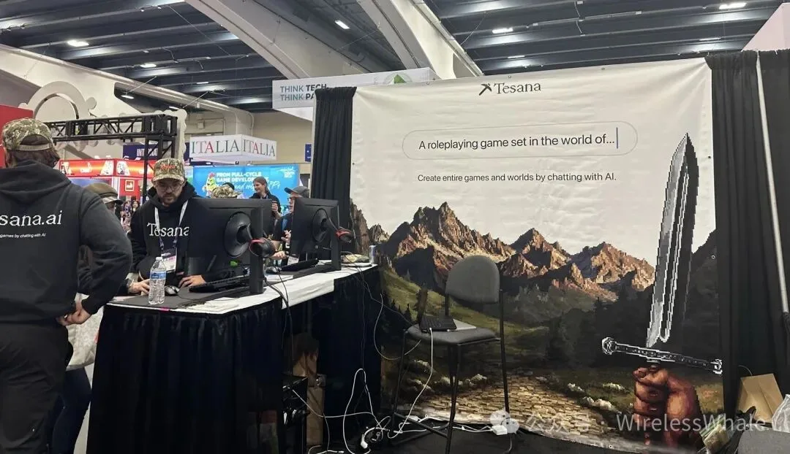

晚上以一场独立游戏颁奖收尾。

# 一个i人话最多的一天

上午起了个大早去听一位大佬的分享，内容主要是些经验和利弊得失，加上困的要命，没怎么听进去，有点可惜。

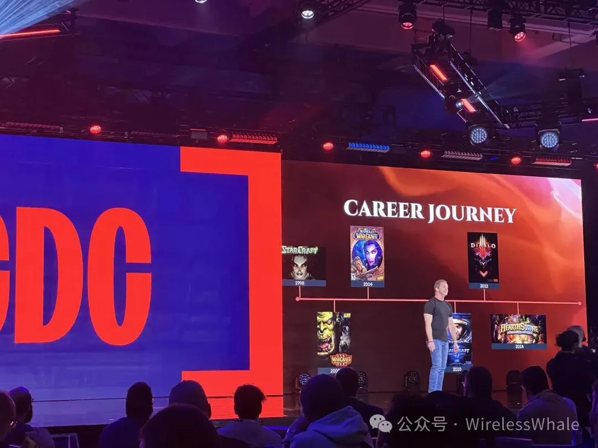

## Meshy：从生成资产到生成机制

然后匆匆赶去Meshy的讲座，坐满了还站了一排。前半场是三个工作室分别介绍他们如何用Meshy的3D生成模型服务加速产能，后半场是CEO胡渊明（Ethan）分享他们的新探索：**AI生成游戏机制**。

他们有个准备发Steam的项目是吸血鬼幸存者like，特色是在沙盒模式下，玩家可以在游戏中通过输入文字描述动态生成技能，并实际造成伤害。我后来去展台玩了很久，相对复杂的描述也能跑个大差不差，基本可玩，然后找他们项目主程聊，算是搞清楚了技术方案。

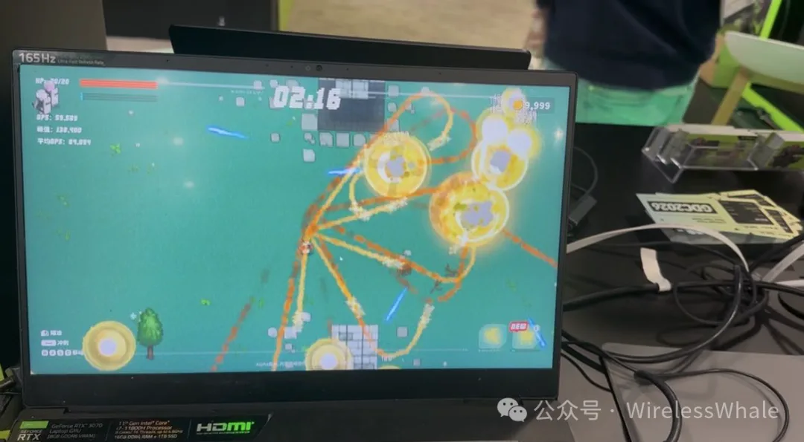

演讲结束后我本来准备了几个问题，主要想问他对AI native游戏的个人理念，以及对去引擎化的看法。无奈问问题的人太多，Ethan后来说还有一个访谈要开始，便冲下电梯，再也没抓着。下次还是不能谦让。

于是就和一位问他问题最多的战略投资大哥聊了会。有意思的是，他关心的话题是**AI工作流能不能跑通**，而不是技术方案本身。我说那后面小团队找投资得先展示AI用得多6才能打动你们了咯。

## 没挤进去的死亡搁浅2

接下来的讲座来自死亡搁浅2开发组（*Making of Voxel 3D Map*）。可能因为小岛叔临时没来，这场讲座成了唯一能近距离接触开发组的机会，队伍太长没能挤进去，只在门外匆匆瞥了一眼logo。

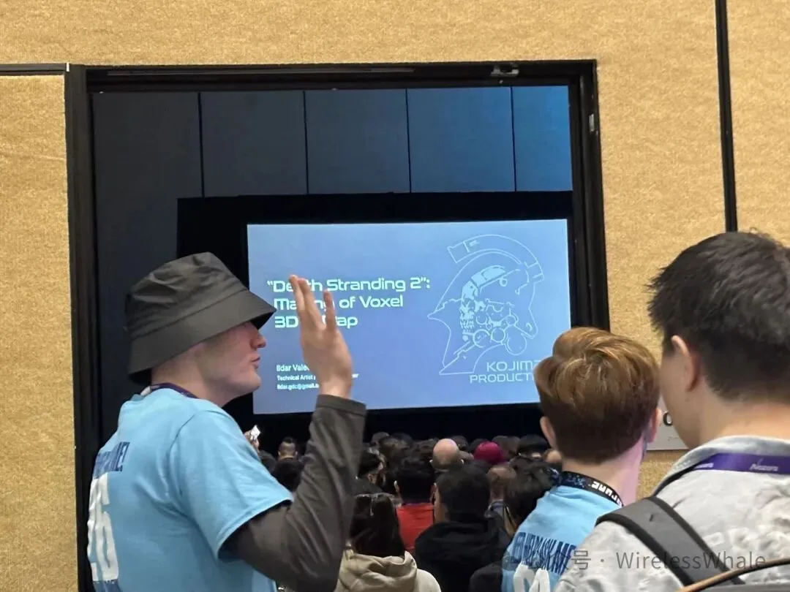

B计划是去隔壁听和平精英关于AI生成游戏物件、角色、视频转骨骼动画、场景布局的讲座，蛮有干货，回去再细化。结束后和一个机核的老哥闲聊了一会，他有个项目想借助AI辅助做3D复原，然后感叹现在AI人才和解决方案都往钱多的方向走，有些方向比如做音乐就没人来做AI工具。

## 展区与开放式小讲座

剩下的时间基本都在展区逛。展区主要分厂商区和indie区，indie区有不少游戏可以体验，包括一些新奇的交互类型——控制器是一颗脑袋、一台沙发、一支巨大的牙刷。

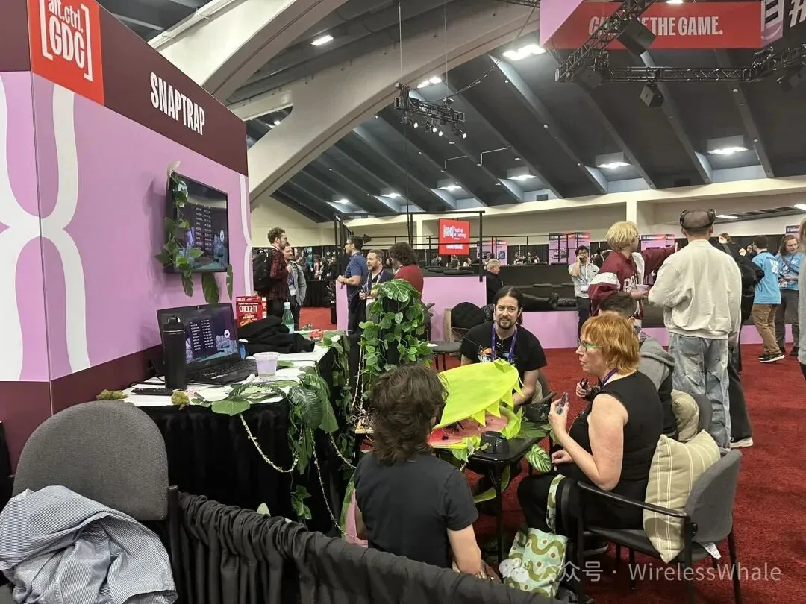

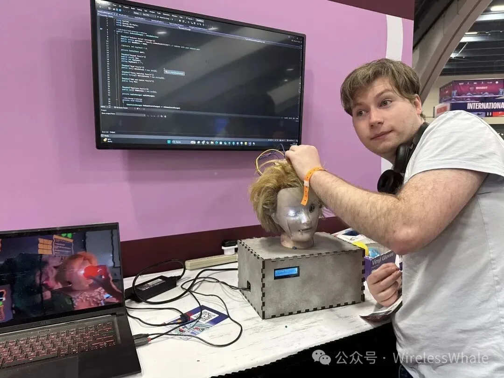

夹杂在其中的是一些关于游戏文化的开放式小讲座，既有cosplay的服装设计技巧，也有"场景内支持100w个可破坏砖块怎么做半精度压缩和GPU碰撞"这种硬货。

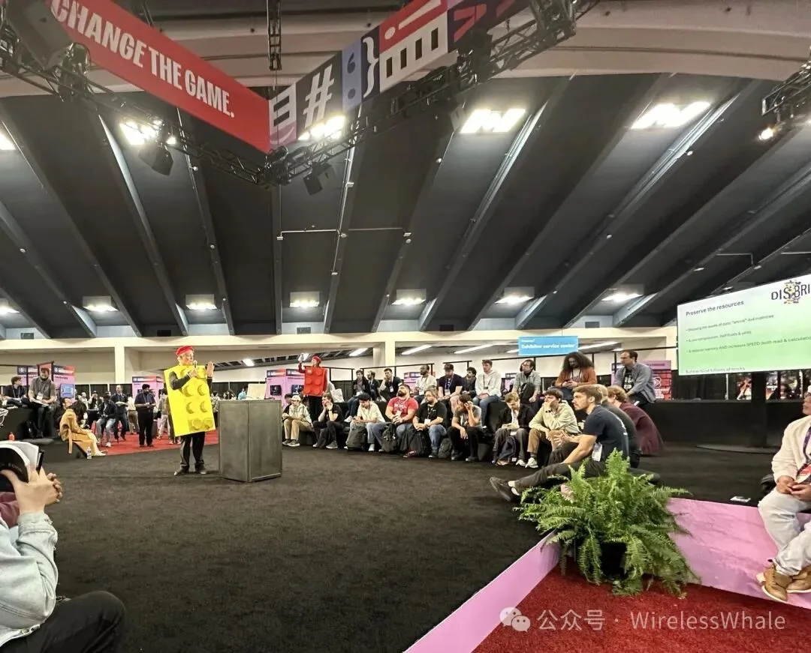

感叹如果英语再好一些，时间再多一些，是很能enjoy的。

## GDCA颁奖

晚上是GDCA游戏开发者选择奖。《33号远征队》再次碾压性拿下包括年度游戏在内的3项大奖，《死亡搁浅2》仅获best technology（还好小岛叔没来不然又笑了）。另外《Blue Prince》砍下best design和innovation两个奖，国内外的热度和口味差异确实显著。

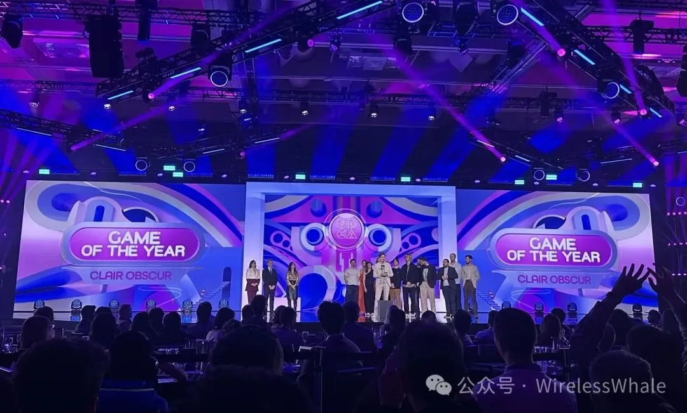

作为一个i人，那天说的话属实过多了。很难概括全部的见闻和感受，就用GDCA典礼最后主持人的那句话结尾：**let's keep making games.**
