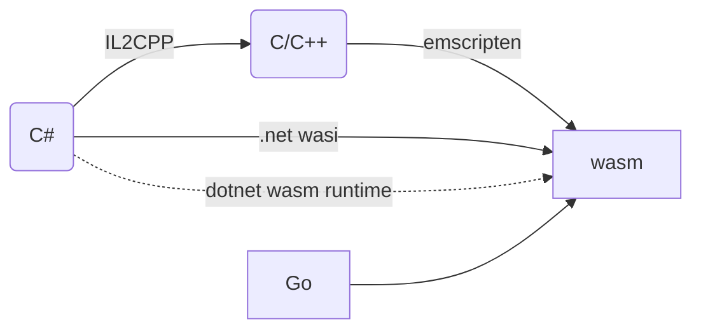

> 前几日参加了Unite上海2024，受益颇多。本篇先就相对感兴趣的小游戏平台WebGL技术方案为引子，引出一些关于WebAssembly, IL2CPP, 以及.NET 8对Web平台支持等话题。

# 什么是WebGL
- 针对Web的3D图形API标准，类似针对移动设备的`OpenGL ES`。
- 桌面平台和移动平台都有实现，如浏览器，但支持程度不同。
- [WebGL Wiki](https://www.khronos.org/webgl/wiki/Main_Page)
- [WebGL Tutorial](https://developer.mozilla.org/en-US/docs/Web/API/WebGL_API/Tutorial)

WebGL1.0出现前，Web中的图形渲染方式主要有：`HTML+CSS`, `SVG`, ~~`Flash`~~, `H5 Canvas API`。WebGL2.0以后的发展趋势是WebGPU（类比`Vulkan`）。

# 什么是WebAssembly
- 一套跨硬件平台的虚拟指令集/二进制代码格式，类比汇编语言`Assembly`。
- 包含系统接口规范`WASI`，类似`ABI`，`API`。
- 运行在沙盒环境。

WebAssembly简称`.wasm`。目前CPU还不能直接执行wasm代码，而是通过一些运行时解释执行。常见运行时有：浏览器中的脚本引擎（如`V8`，` JSCore`）、`iwasm`、`wasmtime`、`wasmer`.……最好的运行时执行wasm的速度只比C程序慢1.5~3倍。

[V8](https://v8.dev/)同时支持js和wasm的运行，但解析、编译、执行是独立的模块。两种语言可以通过共享内存来高效传递数据。Chrome浏览器和NodeJS的脚本引擎都是V8。由于FE基于的Electron内置了NodeJS作为backend，所以也用的是V8。

高级语言可以编译成wasm，或运行在构建在wasm之上的运行时中（如C#通过dotnet wasm runtime可以在浏览器中运行）。

## WebAssembly如何调用WebGL渲染
- WebAssembly目前缺少直接调用WebAPI的能力，所以需要和JS互操作来执行渲染指令。
- 需要WASI增加对图形渲染接口的规定（目前主要规定文件系统、网络相关）。

# 为什么关注WebGL+WebAssembly
- Unity支持导出web平台的技术栈是WebGL+WebAssembly，我们的UGC编辑器内置的游戏客户端正是该方案。后文将该技术栈合称为`Unity WebGL`。
- Unity WebGL的某些性能优化思路（包体、内存占用等）对App也有借鉴作用。
- 小游戏正在兴起，Unity WebGL是一个重要方案，值得关注。

# Unity WebGL方案介绍

- C#脚本通过`C# -> (IL2CPP) -> C/C++ -> (Emscripten) --> wasm`最终被包含在包内。
- 三方插件和原生插件也复用上述部分流程。
- 运行时的Unity堆内存（包括托管和非托管对象、加载的资源、场景、Shader等）是一个`WebAssembly.Memory`对象，底层是`ArrayBuffer`，内存连续、可扩容。
    >尽量不要动态扩容，会造成内存尖峰，非常容易超出平台内存限制而Crash（iOS在进程内存超过1.4G后高概率Crash）。建议休闲游戏预留256MB。

##  Unity WebGL方案的限制
Unity WebGL最主要的功能限制是**网络、文件**，最主要的瓶颈（移动端尤甚）是**内存、CPU**。具体来说可分为平台固有限制和技术限制。

平台固有限制
- 不支持C#多线程，是Web固有限制。
- 不支持SIMD，是Web固有限制。
    > 蒙皮会显著变慢。
- 当页面失去焦点或不可见时，可能被强制限制运行（1FPS），是Web固有限制。
- 不支持socket网络编程，是Web固有限制。用`UnityWebRequest`（基于JS Fetch API）或`WebSockets/WebRTC`。
- 不支持本地文件系统读写，是Web固有限制。Unity使用的Emscripten会在内存中模拟文件系统，并通过`Data caching`和`IndexedDB API`每隔1s保存数据到本地。
    > 注意及时清除下载、解压后不必要的文件，减少内存压力。
    > 
    > 无法调用系统字体，需要自带字体资源。
- GC只在帧尾才执行，是WebAssembly安全限制：不允许用户代码查询执行堆栈。
    > 不要在一帧内构造大量临时对象，否则造成内存不够而Crash或GC压力过大。
- [渲染限制](https://docs.unity3d.com/Manual/webgl-graphics.html)。
- [音效限制](https://docs.unity3d.com/Manual/webgl-audio.html)。

关于内存消耗，WebGL会比原生平台多得多。下图看到主要来自WebAssembly的加载（340MB）、编译和堆内存空隙（90MB），以及模拟文件系统（60MB）。

技术限制
- 不支持代码动态生成，因为该方案依赖IL2CPP。
- 暂不支持移动端（还未针对移动平台优化，导致基本不可用），Unity6后支持。
- 暂不支持compute shader。
- 暂不支持C#代码调试。

# 微信小游戏平台介绍

🟡todo

## 微信小游戏如何支持Unity WebGL
1. 开发期：提供C# SDK对接平台能力
2. 导出期：提供打包工具，对Unity WebGL转换为小游戏包
3. 运行期：提供WebAssembly基础能力，脚本引擎在安卓上为V8，iOS上为JSCore。

具体功能上，微信的SDK提供了一些能力以放宽[[#Unity WebGL方案的限制]]。如：
- 提供了UDP。
- 提供了资源本地缓存机制，限制为200MB，可申请1GB。
- 提供了访问微信字体的方法。
- 提供了[文件系统和管理机制](https://developers.weixin.qq.com/minigame/dev/guide/base-ability/file-system.html)，并切断了JS模拟文件系统写入IndexDB。

[小游戏启动流程与时序](https://wechat-miniprogram.github.io/minigame-unity-webgl-transform/Design/Startup.html)，Unity Loader工作流程图如下：

# 团结引擎WebGL方案介绍

两条腿走路：改进原Unity WebGL方案；开辟DotnetRuntime方案。
不管哪种方案，着力点都在于：**减少包体大小、减少内存占用、加快加载时间、提升开发体验**。

> 例如就包体大小而言，团结引擎版本降低为Unity WebGL的80%。如果使用DotnetRuntime方案，为60%。[出处](https://unity.cn/instantgame/docs/WechatMinigame/InstallUnityWithTuanjieBackport/)。

## 对Unity WebGL方案的改进

对IL2CPP的改进，优化加载时间、内存占用和包体大小。
- 延迟加载类型对应的元数据，优化内存占用。
    - IL2CPP除了是转译工具，也是一个运行时（虚拟机）。该运行时的内存消耗主要来自C#代码的元数据`global-metadata.dat`。经实测，实际用到的元数据只占很小一部分，可以延迟加载。14MB的文件需要60+MB内存，优化后变为30MB。
    - 
- 精简了生成异常处理代码相关部分，优化包体大小。
- 精简了元数据生成数量。`global-metadata.dat`可缩减15%优化内存占用和包体大小。
- 初始化generic方法表时，把HashMap改为数组，可节省20%初始化时间。

对代码剪裁的改进，优化内存占用和包体大小。
- 提供`Extreme`模式，函数级剔除未被调用的用户代码。
- 剪裁引擎功能，打包时彻底剔除未被使用的功能。

对蒙皮效率的改进，优化CPU负载。
- 使用[`WebAssembly SIMD`](https://github.com/WebAssembly/simd)重写了WebGL下的UnityMath库。
- 实现了基于transform feedback的GPU Skinning。不可和上述特性共用。

对粒子系统的改进，优化内存占用。
- 优化DynamicVBO缓存池策略，优化显存占用。

对Shader变体解压策略的改进，优化内存占用。
- 原来会解压所有blob数据并加载所有变体，改为只解压blob表头并按需加载Shader变体对应的blob。

对内存分配器的改进，优化内存占用和CPU。仅用于微信小游戏平台。
- 不再记录每次分配大小。
- 将内存对齐从16B改为4B。

对InstanceID和GUID映射关系的修改，优化内存占用。
- InstanceID利用率提升。
- 把HashMap改为内存紧凑的结构。

对调试和Profiler的改进。
- 精细化FrameDebugger
- 精细化MemoryProfiler
- 支持C#调试。结合特殊host程序使用。该host不仅用于开发调试，还将作为用户产品和渠道商合作，形成类似微信小游戏这样的解决方案。

[其他优化小游戏启动时间的特性](https://docs.unity.cn/cn/tuanjiemanual/Manual/weixin-loading-speedup.html)。

## DotnetRuntime方案介绍

> [`Blazor`](https://dotnet.microsoft.com/en-us/apps/aspnet/web-apps/blazor)是一个使用C#开发Web的框架。C#脚本既可以通过AOT被编译成wasm运行在浏览器中，也可以直接运行在一个基于wasm实现的.NET Runtime上（官方称为`Blazor WebAssembly hosting model`），该方案中C#编译成的IL被封装在[`WebCIL`](https://github.com/dotnet/runtime/blob/main/docs/design/mono/webcil.md)文件格式而不是`DLL`中，防止杀软或防火墙禁止浏览器下载和缓存代码文件。该方案中的.NET Runtime基于Mono（不是Unity的老旧Mono）有JIT, SGen, SIMD等，但并不如CoreCLR强大。

基于同一个原理，可以让Unity C#代码以WebCIL文件形式在浏览器/小游戏中被下载、加载、运行。这套方案被命名为`DotnetRuntime`。相比IL2CPP+Emscripten的现有方案，该方案最大的优势是：**省内存**，在demo项目中可减少20%复杂项目可节省更多。附带的优势有：构建时间短、代码热更新、.NET8的其他运行时优化和工具支持。唯一可见的不足是：**运行效率略有下降**，FameTime有约5%的额外消耗。

构建流程

构建产物

加载流程

执行流程举例

