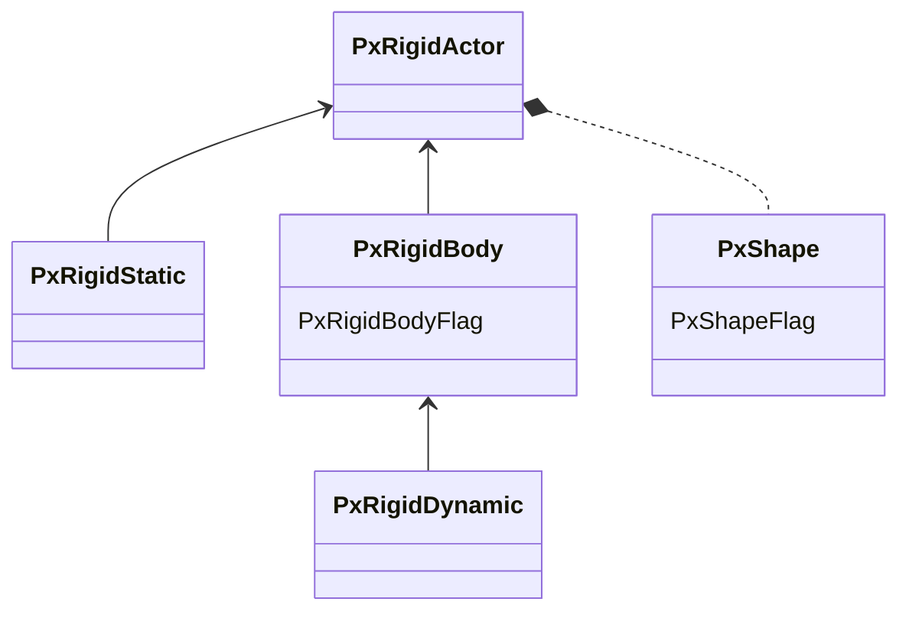

> 本文主要介绍PhysX碰撞检测的一些内部机制和使用方法。
> 
> [PhysX物理引擎系列](({{ tagref "PhysX" }}))记录了在实际项目中使用Nvdia PhysX 3.4物理引擎（[Code](https://github.com/pps43/PhysX-3.4), [Doc](https://github.com/pps43/PhysX-3.4/raw/master/PhysX_3.4/Documentation/PhysXGuide.chm)）的一些经验，有不少对官方资料的补充。

# Warm-up

## Static, Kinematic & Dynamic

- Static colliders are non-movable. In fact, they are not rigidbody, just `PxRigidStatic`.
- Kinematic and  dynamic rigidbody are both `PxRigidDynamic`, and can switch to each other at runtime by `setRigidBodyFlag(PxRigidBodyFlag::eKINEMATIC, true/false)`. The biggest difference is that kinematic rigidbody behaves like infinite mass, and will not move by external force. Instead, you call `MovePosition` on it.
- Dynamic rigidbody is the only type we can `AddForce` to, which has mass, center of mass, and inertia tensor to simulate a natural movement with Newton's laws of motion.



We cannot make a rigidbody without a shape. Shapes are tangible, with a real size.
- One actor can have multiple shapes as children, each with a local position and rotation.

- Each shape have a flag `PxShapeFlag::eSIMULATION_SHAPE` to determine it's a **collider** or a **trigger**.

- When two shapes overlap (collide), a "**triggering event**" or a "**contacting event**" may raise.
    - When two shapes are both collider, the event is contacting, otherwise triggering.
    - Contacting event happens only when at least one of the shape's belonging actor is Non-Kinematic `PxRigidDynamic`.
    - Triggering event happens only when at least one of the shape's belonging actor is `PxRigidbody`.
    - Two shapes must pass a filtering logic, which is usually user-defined rules. This is called "collision filtering".

> Unity Engine also has a doc to explain these rules, see [here](https://docs.unity3d.com/Manual/CollidersOverview.html).

## Filter mechanism

Basically, collision filter decides whether a collision pair should get processed, temporarily ignored or discarded.

Historically, there are 3 different implementation in PhysX.
1. The simpliest way is to use **filter callback function** to determine if two object can interact. Flexible, but too expensive/slow.
2. Next is **Simple group based filtering rules** in PhysX 2.0 (Dividing actors into predefined groups and decide if two groups can collide). Not flexible enough.
3. Now is **Shader system**+**CPU callback** in Physx 3+. Users can tradeoff between speed and flexiblity.

> Shader System, basically, is a custom function injected to the `PxSceneDesc`, and called for all pairs of shapes that come near each other -- more precisely: for all pairs of shapes whose AABB in world space are found to intersect for the first time.
>
> Shader System runs on the **vector processor** and is therefore not able to access any eventual game data base in main memory, so any pointer dereference is FORBIDDEN.

## Simulation loop

To put it simple, here is what happens each frame:
```cpp
void FixedUpdate(float timestep)
{
    if (m_MySimCallback)
	{
		m_MySimCallback->Clear(); // see later in Collision Callback section
	}
	if (m_pxScene)
	{
		m_pxScene->simulate(timeStep, NULL, m_ScratchBlock, SCRATCH_BLOCK_SIZE); 
        // your shader function are called inside simulate, when AABB intersect each other.
		
        m_pxScene->fetchResults(true); 
        // your CPU callbacks are called inside fetchResults.
	}
}
```

See details on Official Manual: [Simulation](https://docs.nvidia.com/gameworks/content/gameworkslibrary/physx/guide/Manual/Simulation.html) and [Broadphase algorithm](https://docs.nvidia.com/gameworks/content/gameworkslibrary/physx/guide/Manual/RigidBodyCollision.html#broad-phase-algorithms)

# Setup Rigidbody

To create a static actor:
```cpp
pxActor = sPxPhysics->createRigidStatic(actorTransform);
pxActor->setName("xxx");
pxActor->userData = &myActorWrapper; // bind to your game actor
m_pxScene->addActor(*pxActor);
```

To create a dynamic/kinematic actor:
```cpp
pxActor = sPxPhysics->createRigidDynamic(actorTransform);
pxActor->setName("xxx");
pxActor->userData = &myActorWrapper;// bind to your game actor
m_pxScene->addActor(*pxActor);
((PxRigidDynamic*)pxActor)->setRigidBodyFlag(PxRigidBodyFlag::eENABLE_CCD, true);
// set more property, e.g., linear damping, actor flag...

if (isKinematic) {
    ((PxRigidDynamic*)pxActor)->setRigidBodyFlag(PxRigidBodyFlag::eENABLE_CCD, false);
    ((PxRigidDynamic*)pxActor)->setRigidBodyFlag(PxRigidBodyFlag::eKINEMATIC, true);
}
```

To set collision data on each shape for filtering later:

```cpp
PxFilterData collisionFilter;
collisionFilter.word0 = layer; // ePlayer
collisionFilter.word1 = layerAgainst; // eGroud | eWall | eObstacle
shape->setSimulationFilterData(collisionFilter);

if (isTrigger) {
    shape->setFlag(PxShapeFlag::eSIMULATION_SHAPE, false);
    shape->setFlag(PxShapeFlag::eTRIGGER_SHAPE, true);
}
```

To register collision filtering and collision callback to all rigidbodies (when creating a `PxScene`):


```cpp
m_MySimCallback = new MySimulationEventCallback();
PxSceneDesc sceneDesc(sPxPhysics->getTolerancesScale());
...
sceneDesc.filterShader = MyFilterShader;
sceneDesc.simulationEventCallback = m_MySimCallback;

m_pxScene = sPxPhysics->createScene(sceneDesc);
```

# Collision Filtering

Just define a function that meets type `PxSimulationFilterShader` (function pointer).

```cpp
PxFilterFlags MyFilterShader(
		PxFilterObjectAttributes attributes0, PxFilterData filterData0,
		PxFilterObjectAttributes attributes1, PxFilterData filterData1,
		PxPairFlags& pairFlags, const void* constantBlock, PxU32 constantBlockSize)
	{
		// for triggers
		if (PxFilterObjectIsTrigger(attributes0) || PxFilterObjectIsTrigger(attributes1))
		{
			pairFlags = PxPairFlag::eTRIGGER_DEFAULT;

            // here I do not examine PxFilterData and just let it pass
			return PxFilterFlag::eDEFAULT;
		}
		else // for collisions
		{
			// Use word0 as self layer, word1 as layerAgainst.
            // word2 and word3 are not used here.
            // In most cases, collision rules are symmetric.
            // Here we use `||` just in case rules are asymmetric, which is equal to "Collision only happens if A can collide with B and B can collide with A."
			if ((0 == (filterData0.word0 & filterData1.word1)) || (0 == (filterData1.word0 & filterData0.word1)))
			{
				return PxFilterFlag::eSUPPRESS; // no collide
			}

            // use contact solver, and use CCD detection
			pairFlags = PxPairFlag::eCONTACT_DEFAULT | PxPairFlag::eDETECT_CCD_CONTACT;

			// notify onContact event
			pairFlags |= PxPairFlag::eNOTIFY_TOUCH_FOUND |
                        PxPairFlag::eNOTIFY_TOUCH_CCD |
                        PxPairFlag::eNOTIFY_TOUCH_LOST;

			return PxFilterFlag::eDEFAULT;
		}
	}
```

- `PxFilterObjectAttributes` param is 32bit flag.

    | value | meaning|
    |--|--|
    |0|eRIGID_STATIC|
    |1|eRIGID_DYNAMIC|
    |...|...|
    |15|as low mask|
    |1<<4|eKINEMATIC|
    |1<<5|eTRIGGER|

- `PxFilterFlags` is return value tells PhysX what to do next.

    |enum| value | meaning|
    |--|--|--|
    |`eDEFAULT`|0|Processed with NO filter callback|
    |`eKILL`|1<<0|Ignore the collision pair as long as the bounding volumes of the pair objects overlap. Until one of these conditions are met:<ul><li>The bounding volumes of the two objects overlap again (after being separated) </li> <li>The user enforces a re-filtering</li></ul>
    |
    |`eSUPPRESS`|1<<1|Similar to eKill, except one more condition that <ul> <li>filter data or attribute changes.</li></ul>✅Usually use this.|
    |`eCALLBACK`|1<<2|Use `PxSimulationFilterCallback::pairFound()`. ⚠SLOW!|
    |`eNOTIFY`|1<<3 \| eCALLBACK|Besides `eCALLBACK`, plus `pairLost()`. ⚠SLOW!|


- `PxPairFlags` is modifiable, to provide more info on what to do next.
     
    |enum| value | meaning|
    |--|--|--|
    |`eSOLVE_CONTACT`|1<<0|need process contact for this pair|
    |`eMODIFY_CONTACTS`|1<<1||
    |`eNOTIFY_TOUCH_FOUND`|1<<2|Raise event when "enter"|
    |`eNOTIFY_TOUCH_PERSISTS`|1<<3|Raise event when "stay"|
    |`eNOTIFY_TOUCH_LOST`|1<<4|Raise event when "exit"|
    |...|...||
    |`eNOTIFY_CONTACT_POINTS`|1<<9|Add contact points info|
    |`eDETECT_DISCRETE_CONTACT`|1<<10|Discrete detection algorithm. Valid when `eSOLVE_CONTACT`|
    |`eDETECT_CCD_CONTACT`|1<<11|Continous detection algoritym. Valid when `eSOLVE_CONTACT`, `PxSceneFlag::eENABLE_CCD`, and `PxRigidBodyFlag::eENABLE_CCD` are all set.|
    |...|...||
    |`eCONTACT_DEFAULT`|...|`eSOLVE_CONTACT` \| `eDETECT_DISCRETE_CONTACT`|
    |`eTRIGGER_DEFAULT`|...|`eNOTIFY_TOUCH_FOUND` \| `eNOTIFY_TOUCH_LOST` \| `eDETECT_DISCRETE_CONTACT`|


# Collision Callback

> This is also how Unity `OnTriggerEnter/Exit` and `OnCollisionEnter/Stay/Exit` are based on.

Creat a new class inheriting `PxSimulationEventCallback` and override its functions. In below example, we only implement `onTrigger` and `onContact`.

```cpp
class MySimulationEventCallback : public PxSimulationEventCallback
{
public: //from PxSimulationEventCallback
	//ignore
	virtual void onConstraintBreak(PxConstraintInfo* constraints, PxU32 count) {};
	virtual void onAdvance(const PxRigidBody*const* bodyBuffer, const PxTransform* poseBuffer, const PxU32 count) {};
	virtual void onWake(PxActor** actors, PxU32 count){};
	virtual void onSleep(PxActor** actors, PxU32 count){};
	//implement
	virtual void onTrigger(PxTriggerPair* pairs, PxU32 count);
	virtual void onContact(const PxContactPairHeader& pairHeader, const PxContactPair* pairs, PxU32 nbPairs);

public:
    // clear m_TriggerRecords and m_ContactRecords. Called before every time you called m_pxScene->simulate
	void Clear();
    // Copy m_TriggerRecords. Called after every time you called m_pxScene->fetchResults(true)
	bool GetTriggerResult(PhysXArray<MyTriggerResult>& out);
    // Copy m_ContactRecords. Called after every time you called m_pxScene->fetchResults(true)
	bool GetContactResult(PhysXArray<MyContactResult>& out);

private:
	PhysXArray<MyTriggerResult> m_TriggerRecords;
	PhysXArray<MyContactResult> m_ContactRecords;
};

void MySimulationEventCallback::onTrigger(PxTriggerPair* pairs, PxU32 count)
{
	for (PxU32 i = 0; i < count; ++i)
	{
		const PxTriggerPair& curPair = pairs[i];
		// ignore pairs when shapes have been deleted
		if (curPair.flags & (PxTriggerPairFlag::eREMOVED_SHAPE_TRIGGER |
                    PxTriggerPairFlag::eREMOVED_SHAPE_OTHER))
			continue;

		MyTriggerResult result;
		result.Trigger = (MyActor*)curPair.triggerActor->userData;
		result.Collider = (MyActor*)curPair.otherActor->userData;
		result.Lost = (curPair.status == PxPairFlag::eNOTIFY_TOUCH_LOST); // onTriggerEnter/Exit
		m_TriggerRecords.push_back(result);
	}
}

void MySimulationEventCallback::onContact(const PxContactPairHeader& pairHeader, const PxContactPair* pairs, PxU32 nbPairs)
{
	if (pairHeader.flags & PxContactPairHeaderFlag::eREMOVED_ACTOR_0 ||
		pairHeader.flags & PxContactPairHeaderFlag::eREMOVED_ACTOR_1)
	{
		return;
	}

	PxRigidActor* actorA = (PxRigidActor*)pairHeader.actors[0];
	PxRigidActor* actorB = (PxRigidActor*)pairHeader.actors[1];

	for (PxU32 i = 0; i < nbPairs; i++)
	{
		const PxContactPair& curPair = pairs[i];

		// ignore pairs when shapes have been deleted
		if (curPair.flags & (PxContactPairFlag::eREMOVED_SHAPE_0 |
                    PxContactPairFlag::eREMOVED_SHAPE_1))
		{
			continue;
		}

		if (curPair.events & PxPairFlag::eNOTIFY_TOUCH_PERSISTS)
		{
			// do nothing when contact persists
		}
		else
		{
			MyContactResult result;
			result.Lost = curPair.events & PxPairFlag::eNOTIFY_TOUCH_LOST; // OnCollisionEnter/Exit
			
			result.ColliderA = actorA == NULL ? NULL : (MyActor*) actorA->userData;
			result.ColliderB = actorB == NULL ? NULL : (MyActor*) actorB->userData;
			//result.ContactPoints= //need open eNOTIFY_CONTACT_POINTS

			if (result.ColliderA != NULL && result.ColliderB != NULL)
			{
				m_ContactRecords.push_back(result);
			}
		}
	}
}
```

# Golden Tips

- PhysX can only handle maximum `65536` total interaction on ONE actor in broadphase. Since it's in broadphase, "total interaction" is regardless of actor type or filter flags.

- When implementing `onContact` method, 
    - Must check actors' state via `PxContactPairHeaderFlag::eREMOVED_ACTOR_0` and `eREMOVED_ACTOR_1`
    - Must check shapes' state via `PxContactPairFlag::eREMOVED_SHAPE_0` and `eREMOVED_SHAPE_1`
    - Must access actor via `pairHeader.actors`, NOT `pairs[i].shapes[0]->getActor()`, which may be invalid.
    - Be careful about whether you bind userData to shape, or actor.