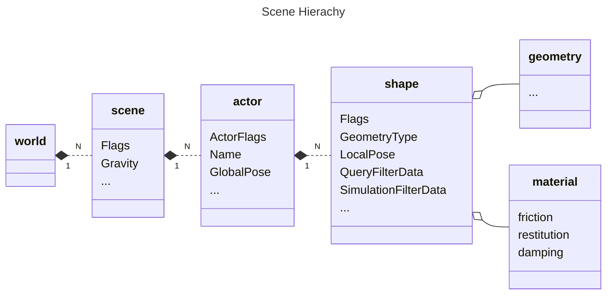
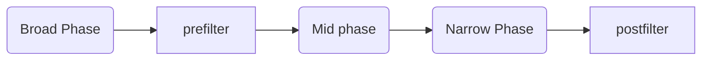

> 本文主要介绍PhysX场景查询的一些内部机制和使用方法。
> 
> [PhysX物理引擎系列](({{ tagref "PhysX" }}))记录了在实际项目中使用Nvdia PhysX 3.4物理引擎（[Code](https://github.com/pps43/PhysX-3.4), [Doc](https://github.com/pps43/PhysX-3.4/raw/master/PhysX_3.4/Documentation/PhysXGuide.chm)）的一些经验，有不少对官方资料的补充。

# Warm-up

A `Scene` in PhysX engine is a container of objects in a hierachical manner.



There are only position and rotation in `GlobalPose` and `LocalPose`, no "scale". Scale only reflects on geometry's actual size.

# Scene Query Basics

Three kinds of scene query:
- raycast
- sweep
- overlap

In general, each `SceneQuery` traverses a culling structure containing the scene objects, performs a precise test using the `GeometryQuery` functions, and accumulates the results.

You can customize filtering logic via `prefilter` and `postfilter`.



- Broad phase traverses the global scene spatial partitioning structure to find the candidates for mid and narrow phases.
- midphase traverses the triangle mesh and heightfield internal culling structures, to find a smaller subset of the triangles in a mesh reported by the broad phase. 
- Narrow phase performs exact intersection tests
- Pre-filtering happens before midphase and narrow phase and allows shapes to be efficiently discarded before the potentially expensive exact collision test.
- Post-filtering happens after the narrow phase test and can therefore use the results of the test (such as PxRaycastHit.position) to determine whether a hit should be discarded or not.

# More on Traversal

A scene uses two query structures, one for "static" objects (`PxRigidStatic`), one for "dynamic" objects (`PxRigidBody`). Each structure can use different culling algorithms, see `PxPruningStructureType`.

|PxPruningStructureType|Explaination|
|--|--|
|eNone| Based on grid. Full rebuild when changed.|
|eDYNAMIC_AABB_TREE| Based on tree. Full rebuild when changed. Only choose this if all static actors in your scene are not modified after initialization.|
|eSTATIC_AABB_TREE|Based on grid and tree. Incremental rebuild when changed, unless by force. Choose this if frequently add/remove geometry, at the cost of higher memory|


# More on Filtering

To make custom filtering logic works, there are 3 steps.
1. Attach data for filtering on the shape (a.k.a. `QueryFilterData`)
2. Define custom filtering logic
3. Attach filter in your scene query

## Step 1. Attach data for filtering on the shape
Attach `PxFilterData` to each shape's QueryFilterData.  It has four 32bit words to hold custom data, e.g., we use `word0` as layer of this shape. Here is an example:

```cpp
PxShape* shape = PxRigidActorExt::createExclusiveShape(*pxActor, PxBoxGeometry(extV), *pxMaterial);
PxFilterData queryFilter;
queryFilter.word0 = layer;
shape->setQueryFilterData(queryFilter);
```

## Step 2. Define custom filtering logic

Define callback function for `prefilter` and `postfilter`. See `PxQueryFilterCallback`. The logic is totally depend on yourself, just return `PxQueryHitType` to tell if this shape can pass.

|PxQueryHitType|Explanation|
|--|--|
|eNONE|Shall not pass.|
|eTOUCH|Pass, but does not stop the raycast or sweep.|
|eBLOCK|Pass, but stop here.|

Here is an example:
```cpp
class PhysxQueryFilterCallback : public PxQueryFilterCallback
{
    public:
        PhysxQueryFilterCallback();
        PhysxQueryFilterCallback(bool isBlocking, bool includeTrigger);
        virtual PxQueryHitType::Enum preFilter(const PxFilterData& filterData, const PxShape* shape, const PxRigidActor* actor, PxHitFlags& queryFlags);
        virtual PxQueryHitType::Enum postFilter(const PxFilterData& filterData, const PxQueryHit& hit);

    private:
        PxQueryHitType::Enum m_HitType;
        bool m_IncludeTrigger;
};

PxQueryHitType::Enum PhysxQueryFilterCallback::preFilter(const PxFilterData& filterData, const PxShape* shape, const PxRigidActor* actor, PxHitFlags& queryFlags)
{
    bool isTrigger = shape->getFlags() & physx::PxShapeFlag::eTRIGGER_SHAPE;
    if (isTrigger && !m_IncludeTrigger) {
        return PxQueryHitType::eNONE;
    }

    PxFilterData shapefilterData = shape->getQueryFilterData();

    if (shapefilterData.word0 & filterData.word0 || shapefilterData.word1 & filterData.word1)
    {
        return m_HitType;
    }
    return PxQueryHitType::eNONE;
}

PxQueryHitType::Enum PhysxQueryFilterCallback::postFilter(const PxFilterData& filterData, const PxQueryHit& hit) 
{
    const PxLocationHit& impactHit = static_cast<const PxLocationHit&>(hit);
    if (impactHit.distance > 0.0f)
        return m_HitType;

    return PxQueryHitType::eNONE;
}
```

## Step 3. Attach filter in your scene query
`PxQueryFilterData` has two fields:

|field|Explaination|
|--|--|
|PxQueryFlags| Supported flags are in `PxQueryFlag::Enums`, e.g. raise `ePREFILTER` means all shapes need to pass `prefilter` you defined.|
|PxFilterData|Has four 32bit words for you, e.g. use `word0` as the "layermask" of the query.|

### Raycast example
Here is an example of raycast (return multiple objects).
```cpp
// save result and use it later
struct MyRaycastHitResult
{
    PhysXVec3 Position;
    PhysXVec3 Normal;
    float Distance;
    PhysXActor* Collider;
};
typedef PhysXArray<MyRaycastHitResult> MyRaycastHitResults;

// make sure "direction" is non-zero and normalized!
bool MyRaycast(MyRaycastHitResults& hitResults, const PhysXVec3& startPos, const PhysXVec3& direction, float distance, unsigned int layerMask, bool includeTrigger)
{
    const PxU32 bufferSize = 256;
    PxRaycastHit hitBuffer[bufferSize];
    PxRaycastBuffer buf(hitBuffer, bufferSize);

    PxQueryFilterData filterData = PxQueryFilterData();
    filterData.flags |= PxQueryFlag::ePREFILTER | PxQueryFlag::ePOSTFILTER; // will call both prefilter and post filter
    filterData.data.word0 = 0;
    filterData.data.word1 = layerMask;
    PhysxQueryFilterCallback filterCallback(false, includeTrigger);

    bool status = m_pxScene->raycast(startPos, direction, distance, buf, PxHitFlag::eDEFAULT, filterData, &filterCallback, NULL);

    if (status)
    {
        hitResults.clear();
        for (PxU32 i = 0; i < buf.nbTouches; i++)
        {
            PxRaycastHit touch = buf.touches[i];
            MyRaycastHitResult hitResult;
            hitResult.Position = touch.position;
            hitResult.Normal = touch.normal;
            hitResult.Distance = touch.distance;
            hitResult.Collider = (PhysXActor*)touch.actor->userData;
            hitResults.push_back(hitResult);
        }
        if (buf.hasBlock) {
            MyRaycastHitResult hitResult;  
            hitResult.Position = buf.block.position;
            hitResult.Normal = buf.block.normal;
            hitResult.Distance = buf.block.distance;
            hitResult.Collider = (PhysXActor*)buf.block.actor->userData;
            hitResults.push_back(hitResult);
        }
    }
    return status;
}
```

### Overlap example
Here is an example of sphere overlap. Other geometries are similar.

```cpp
// make sure radius is above zero!
bool PhysXManager::MySphereOverlap(PhysXRaycastHits& hitResults, float radius, const PhysXVec3& position, const PhysXQuat& rotation, unsigned int layerMask, bool includeTrigger) {
    const PxU32 bufferSize = 256;
    PxOverlapHit hitBuffer[bufferSize];
    PxOverlapBuffer buf(hitBuffer, bufferSize);

    PxQueryFilterData filterData = PxQueryFilterData(); 
    filterData.flags |= PxQueryFlag::ePREFILTER;// no postfilter logic since we SHOULD NOT EXAMINE DISTANCE in overlap query
    filterData.data.word0 = 0;
    filterData.data.word1 = layerMask;
    PhysxQueryFilterCallback filterCallback(false, includeTrigger);

    bool status = false;
    PxTransform trans(position, rotation);
    status = m_pxScene->overlap(PxSphereGeometry(radius), trans, buf, filterData, &filterCallback);
    if (status && buf.nbTouches > 0)
    {
        hitResults.clear();
        for (PxU32 i = 0; i < buf.nbTouches; i++)
        {
            PxOverlapHit hit = buf.touches[i];
            PhysXRaycastHit hitResult;
            hitResult.Collider = (PhysXActor*)hit.actor->userData;
            hitResults.push_back(hitResult);
        }
    }
    return status;
}
```

# Golden Tips

- Make sure shape dimension and queryshape dimension have positive values, recommended  minimum value is `1.192092896e-07F`. Or random crash may happen.
- In `Raycast` or `Sweep`, make sure `direction` is normalized and not zero. Or random crash may happen.
- In `Overlap`, do not check `hit.distance`` (it's always zero) in post-filtering logic.